# MoviePilot v3 架构设计

> 本文面向开发人员，以图文结合的方式说明 MoviePilot v3 的整体架构：分层结构、各核心包的职责、
> 模块间调用关系、典型业务流程与启动生命周期。
>
> 规范性约束以 [`docs/rules/05-architecture.md`](rules/05-architecture.md) 与
> [`docs/rules/04-design-patterns.md`](rules/04-design-patterns.md) 为准，本文与其保持一致；
> 如出现差异，以规则文档为准。
>
> *Last Updated: 2026-08-30*

---

## 一、系统概述

MoviePilot 是一个聚焦影视自动化核心流程的系统，实现**订阅、搜索、下载、文件整理、元数据刮削、
媒体库刷新与消息通知**的全流程自动化。后端基于 FastAPI，前端基于 Vue 3（独立仓库），
同时对外提供 REST API、MCP 工具调用端点（`/api/v1/mcp`）与 OpenAI / Anthropic 兼容协议端点，
内置 AI Agent 支持自然语言操控系统。

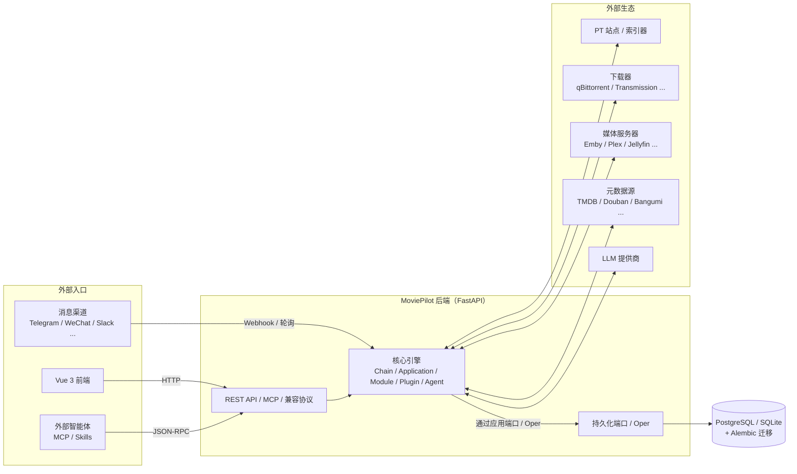

---

## 二、整体分层架构

MoviePilot v3 以单向依赖的模块化单体为目标。历史包 `app/core`、`app/helper`、`app/utils`
已不再存在物理目录，仅作为旧插件的**虚拟兼容导入根**保留。核心边界已有机器门禁，
完整宿主 SCC 与 Adapter 直连已有精确政策门禁；其余尚未强制的边界记录在本章末的优化清单中。

下图同时表达职责关系与运行时调用方向，不等同于 Python 静态 import 图；通过 Port 注入的调用
会与具体 Adapter 的静态依赖方向相反。

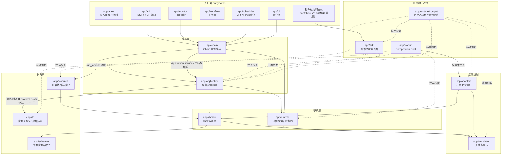

图中的 `Chain → Application` 与 `Application → Db` 是运行时调用关系，表示通过应用端口和组合根
注入的实现完成持久化；静态 import 方向是 `db.adapters → application Protocol`。
具体 DB Adapter 再使用 Oper；这不是允许在用例代码中直接创建数据库引擎或拼接 SQL。`compat` 也不是只面向 SDK 的转发层，
它按 `app/runtime/compat/manifest.py` 的白名单把已经删除的旧模块/符号精确映射到各自的 canonical
归属。`app/application/subscribe.py` 与 `app/application/plugins.py` 都是 V3 重构过程中新增、
未形成插件 ABI 的宿主内部聚合文件，主题实现收口后直接删除，不在 manifest 中制造新的兼容债务。

当前正式目标和已完成参考切片的持久化调用路径可概括为：

```text
入口（API / Agent / CLI / Scheduler / Workflow）
        -> Chain 或 Application 用例
        -> 命名 Port / Protocol
        -> db/adapters 创建短生命周期 Session/UoW
        -> db/oper 与 db/models
```

Chain 的持久化能力由 startup 构造 `ChainRuntimeContext` 并在 `ChainBase` 实例化时显式注入；
Agent manager、memory、tool 和 scheduler 共享同一个 `AgentDataContext`。原
`app/application/chain/data.py`、`app/application/agentdata.py` 的进程级 getter 已删除，且不进入
SDK/Compat。领域查询与写入继续使用 Application 所属的冻结 DTO/Port，具体实现只存在于
`db/adapters`，宿主生产代码不得恢复 raw Oper、`Any` factory 或数据服务 locator。
需要跨进程恢复或 commit 后可靠执行的
业务副作用进入 `app/application/outbox.py` 定义的 Outbox 端口，由
`app/db/adapters/outbox.py` 实现；`app/runtime/tasks.py` 的 TaskRegistry 只负责进程内任务所有权、
取消和有限等待，不承担 durable queue 语义。

**依赖方向的规范目标**如下。完整宿主 SCC 与 Application/Chain 具体 Adapter 直连已经使用
生成事实 + 人工 policy 门禁；当前 Adapter 边均为有迁移 owner 的临时债务，不是永久例外。
其余尚未机器化的规则仍按优化清单补齐，不能把表中每一行都理解为当前已经被 CI 全量证明：

| 方向 | 状态 |
|---|---|
| 入口层 → Chain / Application / 注入 Port | 允许（按工作流复杂度选择；不得直接构造 Oper） |
| Chain → Module | 仅允许通过 `run_module` 方法名分发，禁止直接 import 模块内部 |
| Chain → Agent 实现 | 禁止；只能经 `app/application/agent.py` 门面 |
| Application → Domain / Runtime / 注入的 Port | 允许；不得直接依赖具体 DB/Oper/Adapter |
| DB Adapter → Application 持久化 Protocol / Oper / UoW | 允许；这是依赖倒置的实现方向 |
| Module → Module / Chain | 禁止（跨模块编排一律进 Chain） |
| Adapter → Application / runtime.extensions / sdk / compat | 禁止 |
| Domain → Runtime / Adapter / Application / DB | 禁止 |
| Foundation → 任何其他 app 包 | 禁止 |
| 规范实现包 → sdk / compat | 禁止 |
| 任何形成模块级循环依赖的 import | 禁止（延迟导入也不被接受） |

---

## 三、核心包职责速查

| 包 | 职责 | 代表性文件 |
|---|---|---|
| `app/foundation/` | 无状态、无配置、无 I/O 的底层原语：反射/动态导入、加密、DOM、单例、文本、URL、版本比较 | `reflection.py`、`crypto.py`、`singleton.py` |
| `app/domain/` | 纯 MoviePilot 业务语义：媒体上下文、识别解析、站点状态解释、磁力语义、NFO 刮削 | `context.py`、`metainfo.py`、`meta/`、`scraper.py` |
| `app/runtime/` | 进程级运行机制：配置、进程拓扑、事件、完整日志、缓存契约与内存后端、运行依赖 profile 与原生载荷激活检测、任务所有权、执行/关联上下文、并发、调度、限流、本地化、GC、重启状态 | `config.py`、`events.py`、`event/`、`dependencies/`、`tasks.py`、`execution.py`、`correlation.py`、`log.py`、`cache.py` |
| `app/runtime/extensions/` | 模块 / 插件 / 配置化服务 / 托管资源的发现、注册与生命周期适配；管理器归入对应主题包，旧插件路径只由 Compat 精确映射 | `module/manager.py`、`plugin/manager.py`、`service.py` |
| `app/runtime/compat/` | 仅标准库的精确旧模块、包与符号导入路由；不是业务实现，也不是通用 re-export 层 | `manifest.py`、`imports.py` |
| `app/adapters/network/` | 通用 HTTP、浏览器、DNS、Cloudflare、IP 传输机制 | `http.py`、`browser.py` |
| `app/adapters/cache/` | Redis 与文件缓存的具体实现 | `backends.py`、`redis.py` |
| `app/adapters/system/` | OS/文件/进程/stdio/显示/包安装/Rust 加速适配 | `host.py`、`resource.py`、`fsproxy.py` |
| `app/adapters/external/` | 命名外部生态：插件市场、CookieCloud、OCR、IP 归属、MP Server、微信加密 | `market.py`、`server.py`、`wechat.py` |
| `app/adapters/web/` | Web 技术适配：动态插件路由注册、认证依赖和 OpenAPI 重建；不承载插件路由用例 | `plugin/routes.py` |
| `app/adapters/observability/` | 可选观测技术适配；核心层只依赖 `runtime/observability` 定义的窄端口 | `otel.py` |
| `app/application/` | 读取配置/持久化状态的聚焦应用服务：识别、过滤、通知、RSS、站点、下载器、媒体服务器、存储、整理规则、可靠副作用等；同一主题拆成子包 | `recognition.py`、`rules.py`、`rss.py`、`outbox.py`、`site/`、`subscription/`、`plugin/` |
| `app/application/chain/` | Chain 运行时上下文、跨领域数据端口和 durable event 命令；将组合根注入的能力以命名 getter 暴露给 Chain | `context.py`、`data.py`、`events.py` |
| `app/application/subscription/` | 订阅深度冻结 DTO、typed query/write/staging Repository，以及新增、查询、变更、删除、媒体身份与搜索用例 | `contract.py`、`write.py`、`mutation.py`、`delete.py`、`identity.py`、`search.py` |
| `app/application/plugin/` | 插件市场、安装、运行时端口、文件夹操作和动态路由用例；具体 FastAPI 路由适配器在 adapters 层 | `catalog.py`、`install.py`、`runtime.py`、`folders.py`、`routes.py` |
| `app/application/messaging/` | 渠道回环入口、消息渲染/路由、命令交互会话、插件按钮回调、Agent 消息桥接 | `ingress.py`、`message.py`、`router.py`、`agent.py` |
| `app/application/security/` | 认证、授权、Cookie、Passkey、OTP/二次认证、SSRF 与 URL/路径安全 | `auth.py`、`url.py`、`twofactor.py` |
| `app/chain/` | 跨入口复用的用例编排：订阅、搜索、下载、整理、媒体、消息等 Chain | `subscribe/`、`search.py`、`transfer/` |
| `app/modules/` | 可插拔后端：下载器、媒体服务器、元数据源、消息渠道、索引器、存储 | `qbittorrent/`、`emby/`、`telegram/`、`themoviedb/` |
| `app/db/` | SQLAlchemy 模型、表级 Oper、会话/UoW 与 Application 持久化适配器；Model 只接受显式 Session，不拥有事务提交 | `models/`、`oper/`、`adapters/`、`uow.py` |
| `app/schemas/` | Pydantic 传输模型、枚举（`ModuleType`、`EventType`、`SystemConfigKey` 等） | `types.py`、`context.py` |
| `app/api/` | FastAPI 主端点、鉴权依赖、统一 `Response` 响应封装；动态插件端点不走此统一包装 | `apiv1.py`、`endpoints/`、`response.py` |
| `app/adapters/web/plugin/` | FastAPI 动态插件路由的技术适配：注册/移除、认证依赖、OpenAPI 重建；保留插件原生响应结构 | `routes.py` |
| `app/agent/` | AI Agent：稳定 Manager 门面、会话/生命周期/后台任务 owner、单 Agent 编排器、运行时、工具、中间件、LLM、记忆、技能、策略 | `manager.py`、`session.py`、`lifecycle.py`、`tasks.py`、`orchestrator.py` |
| `app/startup/` | 唯一组合根：跨层装配、领域初始化、声明式生命周期排序与重启策略 | `composition/`、`initializers/`、`lifecycle/` |
| `app/sdk/` | 面向新插件的稳定导入面（网络、缓存、日志、浏览器等）；`_legacy/` 只承载旧插件行为适配薄门面 | `network.py`、`browser.py`、`cache.py`、`_legacy/` |
| `app/monitor/` | 源目录监控 → 触发整理 | `watcher.py`、`dispatcher.py` |
| `app/workflow/` | 工作流引擎 | — |
| `app/plugins/` | 插件运行时副本/覆盖目录，由插件管理器加载；不是官方插件源码或宿主架构实现，架构审计以插件仓库与宿主边界为准 | — |

`app/runtime/dependencies/` 是一个同名能力包：`profile.py` 只负责解释器 ABI 对应的依赖组，`native.py` 只负责已加载原生发行包的快照与变更检测。包根不重复导出实现，宿主直接导入职责子模块；旧的平级 `dependencies.py` 与 `native_dependencies.py` 已退出规范实现。

---

## 四、启动与生命周期

`app/startup/` 是全应用唯一的组合根：负责向低层注入依赖、编排初始化/关停顺序、决定重启策略。
低层模块不允许反向 import `startup`。

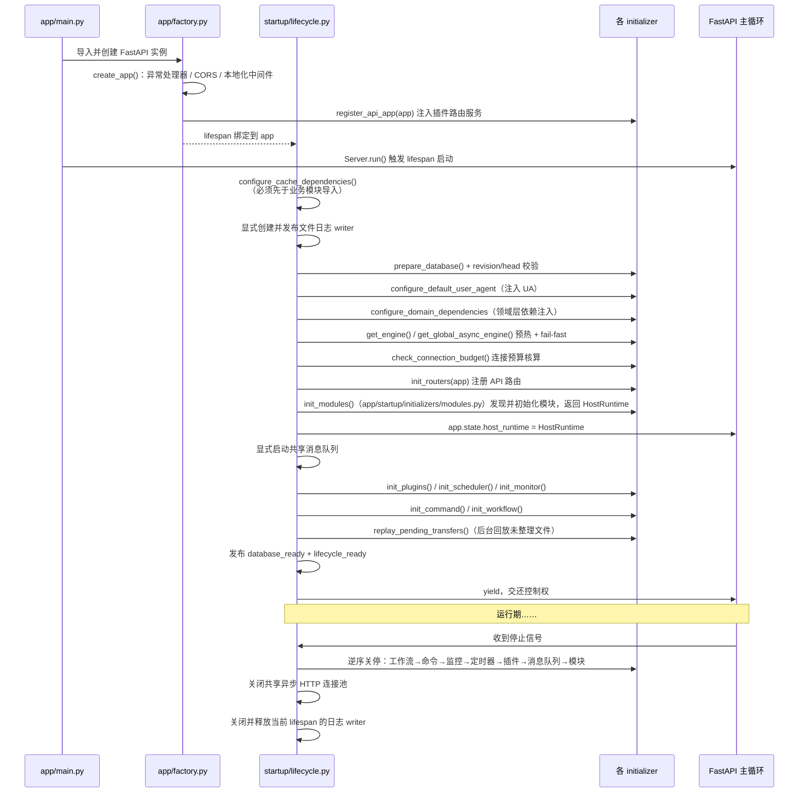

关键设计点：

- **缓存装配先于业务导入**：缓存装饰器会在业务模块 import 时创建后端，
  因此 `configure_cache_dependencies()` 在 `lifecycle.py` 顶部即执行。
- **Uvicorn 入口分流**：生产单 worker 使用带协作停止语义的 `MoviePilotServer`；开发 reload
  和安全模式多 worker 使用 `app.factory:create_app` import string/factory，由 supervisor
  创建应用实例。`app.factory:app` 继续保留给既有 ASGI supervisor 和测试使用。
- **数据库准备唯一入口**：建表、迁移、迁移前备份和 Alembic head 校验统一由 lifespan
  最早的“数据库准备”组件执行，`app.main` 不再主动迁移。主程序、外部 supervisor、factory
  和 TestClient 因而共享同一 fail-fast 语义。
- **引擎预热 fail-fast**：同步/异步数据库引擎在单线程期完成首次创建，
  避免调度器放出大量线程后再创建引擎导致连接锁竞争。
- **类型化请求装配**：`startup/composition/context.py` 的 frozen slots `HostRuntime` 是 lifespan 内唯一宿主
  上下文，`api/context.py` 从 `app.state` 收窄到具体领域能力。认证、消息、历史、媒体服务器、站点、
  订阅、工作流和请求事务均使用命名 runtime 字段，不再通过字符串仓储键定位；API、Scheduler、Chain
  从 `HostRuntime.configuration` 获取 frozen 配置快照。系统设置管理 API 通过
  `HostRuntime.settings` 的窄服务读写可变部署设置，业务域不接触 Settings 实例；生产与测试组合根统一
  复用 `startup/composition/configuration.py` 的映射、快照加载与发布。`startup/composition/database.py`
  持有数据库 worker、兼容事务 runner、查询与插件持久化；`startup/composition/runtime.py` 是
  `HostRuntime`、全部命名领域 Runtime 和旧 `ApiDataPorts` 投影的唯一构造/发布 owner。它先构造
  一份 frozen `RuntimeDependencies`，Agent、Chain 与 HostRuntime 复用同一仓储、transfer execution
  ledger 和消息对象，导入阶段不启动数据库 worker 或消息队列；initializer 只保留顺序调用。
  `startup/composition/chain.py` 集中构造无参 Chain 兼容上下文及其持久化、事件、
  Outbox、消息和模块分发依赖，并延迟绑定旧 Transfer command 与壁纸 Chain，避免组合根导入环。
  `startup/composition/security.py` 统一装配认证、用户查询、PassKey 与 Web 访问
  provider，并把持久化工厂交给 runtime owner 投影为 `AuthenticationRuntime`；
  `startup/composition/network.py` 统一装配网络应用端口；`startup/composition/agent.py` 构造并发布
  唯一的 Agent 数据、会话持久化和自主任务对象，由 runtime owner 投影 `AgentChatRuntime`，
  `HostRuntime`、工具管理器与 Scheduler 复用同一对象身份。`ApiDataPorts` 严格从同一 HostRuntime
  字段投影，仅保留旧导入 ABI，
  不参与正式请求链路。
- **安全模式**：`MOVIEPILOT_SAFE_MODE` 会跳过插件、定时器、监控器、命令与工作流，用于故障自救。
- **Scheduler 同名职责包**：旧 `app/scheduler.py` 单体已退役；`catalog.py` 负责作业目录和计划投影，
  `execution.py`、`bridge.py`、`progress.py` 分别负责执行、跨循环句柄和进度终态，`registry.py`
  唯一持有 generation、active generation、reservation 与 handle，`reconcile.py` 和 `lifecycle.py`
  分别负责动态任务协调与启动/重载/关闭。
- **Scheduler 显式装配**：`startup/initializers/scheduler.py` 构造业务 Chain 一次，将绑定 callable
  组成 frozen `SchedulerServices` 后注入 Scheduler；Scheduler 包内不再构造业务 Chain。
  `app.scheduler` 包根只惰性保留 `Scheduler`/`SchedulerChain` 旧 ABI，新插件经 `app.sdk.scheduler`
  使用窄调度服务，内部 owner 不重复导出。
- **进程拓扑**：全功能 V3 强制 `API_WORKERS=1`，避免每个 worker 重复启动插件和后台控制面；安全模式可临时使用多 worker 诊断，但不是正式扩容方案。
- **健康语义**：`/health/live` 只确认进程和事件循环可响应；`/health/ready` 仅在数据库
  到达当前 head 且生命周期完成后返回 200，启动失败或关停阶段返回 503。两者不公开路径、
  revision、插件和异常详情，深入诊断继续使用 Doctor。
- **关停隔离**：每个关停步骤由 `run_shutdown_step` 独立捕获异常，保证后续资源仍有机会释放；TaskRegistry、事件投递屏障、插件和模块资源按生命周期清单中的 owner 顺序收口。

---

## 五、核心设计模式

### 5.1 Module 模式：可插拔后端

`app/modules/` 下每个目录是一个可插拔后端（下载器、媒体服务器、消息渠道、元数据源、索引器、
存储等），均继承 `_ModuleBase` 并实现统一契约：

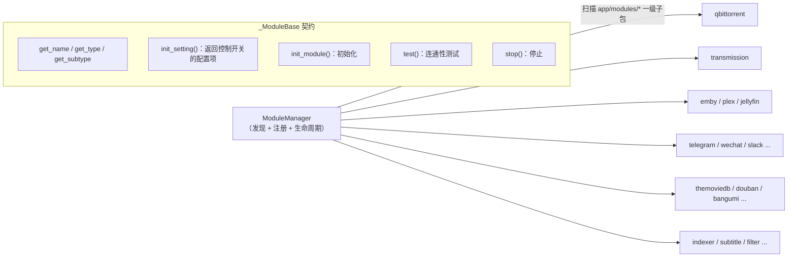

- 模块由 `runtime/extensions/module/manager.py` 发现并管理生命周期；
  `app/modules/_base/` 承载各模块族的共享模板基类（下载器、媒体服务器、消息渠道）。
- 模块开关由 `init_setting()` 声明的配置项决定（如 `DOWNLOADER = "qbittorrent"`）。
- **模块之间、模块到 Chain 的直接依赖被禁止**，跨模块编排一律由 Chain 完成。
- 渠道/存储的管理操作遵循统一契约：`channel_manage(channel, action, **params)` /
  `storage_manage(storage, action, **params)`，结果统一为 `{"success", "message", "data"}` 形态，
  Chain 与端点只做透传。

### 5.2 Chain 模式：用例编排

`app/chain/` 承载被 API、CLI、Agent、调度器、Webhook 等多入口共享的业务用例。
所有 Chain 继承 `ChainBase`，Chain 访问模块**只能通过方法名分发**：

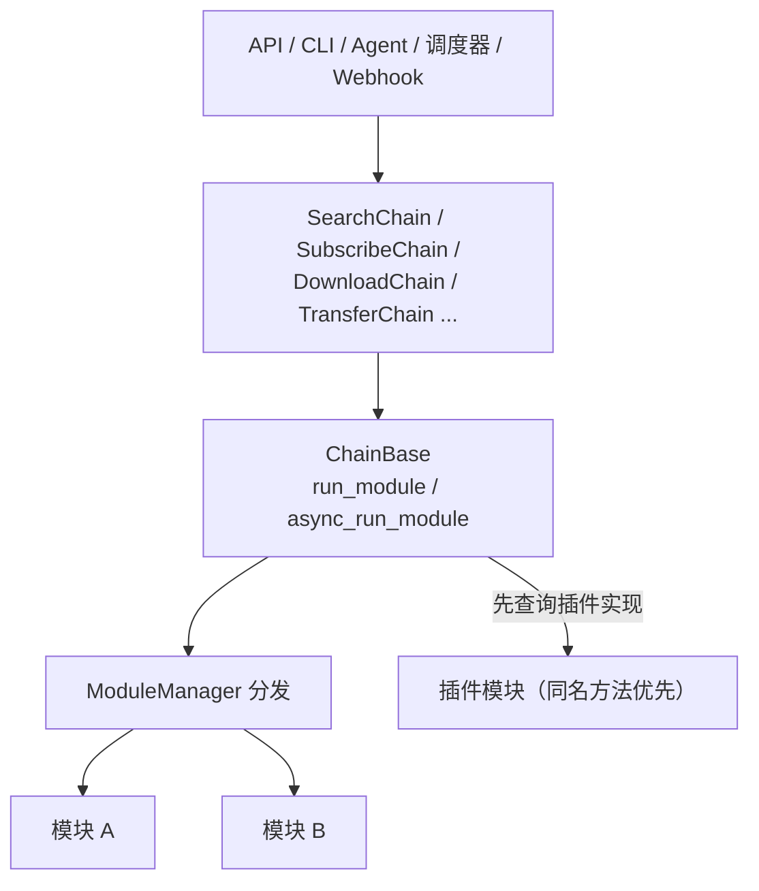

- `run_module("method_name", **kwargs)` 会遍历所有实现了该方法的模块并聚合结果；
  插件若实现了同名方法可获得优先响应。
- `runtime/extensions/module/contracts.py` 为宿主已观察到的方法提供显式参数与返回合同；兼容期只诊断
  旧插件签名差异，不改变插件优先级、短路和自由返回语义。
- 大型稳定 Chain 使用同名目录包治理：包根只保留稳定公开类，Facade 只组合职责 owner；
  `TransferChain`、`SubscribeChain`、`DownloadChain` 与 `SearchChain` 的旧单体文件均不得复活或以
  `source.py` 留存。`SearchChain` 的 provider 列表和流式入口共享同一批次事实，搜索状态仍由
  `application/search/state.py` 唯一拥有。
- `app/chain/` 中下划线前缀文件（`_recognition.py`、`_messaging.py`、`_interaction.py`、
  `_music.py`、`_transfer.py`）是 `ChainBase` 的功能域 Mixin，不是独立 Chain。
- 需要斜杠命令交互的 Chain 继承 `InteractionChainMixin`，只实现 `_interaction_handler`。

### 5.3 Event 模式：跨切面事件

`EventManager`（`app/runtime/events.py`）提供进程级事件总线，用于解耦跨切面反应
（整理完成后刷新媒体库、配置变更后重载模块、消息分发等）：

宿主内建 `EventType` / `ChainEventType` 均在事件注册表中绑定 typed payload。开放插件事件允许
额外字段，校验只生成诊断；分发给既有插件的仍是原始 dict/model 对象，不改变事件 ABI。
插件可通过 `app.sdk.events` 调用 `event.snapshot()` 或
`snapshot_event_data(event_type, event_data)` 获取独立的类型化快照。返回结果中的 `raw` 保留
原始对象，`payload` 是组合契约，链式事件还提供 `input` / `output` 快照；`known`、`valid` 和
`errors` 分别用于处理未知自定义事件和兼容期校验失败。快照修改不会回写原事件，如需拦截、取消
或替换链式结果，插件仍应修改原始 `event.event_data`。

架构基线中的 consumer 表示宿主源码中可静态证明的注册点，不是运行时 listener 实例数。
collector 只接受 canonical `eventmanager`、`EventManager()` 及其有限别名，忽略其他对象的同名
`register`/`add_event_listener`；当前宿主有 16 个静态注册点，另保留 1 个由工作流配置驱动的
真实动态注册。`app/plugins/**` 插件副本不进入宿主事实。

生产者与消费者共用 `scripts/architecture/event_facts.py` 这一份逐调用事实源。当前宿主有 86 个
生产调用，其中 85 个静态解析为 87 个事件引用，只有 `Command.send_plugin_event` 的插件事件类型
保持动态；17 个消费注册中 16 个静态、1 个动态。生成的
`runtime-contract-baseline.json` 保存 line-free 事实、数量和枚举索引；人工维护的
`runtime-contract-policy.json` 只批准 consumer 的精确 fingerprint、owner 和理由，任何新增、替换、
重复或陈旧项都会失败，`--write-host` 不会改写该 policy。

```python
from app.sdk.events import snapshot_event_data

snapshot = snapshot_event_data(event.event_type, event.event_data)
if snapshot.valid and snapshot.payload.context.media_info.type == "音乐":
    music_type = snapshot.payload.context.media_info.music_type
```

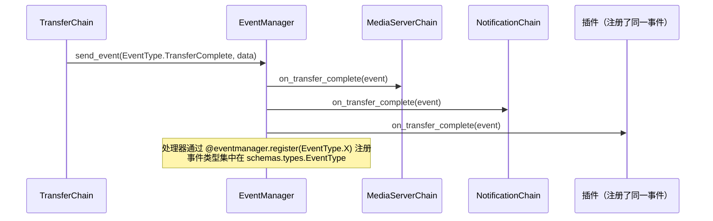

### 5.4 Oper 模式：数据访问层

数据库读写一律通过 `app/db/oper/` 下的 Oper 类，禁止在 Chain / Module / 端点中直接写
SQLAlchemy 查询。`models/` 与 `oper/` 按文件一一镜像（站点族聚合于 `oper/site.py` 等少数例外）。

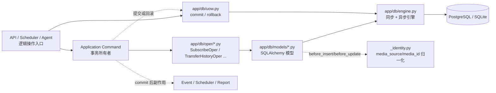

- Oper 只接收和返回持久化值；`MediaInfo` / `MetaBase` 与数据库行之间的转换属于业务逻辑，
  归 `app/application/`（见 `application/subscription/write.py`、`application/history.py`）。
  订阅新增、查询、变更、删除、身份和搜索契约已经统一收口在 `application/subscription/`，
  不再保留主题包之外的第二个写入入口。
- 规范写入口中的 Oper 只 stage mutation，不创建独立 Session、不提交；Application Command
  通过请求或任务入口注入的 UnitOfWork 统一 `commit/rollback`，事件、刷新和上报只在 commit
  成功后执行。订阅新增 Port 位于 `application/subscription/write.py`，由
  `db/adapters/subscription.py` 创建独占 Session，`startup/composition/subscription.py` 只装配回调，
  `application/subscription/write.py` 决定事务与 post-commit 边界，`SubscribeOper.stage_add()`
  只查重、`add` 和 `flush`。旧 SDK 显式构造的无会话 Oper 暂留兼容自动短会话，不得被新代码复用。
  `transaction-debt-baseline.json` 要求 Model 上的查询/写装饰器持续保持为 0。Model 与 Base
  已不再导入数据库装饰器，所有 `db` 参数都要求显式 Session；这些方法只查询或 stage，不能
  创建、提交、回滚或关闭事务。无会话入口只存在于 Oper，由 `_execute_*` 经组合根事务执行器
  承接；内置插件必须调用 Oper，不得直接导入宿主 Model。AST 门禁同时约束装饰器、可选 Session
  和插件到 Model 的依赖，保证提交权不会被底层抢走。
- **Subscription typed boundary**：`application/subscription/contract.py` 是 Subscription 与
  SubscriptionHistory 完整快照、媒体身份、写 Patch 和 Repository Protocol 的唯一 owner；JSON 列在
  Session 内复制并深度冻结。Chain/Agent 的独立操作使用短事务 adapter，请求/API/Application Command
  使用绑定当前 Session 的 adapter；两者都不向调用方泄漏 ORM。旧订阅 Oper 模块和包根符号只经同一
  `sdk/_legacy/subscribe.py` + Compat 门面保留插件 ABI，不进入 canonical `__all__`。
- **Outbox 可靠副作用**：业务行与 durable intent 在同一 Session/UoW 中提交；提交后由
  Outbox dispatcher 依据 topic、claim/lease、有限重试和 dead-letter 执行。完成通知、事件和统计
  的 post-commit 逻辑必须保持幂等，不能用普通线程或 TaskRegistry 代替持久 intent。终态历史随统一
  数据维护任务分批清理，默认成功记录保留 30 天、dead letter 保留 90 天；总开关和两项保留期由
  高级设置维护，待投递和 lease 中记录不参与清理。
- **统一历史保留期**：所有可安全按时间回收的追加型数据均受 `DATA_CLEANUP_ENABLE` 控制，包括消息、
  下载及孤儿文件、站点快照、整理历史、下载失败冷却、订阅历史、Agent 会话、Agent 任务运行和 Outbox
  终态。Agent 会话会保护任务引用，Agent 运行会保护运行中与最后一次运行；`transferpending` 和
  `plugininstallation` 承担恢复语义，禁止按年龄删除。
- 站点、历史、工作流、Agent 会话删除和插件数据重置已经形成同构事务切片；对应 Application
  Command/Service 持有 UoW，Oper 的 `stage_*` 方法只修改当前会话。插件数据重置从
  `startup/initializers/plugins.py` 注入事务能力，插件直接使用 `PluginDataOper` 的旧 ABI 仅作兼容。
- 每次表结构变更必须新增 `database/versions/` 下的 Alembic 迁移。
- 运行期业务配置使用 `SystemConfigKey` 枚举 + `SystemConfigOper`，禁止裸字符串键；
  用户级配置使用 `UserConfigOper`。

### 5.5 其他横切模式

| 模式 | 说明 |
|---|---|
| **Config Reload** | 继承 `ConfigReloadMixin` 并声明 `CONFIG_WATCH`，配置变更时自动重建长生命周期对象（如下载器客户端重连） |
| **Singleton** | `EventManager`、`ModuleManager`、`PluginManager` 等全局共享管理器继承 `foundation/singleton.py` 的 `Singleton` |
| **Managed Resource** | 可选进程级技术资源（浏览器、虚拟显示等）以 data-only `capability.toml` 声明，`runtime/extensions` 解释生命周期，`startup` 构建 Runtime，消费者经 `runtime/resources.py` 显式获取；插件使用浏览器走 `app.sdk.browser` |
| **Observability** | `runtime/observability` 定义低基数指标和默认 no-op 端口，Startup 可选装配 OTel；HTTP、DB、Event、Module、Scheduler、插件生命周期和 Agent 只提交白名单标签 |

---

## 六、典型业务调用流程

### 6.1 搜索 → 过滤 → 下载

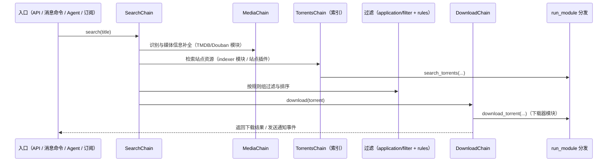

### 6.2 订阅全流程

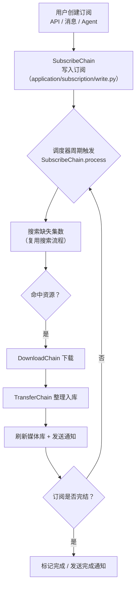

### 6.3 文件整理（Transfer）与监控

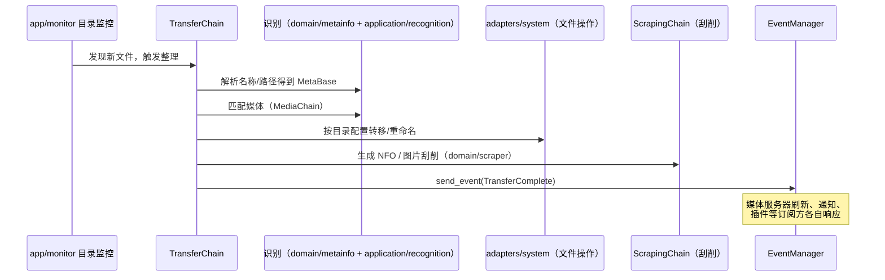

启动时 `replay_pending_transfers()` 会在后台线程回放上次未整理完的文件，保证崩溃恢复。

### 6.4 消息命令交互

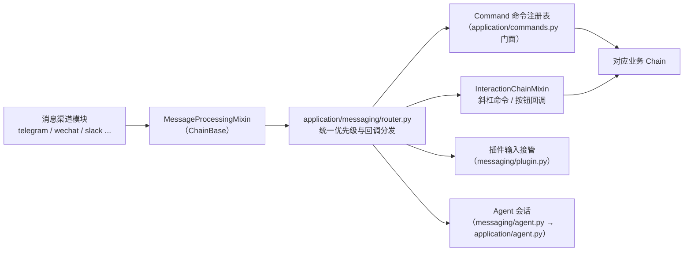

- `app/application/messaging/` 负责渠道回环入口（`ingress.py`）、消息渲染、模板、队列（`message.py`）、交互会话与视图；
  业务工作流仍由对应 Chain 执行（如媒体交互的业务部分在 `MediaInteractionChain`）。
- 该包不作为推荐给插件直接使用的公开 SDK。

---

## 七、AI Agent 子系统

Agent 采用**门面 + 惰性物化**设计，避免 `application → agent` 形成静态依赖边：

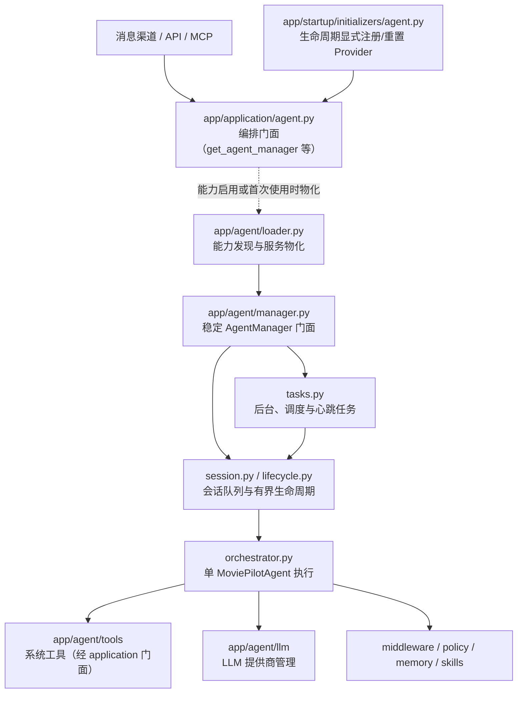

约束要点：

- Chain 访问 Agent 运行时只能经 `app/application/agent.py`；
  `app/chain/agent.py` 的 `AgentChain` 是链层入口，Agent 实现保持在 `app/agent/`。
- `app.agent.AgentManager` 是插件稳定路径，精确解析到
  `app/agent/manager.py`；宿主直接导入 owner，包根不得通配转发
  `orchestrator.py` 的任意内部名称。
- `app.agent.llm` 包根不承载实现或动态通配导出；宿主直接导入
  `llm/helper.py`、`llm/capability.py`、`llm/auth.py`、`llm/provider.py` 等 owner。
  旧 `app.agent.llm.LLMHelper` 由 Compat 精确叠加，`app.helper.llm` 直接映射到
  canonical `llm/helper.py`，三条插件路径保持同一类身份且不公开 Provider 内部 owner。
- 官方插件使用的 `MoviePilotTool` 与 `moviepilot_tool_manager` 继续由
  `agent/tools/base.py`、`agent/tools/manager.py` 原位拥有，现有 `_load_tools()` 调用保持兼容。
- Agent 工具不直接 import API / 调度器 / 命令：插件动态路由与文件夹操作使用
  `application/plugin/routes.py`、`application/plugin/folders.py`，调度和命令分别使用
  `application/scheduling.py`、`application/commands.py`。FastAPI 具体实现位于
  `adapters/web/plugin/`，入口层不承载路由实现。
- 对外暴露 MCP 端点 `/api/v1/mcp` 与 OpenAI / Anthropic 兼容端点，
  错误响应在 `app/factory.py` 中按协议原生格式单独处理（不走统一 `Response` 包装）。

---

## 八、插件系统与 SDK / 兼容边界

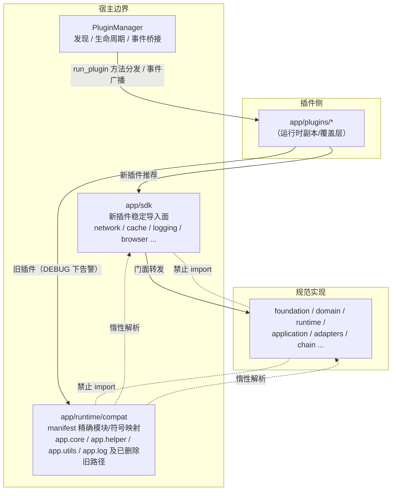

- `app/plugins/` 是运行时插件副本，不是官方插件仓库的源码副本；它不纳入宿主架构拆分的源代码审计。
  宿主代码只使用 canonical 路径；只有运行时插件与兼容性测试可用旧路径。
- `compat` 只存字符串映射并惰性解析，不得在模块导入期急切 import canonical 实现；
  canonical 包也不得为兼容而反向 import `compat` / `sdk`。
- 插件 API 的动态注册/移除及端口协议统一位于 `app/application/plugin/routes.py`，
  FastAPI 技术实现位于
  `app/adapters/web/plugin/routes.py`；FastAPI 实例由组合根（`app/factory.py`）在创建后注入，
  端点层禁止直接依赖 `factory`。
- 动态插件路由使用原生 `APIRoute`，插件自行决定返回结构；主程序的统一 `Response` 封装只适用于
  `app/api/` 的宿主端点。插件若已经自行返回 `Response`、字典、列表或其它可序列化值，宿主不再二次包裹。
- `app/runtime/extensions/plugin/manager.py` 是 canonical 管理器 owner，发现、加载、生命周期、
  目录、同步等实现共同归入 `app/runtime/extensions/plugin/`。旧插件仍从 `app.core.plugin` 或
  `app.sdk.plugins` 进入，并由 Compat 精确路由到同一个 `PluginManager` 身份。
- 插件可参与 `run_module` 方法分发（同名方法优先响应）并注册事件处理器。

---

## 九、运行时基础设施

### 9.1 runtime 与 adapters 的分工

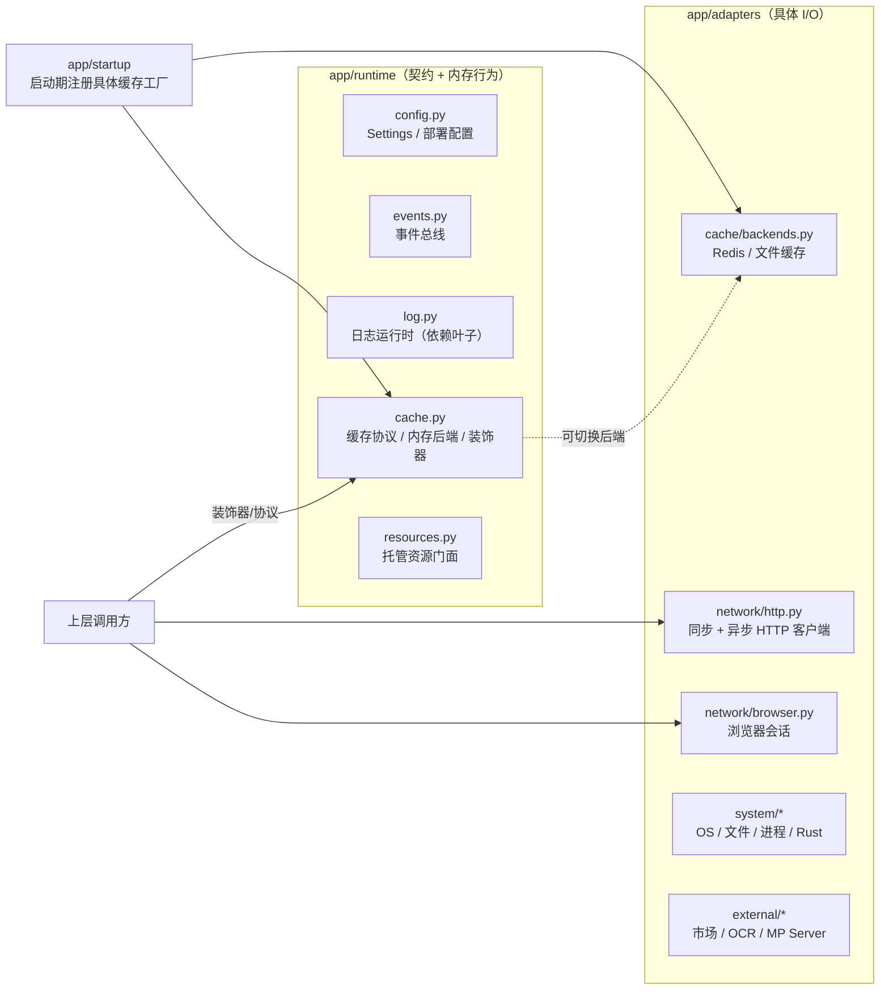

- **第三方 HTTP 的 transport 实现必须走 `RequestUtils`**（`app/adapters/network/http.py`）；
  这不授权 Application/Chain 直接导入具体 Adapter，插件使用 `app.sdk.network`。
- `app/runtime/log.py` 是依赖叶子（无任何 `app.*` 导入）；`foundation` 不输出运行日志，
  由上层所有者决定是否记录。
- 缓存契约与内存后端在 `runtime/cache.py`，Redis/文件实现在 `adapters/cache/backends.py`，
  由 startup 在被装饰的业务模块导入前完成工厂注册。

### 9.2 数据与配置总览

| 类别 | 载体 | 说明 |
|---|---|---|
| 持久化业务数据 | `app/db/models` + Alembic | 每次 schema 变更必须配套迁移 |
| 运行期业务配置 | `SystemConfigKey` + `SystemConfigOper` | 用户可编辑、跨重启持久 |
| 用户级配置 | `UserConfigOper` | 按 `user_id` 隔离 |
| 部署配置 | `runtime/config.py` 的 `Settings` | 环境变量 / `app.env` |
| 缓存 | `runtime/cache.py` 装饰器 | Redis 或文件后端可切换 |
| 站点资源 | `app/application/site/sites.*` | 生成的站点目录、认证与索引能力数据包 |

---

## 十、架构治理

架构边界中的核心子集已经由测试强制执行，其余目标不能只停留在文档约定：

- `tests/test_architecture_dependencies.py` 构建完整 Python 模块图，拒绝：
  物理遗留源码、禁止的上向依赖、SDK/compat 反向引用、包含迁移模块的强连通分量、
  模块间/模块到 Chain 的 import、入口层对 `app.modules` 内部的 import、
  Chain 直接 import 模块内部（必须走 `run_module` 分发）、`app/chain` 内的下载器 SDK 依赖。
- `tests/fixtures/architecture/dependency-baseline.json` 记录生成事实；人工审查的 SCC 分类单独存入
  `dependency-policy.json`。完整宿主 SCC 必须精确匹配 policy，新增、扩大、变形和陈旧 policy 都失败；
  `--write-host` 不会替代人工决策。
- 同一 baseline 的 `direct_adapter_imports` 记录现存原始直连；Application 与 Chain 均已清零，
  policy 目标为空集合。新增、替换、删除后未清理 policy 都会失败。
- `direct_egress` 记录全宿主 53 条 raw transport、network SDK 和协议操作 identity；普通 HTTP/
  Session bridge 与 Application DNS I/O 债务已清零，其余 canonical transport、SDK、
  stream/vendor/diagnostic/control-plane 事实是精确 containment。每条初始边的指纹由测试独立冻结，
  bindings/uses 变化、分类互换、通配导入和初始边增长都会失败；债务删除时同步删除冻结项以禁止恢复，
  `--write-host` 不会改写人工 policy 或冻结上界。
- `event_facts` 是生产者/消费者唯一收集源；运行快照记录 86 个生产调用和 17 个消费注册，
  consumer 的 17 个唯一 fingerprint 另由只读人工 policy 精确准入。CI 将语义 policy 与生成快照
  分成独立步骤，前者不能通过刷新后者绕过。
- 任何所有权迁移必须同步更新：canonical 导入、`app/runtime/compat/manifest.py`、
  SDK 导出（若公开）、`docs/rules/05-architecture.md` 与上述架构测试。
- 延迟导入不被接受为隐藏循环依赖的手段。

### 10.1 2026-09-03 当前收口状态与后续边界

当前宿主架构基线（排除 `app/plugins/**`）如下；数字来自
`tests/fixtures/architecture/`，更新基线前必须先审查语义变化：

| 指标 | 当前值 |
|---|---:|
| Python 模块 | 973 |
| 内部导入边 | 8,220 |
| 非平凡 SCC | 1（精确 containment 的 TMDB 移植包环） |
| Application / Chain 具体 Adapter 直连 | 0 / 0 |
| Direct egress | 53（债务已清零，53 条精确 containment） |
| Module Contract V2 spec | 215（其中 211 个进入 `run_module` 观察面） |
| Event Contract | 53 |
| Event producer / consumer | 86（85 静态、1 动态）/ 17（16 静态、1 动态） |
| Model/Oper 自动事务与自建 Session | 0 |
| 组合根外 `SystemConfigOper()` | 0 |

架构专项验证分为两个 CI 投影：`Check event semantic policy` 先运行依赖、Adapter、出口和 Event
语义门禁，`Check host architecture snapshot` 再执行快照测试及一次
`scripts/architecture/baseline.py --check-host`。快照一致只说明事实未漂移，不能替代边界合理性审查。
本轮最终实现头 `c204e2e97` 的 Unit Tests `33269394727` 与 Pylint `33269394716` 均已成功；
本地锁定全量为 `7659 passed, 9 skipped`，官方插件兼容基线基于
`161fce34caa31deb7d82dd50a31f217d5e6784c2` 通过。S0-S3 与 S5 已全部交付，S4 按维护者决定取消。

本总览与本轮架构治理的关系如下：

- 已完成的宿主边界：旧 `app.core` / `app.helper` / `app.utils` / `app.log` 根路径通过
  `app/runtime/compat/manifest.py` 精确映射；订阅、历史、用户认证等旧 Oper 入口通过
  `app/sdk/_legacy/` 薄门面保留行为兼容。兼容清单是导入路由，不负责合并模块，也不负责把任意
  新实现重新导出到旧模块。
- 已完成的插件边界：插件 API 的动态路由由 application 端口 + web adapter 组成，使用原生
  `APIRoute` 保留插件响应；插件管理器归入 `runtime/extensions/plugin/manager.py`，旧 ABI
  只由 SDK/Compat 路由；`app/plugins/` 仅作为运行时插件副本/覆盖层处理。
- 已完成的主题收口：订阅 DTO/Port 归入 `app/application/subscription/contract.py`，用例写入归入
  `app/application/subscription/write.py`，SQLAlchemy 实现只在 `app/db/adapters/subscription.py`；插件动态路由与
  文件夹操作归入 `app/application/plugin/routes.py`、`folders.py`。原
  `app/application/subscribe.py`、`app/application/plugins.py` 未形成插件 ABI，已经直接删除，
  宿主调用统一改为 canonical 路径。
- 已完成的运行时可靠性收口：已迁移的主干后台任务由 TaskRegistry 或领域 lifecycle owner 管理；
  durable-required 事件和
  订阅关键副作用经 `app/application/outbox.py` 与 `app/db/adapters/outbox.py` 进入同事务 Outbox；
  搜索逐页任务、Agent/消息事件和插件市场子任务均遵守请求或生命周期 owner，不再由入口模块维护
  无法追踪的裸任务集合。
- Scheduler 已从单体迁入 `app.scheduler` 同名职责包，startup 是业务 callable 的唯一构造与注入边界；
  功能、生命周期、架构、兼容、文档与官方插件基线均已完成独立验证。
- 判断是否需要新增 manifest 映射的标准：只有当旧物理模块被删除、改名或公开符号迁移时才登记；
  物理文件仍是稳定入口的，不应为了目录规整新增“自己映射自己”的别名，也不应在 canonical 包中
  保留多余导出。

当前架构问题、优先级、分阶段实施步骤与验收门禁见
[`docs/architecture/optimization-checklist.md`](architecture/optimization-checklist.md)。

---

## 附录：相关文档索引

| 文档 | 内容 |
|---|---|
| [`docs/rules/01-project-overview.md`](rules/01-project-overview.md) | 系统目标与业务范围 |
| [`docs/rules/02-tech-stack.md`](rules/02-tech-stack.md) | 技术栈与第三方集成 |
| [`docs/rules/04-design-patterns.md`](rules/04-design-patterns.md) | Module / Chain / Event / Oper 等模式细则 |
| [`docs/rules/05-architecture.md`](rules/05-architecture.md) | 层边界、依赖方向与关键文件位置（权威） |
| [`docs/rules/09-external-response.md`](rules/09-external-response.md) | 外部 HTTP 约定与统一响应格式 |
| [`docs/rules/10-data-and-persistent.md`](rules/10-data-and-persistent.md) | 数据模型、迁移与缓存规范 |
| [`docs/subscribe-lifecycle.md`](subscribe-lifecycle.md) | 订阅生命周期详解 |
| [`docs/mcp-api.md`](mcp-api.md) | MCP 工具端点说明 |
| [`docs/architecture/optimization-checklist.md`](architecture/optimization-checklist.md) | 当前架构差距、优先级与可执行优化清单 |
| [`docs/architecture/refactor-roadmap.md`](architecture/refactor-roadmap.md) | 多级 Goal、叶子依赖、清零条件与交付状态 |
| [`docs/v3t-runtime-governance.md`](v3t-runtime-governance.md) | V3/V3t 运行依赖、故障恢复、GIL 可观测性与兼容退场门禁 |
| [`docs/adr/0007-background-action-reliability.md`](adr/0007-background-action-reliability.md) | 后台动作 E0–E3 可靠性分级与完成语义决策 |
