# MoviePilot v3 架构设计

> 本文面向开发人员，以图文结合的方式说明 MoviePilot v3 的整体架构：分层结构、各核心包的职责、
> 模块间调用关系、典型业务流程与启动生命周期。
>
> 规范性约束以 [`docs/rules/05-architecture.md`](rules/05-architecture.md) 与
> [`docs/rules/04-design-patterns.md`](rules/04-design-patterns.md) 为准，本文与其保持一致；
> 如出现差异，以规则文档为准。
>
> *Last Updated: 2026-08-21*

---

## 一、系统概述

MoviePilot 是一个聚焦影视自动化核心流程的系统，实现**订阅、搜索、下载、文件整理、元数据刮削、
媒体库刷新与消息通知**的全流程自动化。后端基于 FastAPI，前端基于 Vue 3（独立仓库），
同时对外提供 REST API、MCP 工具调用端点（`/api/v1/mcp`）与 OpenAI / Anthropic 兼容协议端点，
内置 AI Agent 支持自然语言操控系统。

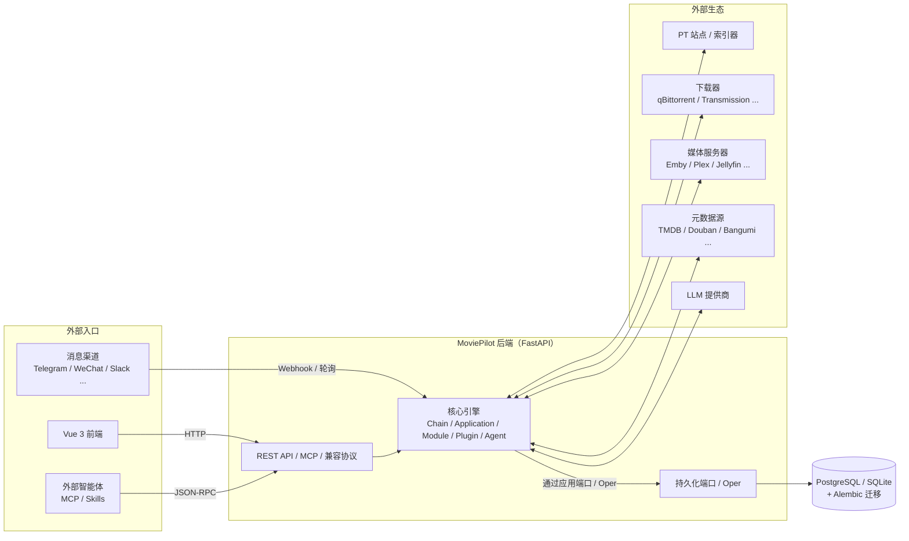

---

## 二、整体分层架构

MoviePilot v3 采用严格的单向依赖分层。历史包 `app/core`、`app/helper`、`app/utils`
已不再存在物理目录，仅作为旧插件的**虚拟兼容导入根**保留。

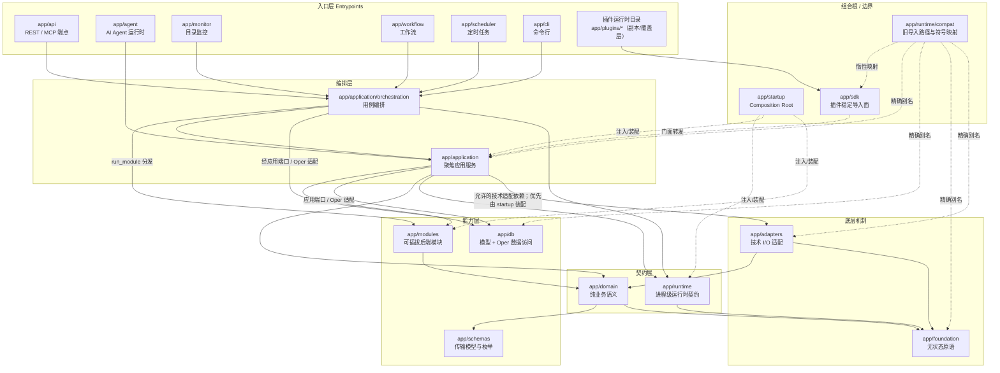

图中的 `Chain → Db`、`Application → Db` 表示通过应用端口、Oper 或组合根注入的实现完成持久化，
不是允许在用例代码中直接创建数据库引擎或拼接 SQL。`compat` 也不是只面向 SDK 的转发层，
它按 `app/runtime/compat/manifest.py` 的白名单把已经删除的旧模块/符号精确映射到各自的 canonical
归属。`app/application/subscribe.py` 与 `app/application/plugins.py` 都是 V3 重构过程中新增、
未形成插件 ABI 的宿主内部聚合文件，主题实现收口后直接删除，不在 manifest 中制造新的兼容债务。

**依赖方向的核心约束**（由 `tests/test_architecture_dependencies.py` 强制检查）：

| 方向 | 状态 |
|---|---|
| 入口层 → Chain / Application / Oper | 允许（按工作流复杂度选择） |
| Chain → Module | 仅允许通过 `run_module` 方法名分发，禁止直接 import 模块内部 |
| Chain → Agent 实现 | 禁止；只能经 `app/application/agent.py` 门面 |
| Application → Domain / Runtime / Adapter / Oper | 允许 |
| Module → Module / Chain | 禁止（跨模块编排一律进 Chain） |
| Adapter → Application / runtime.extensions / sdk / compat | 禁止 |
| Domain → Runtime / Adapter / Application / DB | 禁止 |
| Foundation → 任何其他 app 包 | 禁止 |
| 规范实现包 → sdk / compat | 禁止 |
| 任何形成模块级循环依赖的 import | 禁止（延迟导入也不被接受） |

---

## 三、核心包职责速查

| 包 | 职责 | 代表性文件 |
|---|---|---|
| `app/foundation/` | 无状态、无配置、无 I/O 的底层原语：反射/动态导入、加密、DOM、单例、文本、URL、版本比较 | `reflection.py`、`crypto.py`、`singleton.py` |
| `app/domain/` | 纯 MoviePilot 业务语义：媒体上下文、识别解析、站点状态解释、磁力语义、NFO 刮削 | `context.py`、`metainfo.py`、`meta/`、`scraper.py` |
| `app/runtime/` | 进程级运行机制：配置、进程拓扑、事件、完整日志、缓存契约与内存后端、并发、调度、限流、本地化、GC、重启状态 | `config.py`、`topology.py`、`events.py`、`log.py`、`cache.py` |
| `app/runtime/extensions/` | 模块 / 插件 / 配置化服务 / 托管资源的发现、注册与生命周期适配；旧管理器文件保留稳定 ABI 门面，具体实现拆在主题子包 | `module_manager.py`、`plugin_manager.py`、`plugin/` |
| `app/runtime/compat/` | 仅标准库的精确旧模块、包与符号导入路由；不是业务实现，也不是通用 re-export 层 | `manifest.py`、`imports.py` |
| `app/adapters/network/` | 通用 HTTP、浏览器、DNS、Cloudflare、IP 传输机制 | `http.py`、`browser.py` |
| `app/adapters/cache/` | Redis 与文件缓存的具体实现 | `backends.py`、`redis.py` |
| `app/adapters/system/` | OS/文件/进程/stdio/显示/包安装/Rust 加速适配 | `host.py`、`resource.py`、`fsproxy.py` |
| `app/adapters/external/` | 命名外部生态：插件市场、CookieCloud、OCR、IP 归属、MP Server、微信加密 | `market.py`、`server.py`、`wechat_crypt.py` |
| `app/application/` | 读取配置/持久化状态的聚焦应用服务：识别、过滤、通知、RSS、站点、下载器、媒体服务器、存储、整理规则等；同一主题拆成子包 | `recognition.py`、`rules.py`、`rss.py`、`site/`、`subscription/`、`plugin/` |
| `app/application/subscription/` | 订阅新增、查询、变更、删除、媒体身份与搜索契约 | `write.py`、`contract.py`、`mutation.py`、`delete.py`、`identity.py`、`search.py` |
| `app/application/plugin/` | 插件市场、安装、运行时端口、文件夹操作和动态路由用例；具体 FastAPI 路由适配器在 adapters 层 | `catalog.py`、`install.py`、`runtime.py`、`folders.py`、`routes.py` |
| `app/application/messaging/` | 消息渲染/路由、命令交互会话、插件按钮回调、Agent 消息桥接 | `message.py`、`router.py`、`agent.py` |
| `app/application/security/` | 认证、授权、Cookie、Passkey、OTP/二次认证、SSRF 与 URL/路径安全 | `auth.py`、`url.py`、`twofactor.py` |
| `app/application/orchestration/` | 跨入口复用的用例编排：订阅、搜索、下载、整理、媒体、消息等 Chain | `subscribe.py`、`search.py`、`transfer.py` |
| `app/modules/` | 可插拔后端：下载器、媒体服务器、元数据源、消息渠道、索引器、存储 | `qbittorrent/`、`emby/`、`telegram/`、`themoviedb/` |
| `app/db/` | SQLAlchemy 模型（`models/`）与一一对应的数据访问类（`oper/`） | `models/subscribe.py` ↔ `oper/subscribe.py` |
| `app/schemas/` | Pydantic 传输模型、枚举（`ModuleType`（已退为元数据）、`EventType`、`SystemConfigKey`、`NotificationChannel` 等） | `types.py`、`context.py` |
| `app/api/` | FastAPI 主端点、鉴权依赖、统一 `Response` 响应封装；动态插件端点不走此统一包装 | `apiv1.py`、`endpoints/`、`response.py` |
| `app/adapters/web/plugin/` | FastAPI 动态插件路由的技术适配：注册/移除、认证依赖、OpenAPI 重建；保留插件原生响应结构 | `routes.py` |
| `app/agent/` | AI Agent：编排器、运行时、工具、中间件、LLM、记忆、技能、策略 | `orchestrator.py`、`runtime_loader.py`、`tools/` |
| `app/startup/` | 组合根：装配注入、初始化/关停排序、重启策略 | `lifecycle.py`、`modules_initializer.py` |
| `app/sdk/` | 面向新插件的稳定导入面（网络、缓存、日志、浏览器等）；`_legacy/` 只承载旧插件行为适配薄门面 | `network.py`、`browser.py`、`cache.py`、`_legacy/` |
| `app/monitor/` | 源目录监控 → 触发整理 | `watcher.py`、`dispatcher.py` |
| `app/workflow/` | 工作流引擎 | — |
| `app/plugins/` | 插件运行时副本/覆盖目录，由插件管理器加载；不是官方插件源码或宿主架构实现，架构审计以插件仓库与宿主边界为准 | — |

---

## 四、启动与生命周期

`app/startup/` 是全应用唯一的组合根：负责向低层注入依赖、编排初始化/关停顺序、决定重启策略。
低层模块不允许反向 import `startup`。

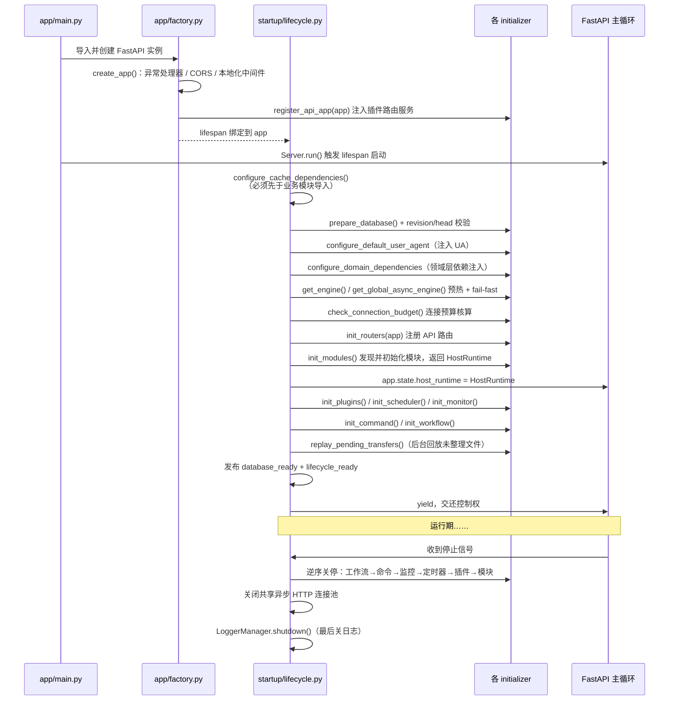

关键设计点：

- **缓存装配先于业务导入**：缓存装饰器会在业务模块 import 时创建后端，
  因此 `configure_cache_dependencies()` 在 `lifecycle.py` 顶部即执行。
- **Uvicorn 入口分流**：生产单 worker 使用带协作停止语义的 `MoviePilotServer`；开发 reload
  和安全模式多 worker 使用 `app.factory:create_app` import string/factory，由 supervisor
  创建应用实例。`app.factory:app` 继续保留给既有 ASGI supervisor 和测试使用。
- **数据库准备唯一入口**：建表、迁移、迁移前备份和 Alembic head 校验统一由 lifespan
  最早的“数据库准备”组件执行，`app.main` 不再主动迁移。主程序、外部 supervisor、factory
  和 TestClient 因而共享同一 fail-fast 语义。
- **引擎预热 fail-fast**：同步/异步数据库引擎在单线程期完成首次创建，
  避免调度器放出大量线程后再创建引擎导致连接锁竞争。
- **类型化请求装配**：`startup/context.py` 的 frozen slots `HostRuntime` 是 lifespan 内唯一宿主
  上下文，`api/context.py` 从 `app.state` 收窄到具体领域能力。认证、消息、历史、媒体服务器、站点、
  订阅、工作流和请求事务均使用命名 runtime 字段，不再通过字符串仓储键定位；API、Scheduler、Chain
  从 `HostRuntime.configuration` 获取 frozen 配置快照。系统设置管理 API 通过
  `HostRuntime.settings` 的窄服务读写可变部署设置，业务域不接触 Settings 实例；生产与测试组合根统一
  复用 `startup/configuration.py` 的映射。`ApiDataPorts` 仅保留旧导入 ABI，不参与正式请求链路。
- **安全模式**：`MOVIEPILOT_SAFE_MODE` 会跳过插件、定时器、监控器、命令与工作流，用于故障自救。
- **进程拓扑**：全功能 V3 强制 `API_WORKERS=1`，避免每个 worker 重复启动插件和后台控制面；安全模式可临时使用多 worker 诊断，但不是正式扩容方案。
- **健康语义**：`/health/live` 只确认进程和事件循环可响应；`/health/ready` 仅在数据库
  到达当前 head 且生命周期完成后返回 200，启动失败或关停阶段返回 503。两者不公开路径、
  revision、插件和异常详情，深入诊断继续使用 Doctor。
- **关停隔离**：每个关停步骤由 `run_shutdown_step` 独立捕获异常，保证后续资源仍有机会释放。

---

## 五、核心设计模式

### 5.1 Module 模式：可插拔后端

`app/modules/` 下每个目录是一个可插拔后端（下载器、媒体服务器、消息渠道、元数据源、索引器、
存储等），均继承 `_ModuleBase` 并实现统一契约：

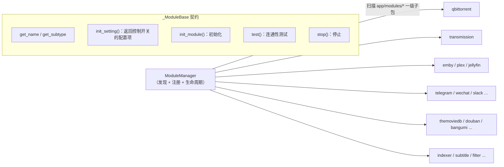

- 模块由 `runtime/extensions/module_manager.py` 发现并管理生命周期；
  `app/modules/_base/` 承载各模块族的共享模板基类（下载器、媒体服务器、消息渠道）。
- 模块开关由 `init_setting()` 声明的配置项决定（如 `DOWNLOADER = "qbittorrent"`）。
- **模块之间、模块到 Chain 的直接依赖被禁止**，跨模块编排一律由 Chain 完成。
- 渠道/存储的管理操作遵循统一契约：`channel_manage(channel, action, **params)` /
  `storage_manage(storage, action, **params)`，结果统一为 `{"success", "message", "data"}` 形态，
  Chain 与端点只做透传。

### 5.2 Chain 模式：用例编排

`app/application/orchestration/` 承载被 API、CLI、Agent、调度器、Webhook 等多入口共享的业务用例。
所有 Chain 继承 `ChainBase`，Chain 访问模块**只能通过方法名分发**：

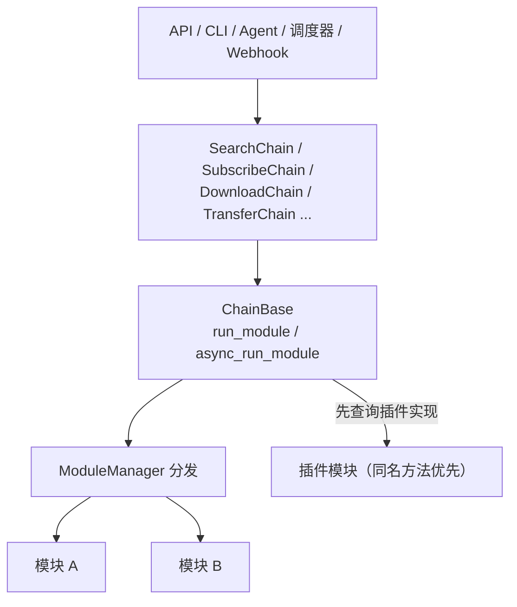

- `run_module("method_name", **kwargs)` 会遍历所有实现了该方法的模块并聚合结果；
  插件若实现了同名方法可获得优先响应。
- `app/application/orchestration/` 中下划线前缀文件（`_recognition.py`、`_messaging.py`、`_interaction.py`、
  `_music.py`、`_transfer.py`）是 `ChainBase` 的功能域 Mixin，不是独立 Chain。
- 需要斜杠命令交互的 Chain 继承 `InteractionChainMixin`，只实现 `_interaction_handler`。

### 5.3 Event 模式：跨切面事件

`EventManager`（`app/runtime/events.py`）提供进程级事件总线，用于解耦跨切面反应
（整理完成后刷新媒体库、配置变更后重载模块、消息分发等）：

宿主内建 `EventType` / `ChainEventType` 均在事件注册表中绑定 typed payload。开放插件事件允许
额外字段，校验只生成诊断；分发给既有插件的仍是原始 dict/model 对象，不改变事件 ABI。

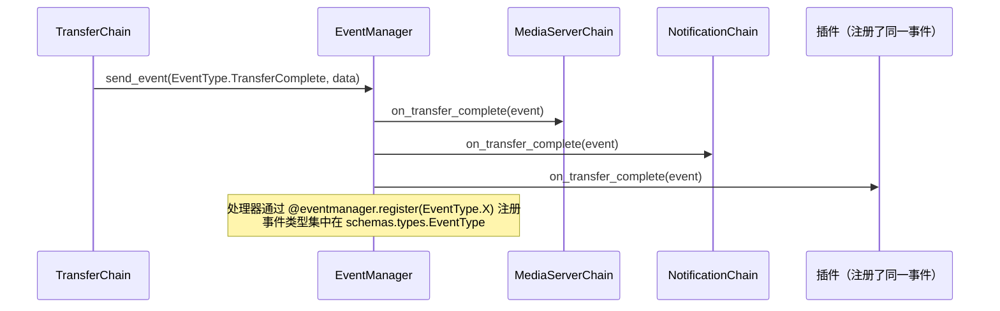

### 5.4 Oper 模式：数据访问层

数据库读写一律通过 `app/db/oper/` 下的 Oper 类，禁止在 Chain / Module / 端点中直接写
SQLAlchemy 查询。`models/` 与 `oper/` 按文件一一镜像（站点族聚合于 `oper/site.py` 等少数例外）。

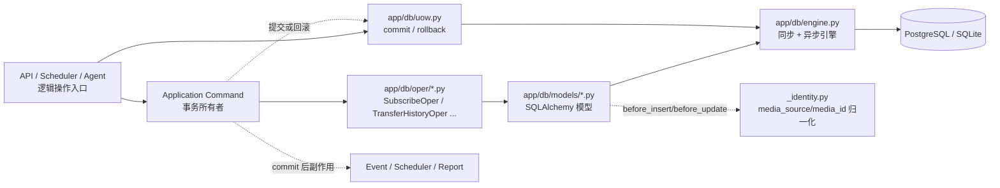

- Oper 只接收和返回持久化值；`MediaInfo` / `MetaBase` 与数据库行之间的转换属于业务逻辑，
  归 `app/application/`（见 `application/subscription/write.py`、`application/history.py`）。
  订阅新增、查询、变更、删除、身份和搜索契约已经统一收口在 `application/subscription/`，
  不再保留主题包之外的第二个写入入口。
- 规范写入口中的 Oper 只 stage mutation，不创建独立 Session、不提交；Application Command
  通过请求或任务入口注入的 UnitOfWork 统一 `commit/rollback`，事件、刷新和上报只在 commit
  成功后执行。订阅新增样板由 `startup/subscription.py` 创建独占 Session，
  `application/subscription/write.py` 决定事务与 post-commit 边界，`SubscribeOper.stage_add()`
  只查重、`add` 和 `flush`。旧 SDK 显式构造的无会话 Oper 暂留兼容自动短会话，不得被新代码复用。
  `transaction-debt-baseline.json` 当前冻结 123 个只读查询装饰器；原有 45 个同步/异步写装饰器
  已全部移除，`db_update` 与 `async_db_update` 必须持续保持为 0。宿主 Oper 也不得调用 Base 保留的
  `create/update/delete/truncate` 兼容包装器；AST 门禁保证显式 Session 的提交权不会被底层抢走。
- 站点、历史、工作流、Agent 会话删除和插件数据重置已经形成同构事务切片；对应 Application
  Command/Service 持有 UoW，Oper 的 `stage_*` 方法只修改当前会话。插件数据重置从
  `startup/plugins_initializer.py` 创建独占会话，插件直接使用 `PluginDataOper` 的旧 ABI 仅作兼容。
- 每次表结构变更必须新增 `database/versions/` 下的 Alembic 迁移。
- 运行期业务配置使用 `SystemConfigKey` 枚举 + `SystemConfigOper`，禁止裸字符串键；
  用户级配置使用 `UserConfigOper`。

### 5.5 其他横切模式

| 模式 | 说明 |
|---|---|
| **Config Reload** | 继承 `ConfigReloadMixin` 并声明 `CONFIG_WATCH`，配置变更时自动重建长生命周期对象（如下载器客户端重连） |
| **Singleton** | `EventManager`、`ModuleManager`、`PluginManager` 等全局共享管理器继承 `foundation/singleton.py` 的 `Singleton` |
| **Managed Resource** | 可选进程级技术资源（浏览器、虚拟显示等）以 data-only `capability.toml` 声明，`runtime/extensions` 解释生命周期，`startup` 构建 Runtime，消费者经 `runtime/managed_resources.py` 显式获取；插件使用浏览器走 `app.sdk.browser` |
| **Observability** | `runtime/observability` 定义低基数指标和默认 no-op 端口，Startup 可选装配 OTel；HTTP、DB、Event、Module、Scheduler、插件生命周期和 Agent 只提交白名单标签 |

---

## 六、典型业务调用流程

### 6.1 搜索 → 过滤 → 下载

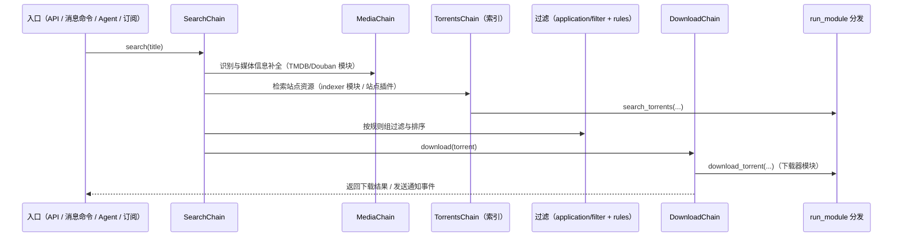

### 6.2 订阅全流程

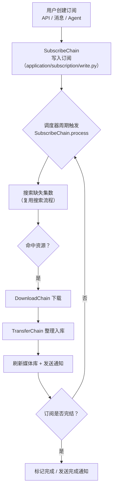

### 6.3 文件整理（Transfer）与监控

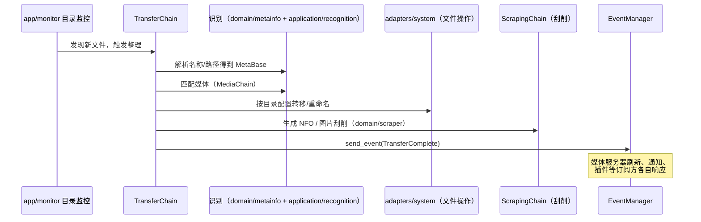

启动时 `replay_pending_transfers()` 会在后台线程回放上次未整理完的文件，保证崩溃恢复。

### 6.4 消息命令交互

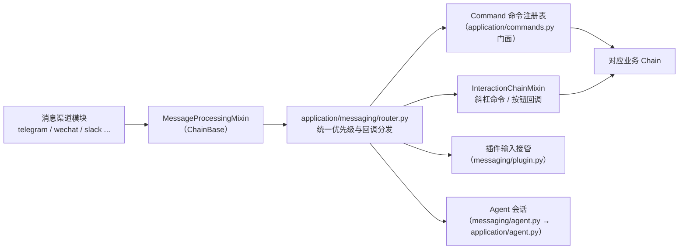

- `app/application/messaging/` 负责消息渲染、模板、队列（`message.py`）、交互会话与视图；
  业务工作流仍由对应 Chain 执行（如媒体交互的业务部分在 `MediaInteractionChain`）。
- 该包不作为推荐给插件直接使用的公开 SDK。

---

## 七、AI Agent 子系统

Agent 采用**门面 + 惰性物化**设计，避免 `application → agent` 形成静态依赖边：

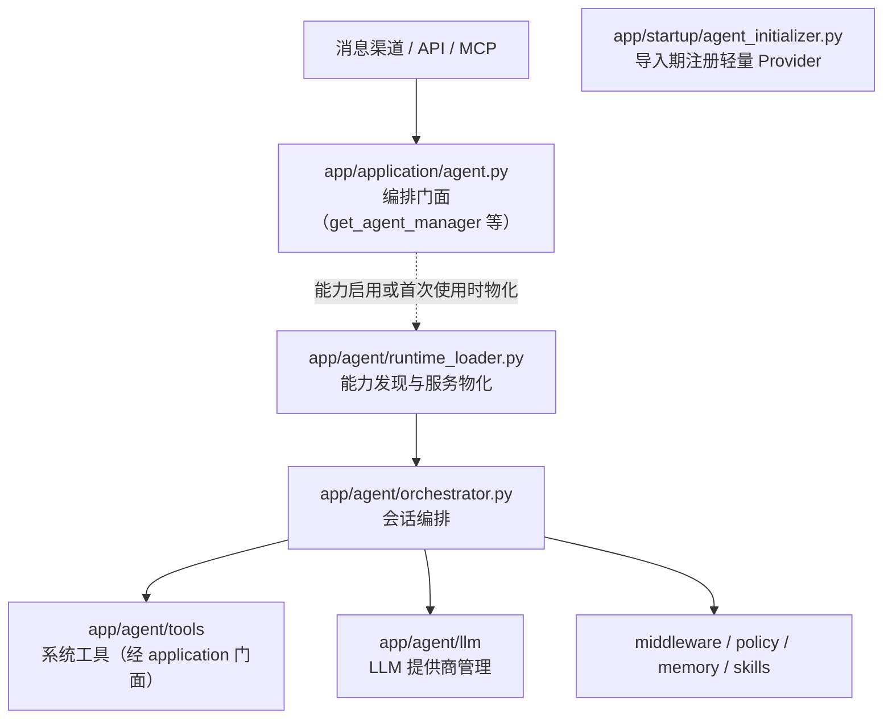

约束要点：

- Chain 访问 Agent 运行时只能经 `app/application/agent.py`；
  `app/application/orchestration/agent.py` 的 `AgentChain` 是链层入口，Agent 实现保持在 `app/agent/`。
- Agent 工具不直接 import API / 调度器 / 命令：插件动态路由与文件夹操作使用
  `application/plugin/routes.py`、`application/plugin/folders.py`，调度和命令分别使用
  `application/scheduling.py`、`application/commands.py`。FastAPI 具体实现位于
  `adapters/web/plugin/`，入口层不承载路由实现。
- 对外暴露 MCP 端点 `/api/v1/mcp` 与 OpenAI / Anthropic 兼容端点，
  错误响应在 `app/factory.py` 中按协议原生格式单独处理（不走统一 `Response` 包装）。

---

## 八、插件系统与 SDK / 兼容边界

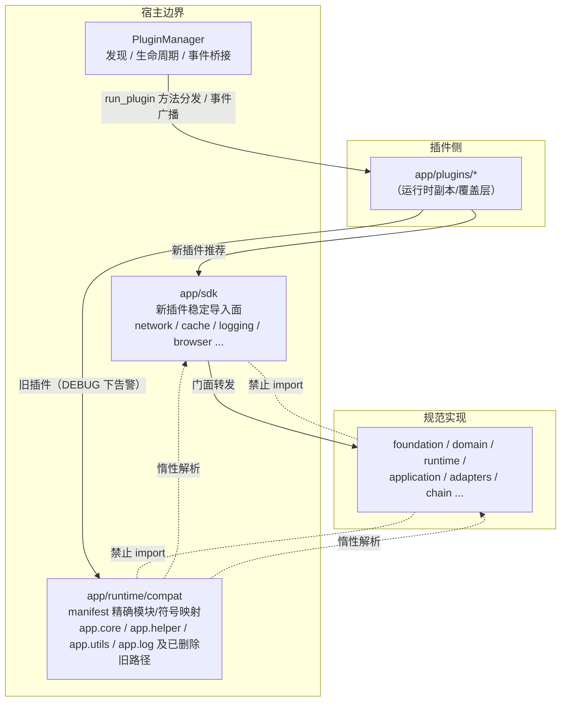

- `app/plugins/` 是运行时插件副本，不是官方插件仓库的源码副本；它不纳入宿主架构拆分的源代码审计。
  宿主代码只使用 canonical 路径；只有运行时插件与兼容性测试可用旧路径。
- `compat` 只存字符串映射并惰性解析，不得在模块导入期急切 import canonical 实现；
  canonical 包也不得为兼容而反向 import `compat` / `sdk`。
- 插件 API 的动态注册/移除及端口协议统一位于 `app/application/plugin/routes.py`，
  FastAPI 技术实现位于
  `app/adapters/web/plugin/routes.py`；FastAPI 实例由组合根（`app/factory.py`）在创建后注入，
  端点层禁止直接依赖 `factory`。
- 动态插件路由使用原生 `APIRoute`，插件自行决定返回结构；主程序的统一 `Response` 封装只适用于
  `app/api/` 的宿主端点。插件若已经自行返回 `Response`、字典、列表或其它可序列化值，宿主不再二次包裹。
- `app/runtime/extensions/plugin_manager.py` 是保留插件 ABI 的管理器门面，发现、加载、生命周期、
  目录、同步等实现按扩展生命周期的时刻拆在 `app/runtime/extensions/` 的 `contract/`、
  `admission/`、`registry/`、`projection/`、`lifecycle/` 五个包里；这个“门面 + 实现包”是有意
  的兼容边界，不应为了目录整齐而让外部插件改用内部实现文件。
- 插件可参与 `run_module` 方法分发（同名方法优先响应）并注册事件处理器。

---

## 九、运行时基础设施

### 9.1 runtime 与 adapters 的分工

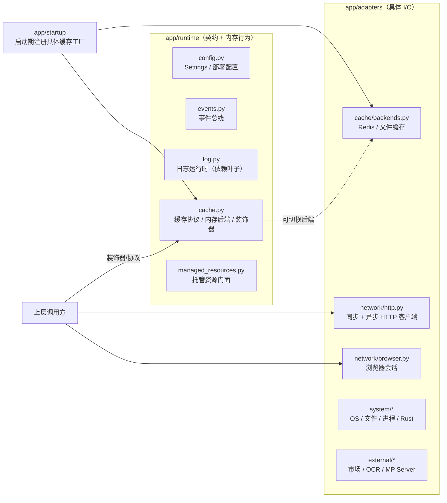

- **所有第三方 HTTP 请求必须走 `RequestUtils`**（`app/adapters/network/http.py`）；
  插件使用 `app.sdk.network`。
- `app/runtime/log.py` 是依赖叶子（无任何 `app.*` 导入）；`foundation` 不输出运行日志，
  由上层所有者决定是否记录。
- 缓存契约与内存后端在 `runtime/cache.py`，Redis/文件实现在 `adapters/cache/backends.py`，
  由 startup 在被装饰的业务模块导入前完成工厂注册。

### 9.2 数据与配置总览

| 类别 | 载体 | 说明 |
|---|---|---|
| 持久化业务数据 | `app/db/models` + Alembic | 每次 schema 变更必须配套迁移 |
| 运行期业务配置 | `SystemConfigKey` + `SystemConfigOper` | 用户可编辑、跨重启持久 |
| 用户级配置 | `UserConfigOper` | 按 `user_id` 隔离 |
| 部署配置 | `runtime/config.py` 的 `Settings` | 环境变量 / `app.env` |
| 缓存 | `runtime/cache.py` 装饰器 | Redis 或文件后端可切换 |
| 站点资源 | `app/application/site/sites.*` | 生成的站点目录、认证与索引能力数据包 |

---

## 十、架构治理

架构边界不是文档约定，而是**由测试强制执行的门禁**：

- `tests/test_architecture_dependencies.py` 构建完整 Python 模块图，拒绝：
  物理遗留源码、禁止的上向依赖、SDK/compat 反向引用、包含迁移模块的强连通分量、
  模块间/模块到 Chain 的 import、入口层对 `app.modules` 内部的 import、
  Chain 直接 import 模块内部（必须走 `run_module` 分发）、`app/application/orchestration` 内的下载器 SDK 依赖。
- 任何所有权迁移必须同步更新：canonical 导入、`app/runtime/compat/manifest.py`、
  SDK 导出（若公开）、`docs/rules/05-architecture.md` 与上述架构测试。
- 延迟导入不被接受为隐藏循环依赖的手段。

### 10.1 2026-08-18 收口状态与后续边界

本总览与本轮架构治理的关系如下：

- 已完成的宿主边界：旧 `app.core` / `app.helper` / `app.utils` / `app.log` 根路径通过
  `app/runtime/compat/manifest.py` 精确映射；订阅、历史、用户认证等旧 Oper 入口通过
  `app/sdk/_legacy/` 薄门面保留行为兼容。兼容清单是导入路由，不负责合并模块，也不负责把任意
  新实现重新导出到旧模块。
- 已完成的插件边界：插件 API 的动态路由由 application 端口 + web adapter 组成，使用原生
  `APIRoute` 保留插件响应；插件管理器保留 `plugin_manager.py` 的稳定 ABI，内部实现按扩展
  生命周期的时刻拆在 `runtime/extensions/` 的各阶段包里；`app/plugins/` 仅作为运行时插件
  副本/覆盖层处理。
- 已完成的主题收口：订阅写入归入 `app/application/subscription/write.py`；插件动态路由与
  文件夹操作归入 `app/application/plugin/routes.py`、`folders.py`。原
  `app/application/subscribe.py`、`app/application/plugins.py` 未形成插件 ABI，已经直接删除，
  宿主调用统一改为 canonical 路径。
- 判断是否需要新增 manifest 映射的标准：只有当旧物理模块被删除、改名或公开符号迁移时才登记；
  物理文件仍是稳定入口的，不应为了目录规整新增“自己映射自己”的别名，也不应在 canonical 包中
  保留多余导出。

详细的迁移批次、风险、验证命令和插件兼容矩阵见
[`docs/refactor/backend-architecture-governance.md`](refactor/backend-architecture-governance.md) 与
[`docs/refactor/backend-module-refactor-compatibility.md`](refactor/backend-module-refactor-compatibility.md)。
第一阶段分层收口后的进程拓扑、事务所有权、类型化运行时契约、后台可靠性和可观测性路线见
[`docs/refactor/backend-architecture-next-stage.md`](refactor/backend-architecture-next-stage.md)。

---

## 附录：相关文档索引

| 文档 | 内容 |
|---|---|
| [`docs/rules/01-project-overview.md`](rules/01-project-overview.md) | 系统目标与业务范围 |
| [`docs/rules/02-tech-stack.md`](rules/02-tech-stack.md) | 技术栈与第三方集成 |
| [`docs/rules/04-design-patterns.md`](rules/04-design-patterns.md) | Module / Chain / Event / Oper 等模式细则 |
| [`docs/rules/05-architecture.md`](rules/05-architecture.md) | 层边界、依赖方向与关键文件位置（权威） |
| [`docs/rules/09-external-response.md`](rules/09-external-response.md) | 外部 HTTP 约定与统一响应格式 |
| [`docs/rules/10-data-and-persistent.md`](rules/10-data-and-persistent.md) | 数据模型、迁移与缓存规范 |
| [`docs/subscribe-lifecycle.md`](subscribe-lifecycle.md) | 订阅生命周期详解 |
| [`docs/mcp-api.md`](mcp-api.md) | MCP 工具端点说明 |
| [`docs/refactor/backend-architecture-governance.md`](refactor/backend-architecture-governance.md) | 分阶段架构治理、边界门禁与迁移验收 |
| [`docs/refactor/backend-module-refactor-compatibility.md`](refactor/backend-module-refactor-compatibility.md) | 模块迁移与插件兼容层实施矩阵 |
| [`docs/refactor/backend-architecture-next-stage.md`](refactor/backend-architecture-next-stage.md) | 对标优秀 Python 后端后的二阶段任务、验收与回滚方案 |
