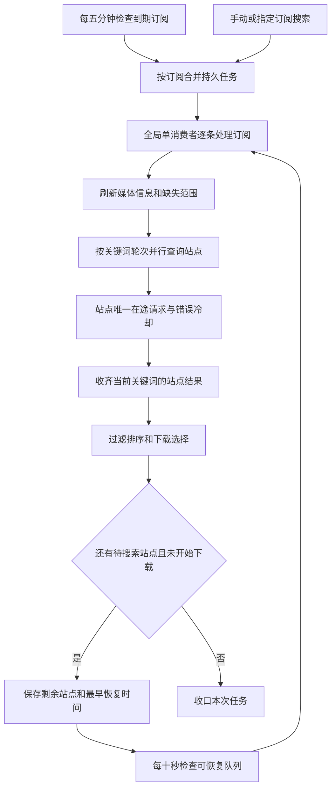

# V3 订阅自动搜索机制审查

审查日期：2026-09-09。后端基线 `ef978d606`，前端基线 `e5de69f4`。
结论来自当前源码和隔离测试；没有连接用户部署、采集生产数据库或测量真实站点响应速度。

## 当前链路

- 自动周期由 `subscription_search_due()` 使用 `search_interval` / 系统间隔与 `last_search` 判断。
- `active_key` 合并同一订阅的重复请求；订阅准入阻止 Search 和 Match 同时修改同一订阅。
- 站点预算是非阻塞认领。忙碌站点通常十秒后再试，错误冷却按类别指数退避。
- 成功站点不追加冷却；站点配置的访问间隔仍在 provider 中执行。
- 未完成站点通过 `pending_site_ids` 保存，普通续跑不会重新访问已经完成的站点或插件搜索源。
- 正常定时入口持久来源为 `fallback`，新增入口为 `new`；前端已经隐藏这两类后台状态。持续可见的等待还应核对是否来自手工、指定搜索或旧状态。

## 已确认的问题与本次修正

| 问题 | 触发与影响 | 本次修正 |
| --- | --- | --- |
| 续跑刷新整个订阅的搜索时间 | 只补查坏站点也写 `last_search`，正常站点下一轮到期时间不断后移 | 上下文明确区分剩余站点续跑，只在完整搜索轮次开始时更新搜索时间 |
| 新周期合并仍只查旧剩余站点 | 活动键长期存在，自动入队保留旧游标；正常站点的新内容得不到新一轮查询 | 只有经过到期筛选的新周期，才把尚未运行的续跑任务恢复为当前完整站点范围；普通恢复保留游标，在途任务不改写 |
| 单站点状态覆盖整体状态 | 一个并行请求遇到冷却，立即把任务写成等待，其他站点其实仍在搜索 | 等待由任务完成本轮处理并持久化恢复时间后统一发布 |
| 订阅重复承担整轮随机等待 | 关键词切换前再等待一至十秒，与已有站点预算和访问间隔叠加 | 仅订阅预算路径去掉额外随机等待，站点实际访问间隔继续执行 |
| IMDb 按别名重复发相同查询 | 多个名称最终都投影成同一个 IMDb ID，无结果时重复查询 | 订阅使用有效 IMDb ID 搜索时只执行一个关键词轮次；缺少 ID 时继续名称回退 |
| 等待和失败提示缺乏预期与操作 | 只有黄色“等待站点”，未使用已有 `next_run_at`；原始错误直接显示或依赖悬停 | 中性等待提示、可触摸详情和预计恢复时间；失败明细折叠，并提供重试与有权限的站点检查入口 |

例如：A 站正常、B 站持续故障。首次已搜 A、只剩 B 时，后续补查 B 不应推迟 A 的下一次正常搜索。到用户配置的下一周期，任务重新覆盖当前启用站点；B 仍遵守自己的冷却，A 可以查找新发布的资源。

本次不缩短站点错误冷却、不增加同站并发，也不改变缺集、整季包和洗版优先级。剩余站点仍保留恢复机会，不通过丢弃任务来制造“已完成”。

## 仍影响吞吐的机制及后续优先级

### 1. 按站点调度可用工作，而非长期占住整条订阅消费者

当前一个订阅的慢站点会阻止消费者开始下一条订阅；单条订阅内部虽已并行，但整个队列仍串行。
下一阶段应先建立可恢复的站点子工作及结果检查点，由站点就绪时间调度请求，避免所有订阅排在慢站后面。

需要保留三个边界：每站唯一在途请求、每订阅提交下载时的独占权、下载器副作用后的事实对账。
不能仅把全局锁删除或简单开启多个整订阅 worker；那会同时增加媒体识别、媒体库查询和下载器竞争。

### 2. 完善请求事实，再调整错误退避

当前部分 Spider 将 HTTP 失败或超时压成布尔错误，Indexer 只能得到通用 `error`，因此预期的超时、登录失效、403、429分类并不总能生效。
需要在传输与站点适配边界保留结构化结果，并用真实返回形状的隔离测试覆盖整个调用链，再考虑分类退避和恢复探测。

建议临时网络错误静默退避；登录失效等可操作问题集中到站点层展示一次，给 Cookie 更新或连通性测试入口。
不要从一段错误字符串可靠性不足地推断“必须用户处理”，也不要把每个订阅对同一坏站的失败重复推送。

### 3. 把恢复检查点细化到实际请求

当前游标只有站点 ID，没有关键词和页码。某站点已经返回第一页、第二页发生冲突时，恢复会从该站第一页开始；成功来源事实也只保存在单次预算对象中。
后续应保存关键词、页码、来源结果及已处理候选身份，防止多页恢复重复工作，并让跨多次恢复的最终结果准确表达“部分完成”。

### 4. 控制慢站长尾，但保留择优语义

`FIRST_COMPLETED` 只是及时回收完成请求；当前关键词仍需等待所有站点和续页，随后才统一过滤和择优下载。
快站结果提前可见与提前下载是两个不同合同。可以先渐进展示计数和进度；提前下载必须证明剩余来源不会改变整季包、优先级或洗版选择，否则会产生额外下载。

应先测量每站请求耗时、线程池排队时间、限流等待时间与关键词轮次数，再决定请求超时和慢站策略。
当前同步流控 `sleep` 发生在站点租约内，后续可改为可取消的就绪调度；不能在线程未退出时释放其租约并让新请求接管。

## 用户反馈原则

| 情况 | 主界面 | 详情或操作 |
| --- | --- | --- |
| 正常自动检查、暂时无资源 | 维持正常订阅状态 | 无需用户处理 |
| 手工搜索暂时遇到站点繁忙或冷却 | 中性“稍后继续” | 预计继续时间，说明系统自动处理 |
| 部分站点失败、其它来源成功 | 不升级为整个订阅失败 | 站点诊断或折叠明细 |
| 本轮所有实际来源失败 | 简洁说明本轮未完成 | 重试搜索；管理权限用户可检查站点 |
| 用户需要修改凭据或配置 | 后续通过结构化错误识别，集中提示 | 直接进入对应站点处理，避免重复消息 |

预计继续时间表示最早可尝试时间，不保证该时刻完成搜索。现有取消接口是批次级，不能把它包装为“只停止这个订阅”。

## 验证口径

- 使用独立 SQLite、模拟站点返回和可控时间，验证恢复任务的时间语义、到期范围刷新、在途保护和并行状态投影。
- 记录实际 provider 调用与随机等待调用，验证 IMDb 去重及仅订阅移除随机等待；站点间隔和普通搜索行为需要维持回归覆盖。
- 前端验证后台静默、等待到搜索的恢复、预计时间、失败明细折叠、重试操作和站点管理权限，并检查窄屏触摸入口。
- 全量通过与真实部署变快不是同一结论。没有生产耗时样本时，只报告已消除的请求/等待次数，不给未经测量的整体加速倍数。

### 本次本地验证结果

- 后端执行 `uv run --locked --no-sync python tests/run.py`，首轮三个分片通过，第四片出现一次受控规模验收失败。排查复现了原验收脚本的线程协调竞态：租约已占用但模拟请求尚未开始时，正确的拒绝被误判。修复试验同步并增加确定性回归，保持全部通过条件和反向变异检查；最终重跑第四片后，四分片合计 **9042 passed、9 skipped**。
- 架构策略测试 **165 passed**，基线与 CLI 测试 **45 passed**；事件策略、host 快照、mypy、两代复杂度、并发、异步阻塞、后台任务、服务定位、Ruff / mypy ratchet 和三次启动采样通过。依赖快照只新增搜索执行对既有 Application 站点预算的合法依赖。
- 前端卡片、列表和搜索详情组件 **117 项测试通过**，包括同一任务持续更新、任务切换关闭详情，以及旧批次消失后新批次不会自动弹窗。
- 375px 手机与 1280px 桌面使用真实 Vuetify 组件和隔离状态预览，验证等待、到期、失败折叠、触摸展开、重试事件和站点权限；未连接真实后端或调用外站。
- 随后尝试将修改前端连接开发配置指定的本机 `localhost:3001` 进行真实账号验证，但健康检查和前端代理请求均超时，登录页未就绪，未进入账号登录。实际部署的订阅状态与恢复时效仍未验证。
- 本地验证使用独立 worktree；前端未执行本地生产 build，生产环境整体搜索耗时未测量。提交与发布结果以仓库最终提交对应的 CI 和 Release 为准。
