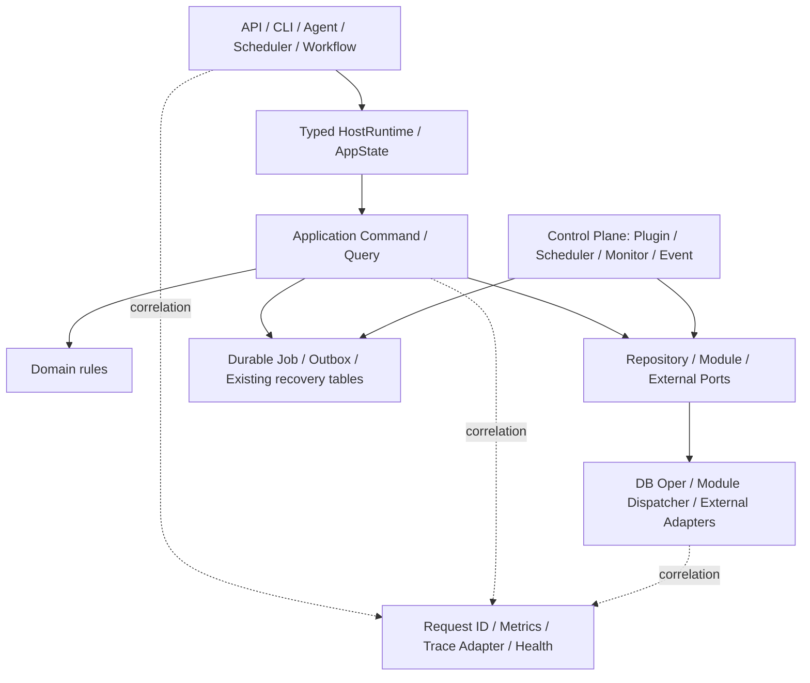

# MoviePilot V3 后端架构二阶段提升方案

> 文档性质：当前架构复核、优秀 Python 后端实践对标、AI 可执行任务手册
> 适用仓库：`MoviePilot`，分支 `v3`
> 审计基线：`6404a3aa583de03bf0770c37b106413461cec1f8`（2026-08-21）
> 审计范围：宿主后端；排除 `app/plugins/**` 运行时插件副本
> 规范优先级：`AGENTS.md` 与 `docs/rules/` 高于本文
> 相关文档：`docs/architecture-overview.md`、`docs/refactor/backend-architecture-governance.md`、`docs/refactor/backend-module-refactor-compatibility.md`
> 实施进度：阶段 0～6 的宿主架构能力已完成收口；API/Application 公共复杂度基线已清零，启动组合根的 SystemConfigOper 构造点已由 14 降至 1；API 进程内后台任务已完成首批统一登记，插件仓适配和 Outbox 外围扩展仍按风险切片推进。Model/Base 查询与写装饰器、legacy 隐式会话外壳均已清零，插件 SDK 也不再导出宿主 Model。2026-08-23 的长期整改阶段 0 已恢复宿主、启动性能、官方插件和 SDK 契约门禁的可信基线；阶段 1a 已补齐 TaskRegistry owner 零债务门禁和诚实的关停超时语义；阶段 1b1 已收口整理 worker、pending 回放、失败通知、进程内 AI 重试、插件监控与事件投递的生命周期所有权；2026-08-24 的阶段 2 已将 212 个已观察宿主模块方法的 legacy aggregation 清零，并补齐可执行 fanout 与下载器文件 DTO 边界；阶段 3 已将消息交互和远程命令的订阅删除统一到 Application/UoW/outbox，宿主不再调用裸线程统计入口；阶段 4 已统一七种消息渠道的宿主回环与后台执行边界；阶段 5 已补齐事件窗口聚合任务的生命周期所有权；阶段 6 已统一插件文件操作的取消完成语义；阶段 7 已统一插件协程补偿的终态等待；阶段 8 已统一宿主同步函数的异步线程池入口；阶段 9 已统一工作流运行时的宿主获取路径；阶段 10 已统一模块、插件与调度运行时的显式 getter 调用；阶段 11 已清除系统配置 getter 的 Oper 形别名；阶段 12 已完成工作流域的显式 Chain 数据端口迁移；阶段 13 已收口用户、交互与消息链的数据端口；阶段 14 已收口音乐订阅数据端口；阶段 15 已收口站点数据端口；阶段 16 已收口媒体服务器数据端口；阶段 17 已收口下载数据端口；阶段 18 已收口主订阅数据端口；阶段 19 已收口整理数据端口；阶段 20 已收口 Agent 数据端口；阶段 21 已收口监控历史端口；阶段 22 已统一服务配置应用边界。

## 当前复核结论（2026-08-24）

本节是本轮全面复核后的当前事实源。本文后续的阶段实施记录保留历史审计证据，
其中的数量和判断以当时审计提交为准，不能直接当作当前未完成项。

### 长期整改阶段 0：治理门禁恢复（2026-08-23）

- 宿主依赖基线已审查 TaskRegistry、有界后台 owner 与插件变更准入接入后的语义差异：当前为 `806` 个模块、`6544` 条内部导入边，12 组重点禁止边继续全部为 `0`，唯一非平凡 SCC 仍是隔离的 TMDB 移植包。
- 启动性能探针会在隔离生命周期中真实创建并释放 TaskRegistry；normal/safe 组件数分别为 `23`/`11`，CI 只读检查使用稳定的宿主模块集合和生命周期组件顺序，不再把 Python/平台模块数量当作硬合同。
- 官方插件快照覆盖 `plugins.v3`、`plugins.v2` 以及 V3 实际会从 `package.json` 回退加载的 31 个默认实现；`app/plugins/**` 仍只是宿主运行副本，不进入扫描。
- SDK 快照以各模块显式 `__all__` 为公开合同，能够记录赋值别名；`typing`、`__future__` 等实现期导入不再被误冻结，既有数据库备份门面已补精确导出清单。
- async 阻塞实际债务已由 fixture 中的 10 项归零；Scheduler Agent task 收尾查询已复用
  `AgentTaskOper.async_get` 的统一 AsyncSession 边界，CI 继续以零债务基线拒绝回退。

本阶段只修复治理信号和事实源，不把基线刷新当作业务重构完成。后台任务所有权、typed runtime、durable 副作用和质量规模化仍按下列 P1/P2 顺序推进；Module Contract V2 的宿主观察面已在阶段 2 收口。

### 长期整改阶段 1a：TaskRegistry owner 与关停契约（2026-08-23）

- 手工订阅搜索曾因 `create_sync()` 缺少必填 `owner` 在真实命令路径抛出 `TypeError`；现以
  `api.subscription.search_schedule` 登记，并由命令级测试冻结既有 scheduler 参数和立即返回语义。
- 新增符号感知的 `scripts/architecture/task_ownership.py`：宿主中所有可证明为 TaskRegistry 的
  `create`、`create_sync`、`register` 调用必须显式传入非空字符串字面量 owner，当前债务为零；CI
  只读执行该门禁。插件、SDK、`runtime/compat` 和测试运行时目录明确排除，不扩大插件 ABI 约束。
- TaskRegistry 关停超过预算时不再取消不可中断的同步线程包装任务或清空其记录；尚未真正结束的任务
  保留 owner 并通过事件循环异常处理器报告。可取消协程在整个关停周期只收到一次取消请求，重复或并发
  关停不会再次打断其异步清理，超时诊断也按任务去重。
- 本子阶段仍只覆盖 TaskRegistry。Transfer worker/replay、Agent blocking executor、Event handler
  drain、通道线程和 E2/E3 durable 完成点继续作为阶段 1 后续切片，不能因 owner 门禁通过而宣称完成。

### 长期整改阶段 1b1：整理后台生命周期所有权（2026-08-23）

- `TransferChain` 为每一代整理 worker 使用独立停止信号；配置热更新只让旧代完成已经进入同步 I/O 的
  工作，不再让旧线程重新领取新任务。超时旧线程继续由 `_retiring_threads` 持有，重复关闭可以继续等待，
  不把无法强制取消的文件操作伪装成已结束。生命周期锁等待与 worker/replay join 共用同一个 deadline，
  停止哨兵也不再被误算成真实队列任务而阻止最后一批进度结算。
- pending 回放改为单一受管线程，启动重复调用不会并发扫描；关停信号会在查询、`stat` 和逐条回放边界
  重新检查，尚未处理的 `TransferPending` 登记保持不变。关闭与 `queue.get()` 竞争时，尚未开始的任务会
  原样放回队列并保持 `task_done()` 计数平衡。
- 失败通知聚合器和 AI 重试 scheduler 现在拥有 timer、buffer 与 flush task 的显式 `close()`；分组使用
  generation 阻止旧 timer 在新静默窗口尚未 armed 时提前消费新批次。跨线程提交 AI 重试产生的 Future
  也会观察最终异常，不再只用提交调用外层的 `try/except` 假设异步执行成功。
- 生命周期新增常驻“整理后台服务” owner：正常模式和安全模式都只关闭已存在的单例，不会在 shutdown
  反向创建 worker。插件文件监控、Scheduler、Agent 和整理 owner 先停止宿主生产任务；随后封口插件变更、
  停用插件事件入口并结算全部在途 handler，最后才调用插件私有 timer、scheduler、watcher 的旧停机 hook。
  任一阶段返回 `False` 或超时，`FAIL_FAST` 屏障都会停止释放仍可能被活线程使用的后续依赖。
- EventManager 同时持有线程池同步 handler Future 和事件循环异步 handler completion；“事件投递屏障”会
  等待队列、handler 及 handler 派生事件自然收敛，再原子封住新的广播提交。为兼容无法声明资源依赖的
  旧插件，宿主先停用其新 handler 投递，再用非封口屏障等待已经开始的 handler 退出，之后按原顺序调用
  `close`/`stop_service`；hook 产生的尾事件仍可由其他宿主 handler 消费，最终屏障后才卸载插件实例。
  事件消费、共享线程池和模块资源仍在插件之后关闭。
- lifespan 启动中途失败会记录已完成及当前部分启动的组件，递归纳入已激活依赖对应的 stop-only owner，
  并复用正常停机的顺序、超时和 `FAIL_FAST` 策略。后段初始化失败不再只停止 TaskRegistry 后遗留 Scheduler、
  Transfer、Event、插件或 HTTP 资源。
- 兼容边界没有变化：`do_transfer`、队列与手工整理公开签名、模块方法 kwargs、插件整理事件类型及 payload、
  同步插件 ABI 和动态 API 原生返回结构均未改名或包裹；本阶段也没有 schema/Alembic 变更。
- 本阶段只证明进程内 owner、取消、等待和依赖释放顺序。失败通知仍可能在业务提交后、消息接受前随进程
  崩溃而丢失；五分钟 AI 重试缓冲仍未持久化；`TransferPending` 仍只有 `storage + src_path`，不能表达文件
  副作用 checkpoint、lease 和未知完成状态。它们分别留给阶段 1b2、1b3、1b4，不能据此宣称 E2/E3 完成。

### 长期整改阶段 2：Module Contract V2 宿主收口（2026-08-24）

- 212 个显式 spec 当前分布为 `first_non_empty=94`、`ordered_list_merge=108`、
  `ordered_mapping_merge=1`、`pipeline_relay=2`、`fan_out=7`，已观察宿主方法的 `legacy` aggregation 为 `0`。
- 媒体发现、豆瓣、Bangumi、AniList、TMDB、音乐、媒体服务器、存储、消息、识别和下载器能力均按真实
  同步/异步入口复用契约；15 个无 required parameters 的方法均为真实无参调用，不再是 family 默认值遗漏。
- `plugin_short_circuit` 已接入同步与异步 dispatcher；缓存清理、命令注册、调度、下载新增和整理完成等
  副作用方法使用 `fan_out`，忽略 provider 返回值并执行全部插件和宿主实现，异常仍按 provider 隔离。
- `torrent_files` 不再把 qBittorrent SDK 集合、Transmission 对象和 rTorrent 字典泄漏给 Chain；三个宿主
  provider 在共同适配边界投影为 `DownloaderFile`，修复 rTorrent 字典与调用方 `.name` 假设并存的双实现。
- 兼容边界不变：未知第三方自定义方法继续走开放 legacy fallback；旧插件签名和结果不匹配仍只诊断、
  不拒绝加载。已登记方法的名称、kwargs、插件优先级、同步/异步入口和异常隔离 ABI 均保留。

### 长期整改阶段 3：订阅删除生产路径统一（2026-08-24）

- `/subscribes` 交互删除与 `/subscribe_delete` 远程命令不再直接调用 `SubscribeOper.delete` 后启动
  `sub_done_async` 裸线程；两个同步入口统一委托 `app.application.subscription.delete` 的权限、事务、
  事件、统计与 outbox 协议，和 API、Agent 的异步删除路径共享候选快照、授权规则及 durable intent。
- 启动组合根为同步消息入口提供独占 Session、UoW 和 outbox；订阅行与 `subscribe.deleted`、
  `subscribe.deleted.report` 在同一事务提交，暂存或提交失败都会回滚，成功后仍按事件、统计顺序收口。
- 消息交互层只保留 ID 解析、名称展示和结果提示，不再拥有写库或统计实现；事务内目标已消失时按既有
  “未找到”语义返回，避免读取与删除竞态被误报为成功。
- 插件兼容边界保持不变：`MoviePilotServerHelper.sub_reg_async` 与 `sub_done_async` 的类方法、签名和返回值
  继续保留给旧插件；仅宿主生产调用清零，因此没有改动插件仓、SDK/Compat 映射或事件 payload。

### 长期整改阶段 4：消息渠道回环与线程所有权统一（2026-08-24）

- Slack、Telegram、Discord、飞书、QQBot、企业微信与 WeChatClawBot 原先分别拼接本地消息 API URL、
  执行 HTTP 并判断响应；其中飞书、QQBot、企业微信还为每条入站消息创建不可追踪的 daemon 线程。现在七者统一复用
  `app.application.messaging.ingress` 的 URL 编码、请求、状态确认、异常日志和响应释放语义。
- SDK 回调需要同步确认的 Slack/Telegram/WeChatClawBot 保留同步调用，Discord 保留自有事件循环内的
  异步调用；飞书、QQBot、企业微信继续立即返回，但任务改由现有 `ThreadHelper` 共享执行器承载，应用
  关闭时由既有线程池生命周期等待，不再产生逐消息游离线程。HTTP 到达后仍由 `/api/v1/message` 的
  TaskRegistry owner 执行消息主链。
- 新门禁扫描全部宿主 `app/modules/**/*.py`，禁止渠道再次硬编码 `/api/v1/message`；新增渠道必须使用统一
  ingress。source、token 统一通过 query encoder 处理，修复配置名含 `&` 等字符时被拆成额外参数的问题。
- 兼容边界不变：七个渠道类、模块方法、配置字段、消息 payload、同步/异步 SDK 回调方式和
  `/api/v1/message` HTTP 合同均未改；没有修改插件仓或向 SDK/Compat 新增宿主内部入口。

### 长期整改阶段 9：工作流运行时获取路径统一（2026-08-24）

- API 列表端点、请求级工作流写用例装配和 `WorkflowChain` 原先分别直接构造
  `app.workflow.WorkFlowManager` Singleton；现在统一通过 `app.application.workflow` 的 typed runtime
  provider 获取启动组合根登记的同一实例，不再由消费者自行定位 concrete 管理器。
- 架构门禁禁止 `app.workflow/**` 实现包和 `app.startup/initializers/workflow.py` 以外的宿主模块直接依赖
  `app.workflow`。依赖图总边数保持 `6544`：移除 3 条 API/Chain concrete 边，同时新增 Chain 的
  Application 端口边和 startup 的两条装配边；重点禁止边与自有 SCC 均未增长。
- 兼容边界不变：`app.workflow.WorkFlowManager` 的类路径、Singleton identity、公开方法、事件监听和
  action 加载保持原样，旧插件仍可直接使用 concrete 类；本阶段只收口 canonical 宿主消费者。

### 长期整改阶段 10：运行时 Facade 获取方式统一（2026-08-24）

- API、CLI、Scheduler 和工作流动作原先同时存在显式 `get_*` 调用、Application 兼容类构造，以及
  `get_plugin_manager as PluginManager` 的类形别名。canonical 宿主消费者现统一显式调用
  `get_module_manager()`、`get_plugin_manager()` 和 `get_scheduler()`，不再把 Service Locator 伪装成
  concrete 类构造。
- 架构门禁扫描全部宿主 Python 源码，禁止重新导入 `app.application.module.ModuleManager`、
  `app.application.scheduling.Scheduler`，或为插件 getter 建立别名。startup 仍负责创建 concrete
  管理器并注册 provider，运行时实例身份、初始化顺序和依赖图边均不改变。
- 兼容边界不变：Application 的 `ModuleManager`、`Scheduler` 类形 Facade 和 concrete 插件管理器类路径
  继续保留，旧插件、V1/V2/V3 索引加载及 SDK/Compat 映射无需迁移；本阶段仅统一宿主生产路径。

### 长期整改阶段 11：系统配置端口命名统一（2026-08-24）

- Agent、Chain、Module 和 Workflow 的 17 个 canonical 文件原先把
  `get_configured_system_config()` 别名或赋值为 `SystemConfigOper`，使 Application 配置端口在调用处
  看起来仍像数据库 Oper。宿主生产路径现统一显式调用 getter，测试也改为替换真实组合根接缝。
- 架构门禁禁止为 `get_configured_system_config` 建立别名，也禁止把它赋给本地
  `SystemConfigOper`；真正的 `app.db.oper.systemconfig.SystemConfigOper` 只留在 DB 实现、startup 装配和
  testing bootstrap，不再形成第二种 canonical 获取方式。
- 兼容边界不变：DB Oper 类、`app.db.oper` 懒导出、SDK/Compat 旧路径和 V1/V2/V3 插件加载均未改动；
  已注入 `SystemConfigReader/SystemConfigService` 的 Agent 工具构造合同保持原样。

### 长期整改阶段 12：工作流域 Chain 数据端口收口（2026-08-24）

- `app.application.chain.data` 已提供命名 `get_chain_*_port()`，但 `WorkFlowManager`、`WorkflowChain`、
  添加订阅和整理文件动作仍把 `*PortProxy` 别名为数据库 Oper，形成 getter 与代理双轨。四个工作流消费者
  现统一使用显式 getter，测试替换同一个组合根接缝。
- 架构门禁禁止 `app/workflow/**` 和 `app/chain/workflow.py` 重新导入任何 `*PortProxy`。其它 Chain 域仍按
  独立风险切片迁移，不能因本阶段通过而宣称全部 Chain 数据代理已清零。
- 兼容边界不变：全部 `*PortProxy` 类、`WorkFlowManager` 类路径/Singleton identity、动作类型与参数、
  工作流事件和数据库 `WorkflowOper/SubscribeOper/TransferHistoryOper` 均保留，插件无需迁移。

### 长期整改阶段 13：用户与消息 Chain 数据端口收口（2026-08-24）

- `UserChain`、`InteractionChain` 和消息发送 mixin 原先都把 `UserPortProxy` 别名为 `UserOper`；现在统一
  通过 `get_chain_user_port()` 获取组合根登记的数据端口，登录、用户绑定查询和通知收件人解析不再存在
  第二种伪 Oper 获取路径。
- 架构门禁覆盖这三个用户身份消费者，禁止重新导入 `UserPortProxy`。站点、媒体服务器、音乐、订阅、
  下载和整理 Chain 仍保留独立迁移清单，继续按行为风险分阶段推进。
- 兼容边界不变：数据库 `UserOper`、`UserPortProxy`、User/Interaction/Message Chain 公开方法、消息渠道
  payload 和插件调用方式均未改动。

### 长期整改阶段 14：音乐订阅 Chain 数据端口收口（2026-08-24）

- 音乐订阅辅助链原先通过 `SubscribePortProxy as SubscribeOper` 更新音乐元数据、质量和当前订阅；现在
  统一调用 `get_chain_subscribe_port()`，测试改为替换同一个命名 getter。
- 架构门禁单独覆盖 `_music.py`，禁止重新引入 `SubscribePortProxy`。主订阅 Chain 仍有更多数据端口和
  事务/副作用耦合，继续作为独立高风险阶段处理。
- 兼容边界不变：音乐订阅公开方法、数据库 `SubscribeOper`、`SubscribePortProxy`、字段写入与插件调用
  合同均未修改。

### 长期整改阶段 15：站点 Chain 数据端口收口（2026-08-24）

- `SiteChain` 与 `TorrentsChain` 原先把 `SitePortProxy` 别名为 `SiteOper`，覆盖 CookieCloud、用户数据、
  站点增删改、认证后刷新和 RSS 地址更新。现在全部统一通过 `get_chain_site_port()` 获取同一组合根端口。
- `/sites` 交互测试不再修改 Proxy 类属性，而是替换 getter 返回的 repository；架构门禁同时覆盖两个
  消费者，禁止站点域重新引入 `SitePortProxy`。
- 兼容边界不变：数据库 `SiteOper`、`SitePortProxy`、`SiteChain/TorrentsChain` 公开方法、站点事件、
  CookieCloud/RSS 语义和插件调用方式均未改动。

### 长期整改阶段 16：媒体服务器 Chain 数据端口收口（2026-08-24）

- `MediaServerChain` 原先通过 `MediaServerPortProxy as MediaServerOper` 清理已移除服务器、写入媒体项并
  清理陈旧记录；现在统一调用 `get_chain_media_server_port()`，同步阶段继续共享同一个端口实例。
- 五个增量同步测试接缝改为替换命名 getter，架构门禁禁止媒体服务器 Chain 重新导入
  `MediaServerPortProxy`。
- 兼容边界不变：数据库 `MediaServerOper`、Proxy 类、媒体库同步公开方法、进度合同、停止语义和插件调用
  方式均未修改。

### 长期整改阶段 17：下载 Chain 数据端口收口（2026-08-24）

- `DownloadChain` 原先把下载失败、下载历史和媒体服务器三个 `*PortProxy` 别名为数据库 Oper，用于失败
  抑制、重复下载查询、下载结果结算和媒体库判重；现在全部统一调用对应 `get_chain_*_port()`。
- 五个下载/音乐测试接缝改为替换命名 getter，架构门禁禁止下载 Chain 重新导入这三个 Proxy。
- 兼容边界不变：三个 DB Oper、Proxy 类、下载公开入口、失败指纹、历史 hash 查询、媒体库判重和插件
  调用合同均未修改。

### 长期整改阶段 18：主订阅 Chain 数据端口收口（2026-08-24）

- `SubscribeChain` 原先把订阅、站点和下载历史三个 `*PortProxy` 别名为数据库 Oper，查询、搜索、匹配、
  完成检查与订阅文件视图因此和命名数据端口形成双轨；现在统一调用对应 `get_chain_*_port()`。
- 订阅、音乐与交互测试改为替换命名 getter，架构门禁禁止主订阅 Chain 重新导入这三个 Proxy。
- 兼容边界不变：三个 DB Oper、Proxy 类、订阅 Chain 公开方法、订阅字段和事件合同、V2/V3 插件调用
  方式均未修改。

### 长期整改阶段 19：整理 Chain 数据端口收口（2026-08-24）

- `TransferChain` 与 `_transfer` mixin 原先把 pending、下载历史和整理历史三个 `*PortProxy` 别名为
  数据库 Oper；现在 worker 回放、查重、历史解析、手动重整和失败重试统一调用对应 `get_chain_*_port()`。
- 整理主流程、同步附属文件、音乐整理和手动历史测试改为替换命名 getter；架构门禁同时覆盖主链和
  mixin，禁止重新引入三个 Proxy。
- 兼容边界不变：三个 DB Oper、Proxy 类、整理公开入口、队列和生命周期、历史字段、事件 payload 以及
  V2/V3 插件调用方式均未修改。

### 长期整改阶段 20：Agent 数据端口收口（2026-08-24）

- Agent 编排、会话记忆和 22 个工具实现原先把十种 `AgentDataPort` 代理重新别名为数据库 Oper，形成与
  Chain 命名 getter 不同的第二套数据端口用法；现在统一调用 `get_agent_*_port()`。
- Agent 测试接缝改为替换 getter 返回的端口实例，架构门禁遍历 `app/agent/**`，禁止生产模块重新导入
  十个兼容 Port 代理。
- 兼容边界不变：`AgentDataPorts` 注册表、十个旧 Port 代理类、DB Oper、Agent/工具公开参数和返回值、
  权限判断以及 V2/V3 插件调用方式均未修改。

### 长期整改阶段 21：监控历史端口收口（2026-08-24）

- `TransferDispatcher` 原先把应用层兼容 `TransferHistoryPort` 再别名为 `TransferHistoryOper`；现在通过
  `get_transfer_history_port()` 直接取得组合根登记的整理历史端口。
- 监控历史与文件事件测试改为替换命名 getter，架构门禁禁止监控分发器重新导入兼容 Facade。
- 兼容边界不变：`TransferHistoryPort`、DB Oper、监控候选判定、历史查重、失败重试和整理触发语义均
  未修改。

### 长期整改阶段 22：服务配置应用边界统一（2026-08-24）

- 启动组合根已注入应用层服务目录，但 Chain、消息 API、Scheduler 和 Agent 仍直接读取 runtime
  `ServiceConfigHelper`，形成两个应用入口；现在统一通过通知与媒体服务器应用模块的命名函数读取。
- 命名函数显式区分仅启用配置和包含禁用配置，保持定向同步、定时注册、企业微信模式和渠道管理员判断
  的原语义；架构门禁覆盖七个生产消费者。
- 依赖基线经语义诊断后从 `6544` 条边降为 `6539`：七个消费者移除 runtime service-config 边并改为
  Application 边，12 组禁止边和唯一隔离 TMDB SCC 均未变化。
- `ServiceConfigHelper` 继续保留在 startup、runtime module adapter、模块实例初始化和 `app.sdk.services`
  插件兼容出口；V2/V3 插件导入、配置 Schema 和热更新读取器均未修改。

### 总体判断

当前架构总体合理，已经从跨层混合的遗留单体收敛为**边界清晰的模块化单体**：

- 继续采用单进程控制面是正确选择，不建议现在拆成微服务；插件、调度器、工作流、事件和数据库共享进程内状态，拆分会放大部署、事务和兼容成本。
- `foundation/domain/runtime/adapters/application/chain/api/startup` 的职责方向基本成立；宿主架构基线、复杂度 ratchet、异步阻塞 ratchet 当前均通过。
- 依赖图当前为 `806` 个 Python 模块、`6539` 条内部导入边；唯一非平凡 SCC 位于隔离的 TMDB 第三方移植包内部，不应为了指标归零重写。
- 当前主要风险已经从“目录和依赖失控”转移到运行时协议、后台副作用的可靠性和遗留兼容面。换言之，下一阶段重点应是**语义收口和可验证性**，而不是继续搬文件或机械拆大文件。

综合评价：架构方向可持续，生产可用性较高；可演进性仍处于中等水平。现阶段没有静态审计发现必须立即推倒重来的 P0 架构问题，但存在需要按 P1/P2 计划治理的真实债务。

### P1：需要优先治理的真实债务

1. **后台任务的统一所有权已覆盖 API 入口，但仍有更深层任务机制待分级。** `app/runtime/tasks.py` 已建立 lifespan 级 TaskRegistry，启动收尾、插件 Release 刷新、Webhook E0 广播、CookieCloud E1 手工调度、消息入口、Seerr 订阅、整理历史 AI 重做、OpenAI/Anthropic 协议流和 WebAgent 断线后执行/快照保存均不再维护端点模块级任务集合或 Starlette 回调，shutdown 会停止接收、取消并有限等待，且生命周期清单明确登记其顺序。主仓 `app/` 已无裸 FastAPI `BackgroundTasks`；当前仍有约 `50` 个更底层 `create_task`/等价任务创建点，与线程池和 APScheduler 并存，后续需逐项确认 owner、取消、等待、重试、幂等和是否 durable，关键业务副作用优先接入已有 Outbox/恢复表。

   Agent 活动摘要已完成一个深层 owner 切片：中间件仍保留自己的完成回调与非阻塞语义，但任务创建统一
   经 lifespan `TaskRegistry` 登记为 `agent.activity_log.record`，宿主关停会取消并有限等待，不再形成
   绕过全局关停预算的第二套后台任务集合。该摘要属于可丢弃 E1 观测数据，不宣称 durable。
   模块同步清缓存的异步桥接也统一复用同一模式：Fanart 不再保留裸 `loop.create_task`，与 IMDb 一样登记
   稳定 owner，并继续保留无事件循环时 `asyncio.run` 和原同步 ABI。
   插件市场 Release 合并层的普通读取和强刷子任务也已登记稳定 owner；API 外层任务被关停取消时，内部
   `shield` 不再让网络请求逃逸生命周期预算，仓库级并发合并、缓存键和 V1/V2/V3 返回兼容保持不变。
   请求作用域的结构化并发不进入全局登记器：传统 WebAgent SSE 的 collection 子任务改由生成器
   `finally` 取消并等待清理，断线和 ASGI 取消均不会留下请求级 task。
   订阅删除的宿主生产者也已完成 durable 分级：消息交互和远程删除不再调用裸线程统计入口，而是
   与业务删除原子暂存事件和统计 intent；旧类方法只作为插件 ABI 保留，不纳入宿主可靠性证明。
   消息渠道回环也不再各自拥有 URL、HTTP 判定和逐消息线程：七种宿主渠道共享 ingress，三种立即返回
   渠道交给生命周期持有的共享线程池；这仍是 E0 投递，不宣称跨进程恢复。
   图片代理安全日志的窗口聚合也已补齐内部任务所有权：timer 到期创建的 flush task 由 coalescer 持有，
   `stop_modules()` 会刷新未到期摘要并等待已启动回调；它属于 E1 观测，不扩大 TaskRegistry 或 Outbox 范围。
   插件市场与插件包适配器原有两套线程取消 wrapper 也已统一到 `runtime.execution`：连续取消必须等同步
   文件 worker 到达终态后再传播，避免提前释放 mutation owner；旧模块内私有名称保留为 canonical 别名。
   插件安装快照、取消补偿与市场临时文件清理原有两套协程终态循环也已合并为
   `await_task_to_terminal`；数据库 worker 的 interruptible 等待属于队列 owner，未被机械合并。
   canonical 宿主原有 11 处 FastAPI `run_in_threadpool` 导入也已统一到 `runtime.execution`，AST 门禁
   防止再次出现框架直连；模块局部符号及调用参数不变，不改变插件运行和 monkeypatch 接缝。
2. **Model/Base 的数据库装饰器和隐式会话 ABI 已全部清零。** 查询、写事务和 `legacy_*` 装饰器均为 `0`；所有 Model `db` 参数要求显式 Session，Base CRUD 仅在调用方事务内查询或 stage。可无会话构造的入口统一留在 Oper，经组合根事务执行器运行；插件 SDK 不再导出宿主 Model。后续重点转为减少 ORM 对象跨层流转，并保持 Model 隐式事务零回退。

   Oper 内部的执行入口也已统一：最后一处 `AgentTaskOper` 直接 transaction runner 调用已迁入
   `DbOper._execute_sync_query`，静态门禁禁止 `app/db/oper` 再绕过统一的 Session 类型分派。
3. **组合根和全局状态仍形成复杂的隐式运行时图。** Singleton 实例、模块级 provider、`configure_*` 注册函数和兼容 Facade 同时存在；它们解决了旧 ABI 和启动顺序问题，但增加测试污染、重复装配、实例身份和初始化顺序风险。`app/startup/lifecycle/__init__.py` 已有声明式生命周期，`app/startup/initializers/modules.py` 也有分阶段关闭，但尚未做到所有进程级资源都只通过 typed HostRuntime 访问。后续应以“新代码禁止新增 Service Locator/Singleton 依赖、旧入口有命中观测”为 ratchet。

   Scheduler 已先完成一个可验证切片：API、Agent 与 Command 统一经
   `app.application.scheduling` Facade 获取实例，只有 `app.scheduler` 实现本身及 startup 组合根允许
   依赖 concrete Scheduler；架构测试拒绝普通宿主消费者重新引入第二条实例化路径。
   插件运行时也采用相同边界：factory 的动态路由投影和 Scheduler 插件任务统一延迟调用
   `app.application.plugin.runtime`，只有 startup 组合根与 `app.sdk.plugins` 兼容面允许直接引用
   concrete `PluginManager`，不改变 V1/V2/V3 插件加载与自由响应 API。
   Command 的 API 消费点也已完成原计划迁移：WebAgent 查询和站点认证后的刷新统一使用
   `app.application.commands`，只有 startup 组合根注册 concrete Command；门面保留原命令对象与插件命令语义。
   宿主 Module 的部署配置读取也已统一到 `RuntimeSettingsCompat`：PostgreSQL、Redis、qBittorrent、
   rTorrent 和 Transmission 不再直接导入全局 Settings，模块目录由架构测试保持零直连；兼容代理仍保留
   启动早期与旧插件/测试的动态 Settings 注入语义。
   配置治理基线进一步区分债务与批准边界：canonical 未批准 Settings 直连和非组合根
   `SystemConfigOper()` 构造均为 `0`；`app/db/base.py`、`engine.py`、`session.py` 的启动前数据库基础设施
   读取及 startup 唯一 Oper 构造点以带理由的固定边界登记。四个集合都只能减少，不能新增或换位置。
   工作流运行时也已按相同模式收口：API、请求依赖与 Chain 只依赖
   `app.application.workflow.get_workflow_manager()`；只有工作流实现包和 startup 组合根可直接依赖
   concrete `WorkFlowManager`，架构测试拒绝宿主重新引入第二条实例获取路径。

### P2：中长期可演进性债务

- **大型职责域仍偏重。** 代表性热点包括 `app/chain/subscribe.py`（约 `4141` 行）、`app/chain/transfer.py`（约 `2944` 行）、`app/agent/orchestrator.py`（约 `3540` 行）、`app/agent/llm/provider.py`（约 `3529` 行）、`app/adapters/external/market.py`（约 `3139` 行）和 `app/api/endpoints/agent.py`（约 `2489` 行）。复杂度 ratchet 只保证不超过当前基线，不代表这些文件已经易维护。只有在行为快照、调用命中和事务边界明确后，才值得按用例拆分。
- **类型门禁覆盖面不足。** `mypy.ini` strict 文件清单目前为 `39` 个文件，Agent、Chain、Module、Adapter 大量代码仍依赖动态类型。应从模块契约、生命周期、Repository/Port 和关键 Chain 返回值开始扩展，而不是直接开启全仓 strict。
- **Pylint 仍是增量硬门禁。** `.github/workflows/pylint.yml` 对改动 Python 文件执行硬检查，但全仓报告使用 `|| true` 仅作 advisory。该策略适合存量迁移，却没有形成全仓质量趋势约束；应增加按目录和新增问题数的 ratchet。
- **测试风格存在历史混用。** 当前有 `527` 个测试文件，仍有 `70` 个 `unittest.TestCase` 文件。它不是生产架构缺陷，但会增加 fixture、状态隔离和异步测试迁移成本，应在触碰相关模块时渐进迁移。
- **跨仓治理链路尚未完全闭环。** 前端已有 lint、typecheck、分片 Vitest 和构建门禁；插件仓有 V1/V2/V3 索引及版本/依赖检查；资源和 Rust 仓有独立构建发布链路。但插件 CI 本地复核因插件仓环境缺少主仓依赖 `httpx2` 无法完成收集，说明“插件仓测试环境与主仓锁定依赖”的可复现性仍需加强。资源构建通过 PR 同步到 `MoviePilot-Resources`，Rust 发布后自动向主仓发依赖 bump PR，链路合理但仍是多仓异步发布，需保留版本 provenance 和回滚点。

### 已解决、不应重复治理的问题

- 分层依赖和重点禁止边已建立门禁；不要再以“减少目录数量”作为目标。
- 全功能多 worker 的误导性配置已由 `app/runtime/topology.py` 和 `app/main.py` 拒绝；V3 默认单 worker 的部署事实已经明确。
- 写事务已由组合根/UoW/Outbox 方向收口，`db_update/async_db_update` 为零；不要重新引入 Model 自动提交。
- 已具备 correlation ID、`/health/live`、`/health/ready`、模块/事件/调度观测端口和兼容 Facade 命中指标；历史文档中“完全缺少观测能力”的描述已过时。
- 212 个已观察宿主模块方法已全部使用可执行的非 legacy aggregation；只为未知第三方自定义方法保留开放 fallback，不再重复按能力族补聚合标签。
- 旧导入路径、显式 `__all__` SDK 合同、插件 manifest 和 V3 实际可加载的三层索引实现均有白名单或版本约束；兼容层应继续保持“薄、可观测、只增不删”，不应为了清理目录直接删除。
- TMDB 移植包内部 SCC 属于第三方隔离代码，按现状豁免是合理的技术决策。

### 刻意保留的兼容成本

以下内容不是遗漏，而是当前产品 ABI 的有意成本：

1. 未知第三方插件自定义模块方法继续走 `legacy` fallback，不能因宿主契约收口而拒绝加载旧插件。
2. `PluginManager`、`PluginHelper`、`MoviePilotServerHelper` 等 Facade 继续保留旧公开/私有调用面，并通过 `compat.facade.hit` 统计迁移命中。
3. `app/runtime/compat` 的精确旧导入映射、`app.sdk._legacy` 薄门面和插件 V1/V2/V3 三代索引继续存在，直到命中数据和发行策略支持删除。
4. 插件访问宿主持久化必须经过 Oper 或稳定 SDK；不再保留直接调用宿主 Model 的事务兼容。

### 建议的后续治理顺序

1. **先做后台任务审计与统一登记**：建立 TaskOwner/生命周期协议，区分请求后非关键通知、可重试 Outbox 副作用和必须在请求内完成的业务写入；为断线、崩溃、重复执行和 shutdown 补测试。
2. **随后收敛组合根和全局状态**：为新代码禁止新增 Service Locator/Singleton 依赖，逐步让关键服务只通过 typed HostRuntime 获取；旧 Facade 继续保留命中观测和插件 ABI。
3. **再扩展类型和复杂度预算**：每次触碰大型职责域时拆一个可回滚垂直切片，同时扩大 mypy strict 清单和 Pylint 新增问题 ratchet；不要为追求行数指标进行无行为收益的拆分。Module Contract V2 只继续保持新增方法门禁和第三方 fallback 观测。
4. **跨仓发布以契约为中心**：保持插件索引、前端远程组件、资源版本、Rust wheel 和主仓依赖的 provenance；将插件测试环境固定为主仓 `uv.lock` 可复现安装，避免本地和 CI 依赖漂移。

本轮复核结论：**当前架构不需要推倒重来，真正未完成的是运行时可靠性和协议收口。** 下一轮治理完成上述 P1 后，再评估是否值得继续拆分大型文件或扩大严格类型范围。

## 1. 结论先行

MoviePilot V3 当前不是“目录混乱、必须推倒重来”的状态。第一阶段治理已经取得实质成果：

- `foundation/domain/runtime/adapters/application` 等实现根没有自有循环依赖；
- Adapter、Runtime、Application、Chain、API 等重点边界到 DB 的禁止边为零；
- `app.core`、`app.helper`、`app.utils` 已经是精确兼容入口，不再是宿主实现目录；
- 插件 raw API、SDK/Compat、生命周期清单、模块调度快照和零真实网络测试均已有门禁；
- 当前唯一 SCC 位于隔离的 TMDB 移植包内部，不应为了指标归零重写第三方风格代码。

因此，下一阶段不应继续以“搬文件、拆目录、减少行数”为主目标。八类运行时和演进问题的当前状态如下；
其中已完成的门禁不能再作为待办重复实施，部分完成项则继续按低水位推进：

1. **架构基线工具的事实源分离已完成。**宿主、官方插件和启动性能使用独立 check/write；稳定语义与源码位置诊断分开，配置/事务低水位采用单向 ratchet，不能再用一次全量 `--write` 掩盖跨域变化。
2. **V3 部署拓扑边界已完成。**全功能模式在 startup、launcher 和 Doctor 共同拒绝 `API_WORKERS > 1`，生产入口固定单 worker；开发 reload/监督模式使用 `app.factory:create_app` import-string factory，不再把 app 实例交给多进程 supervisor。旧配置键继续可解析，未来只有拆出 control role 后才重新评估全功能多 worker。
3. **事务所有权已完成装饰器层收口，但 ORM 对象跨层流转仍需治理。**正式 Model 查询/写装饰器均已清零，宿主 Oper 查询统一接收显式 Session；调用方仍需继续明确 ORM 对象生命周期、懒加载和业务提交后副作用边界。
4. **组合根之后仍存在全局服务定位，但配置和 API 数据主路径已收口。**canonical 未批准 Settings 导入与非组合根 `SystemConfigOper()` 构造均为 `0`；数据库基础设施 3 处和 startup 唯一构造点作为不可扩张边界登记。正式 FastAPI 依赖只读取 AppState `HostRuntime` 的命名领域，字符串 API 数据注册表仅允许 startup 注入和旧 Facade 转发；后续对象是 Singleton 与模块级 `configure/get` provider，不应再迁移已类型化 API 依赖。
5. **模块与事件契约登记均已完成。**当前 212 个模块 spec 的宿主观察面已无 legacy aggregation，53 个事件全部绑定 typed payload，可见性、投递等级、错误行为和敏感字段均有基线，legacy event payload 为 `0`。后续重点是保持新增能力 ratchet、观察未知第三方 fallback 命中，以及 6 个 durable-required 事件的真实持久投递，不是重复创建契约或事件 DTO。
6. **后台副作用缺少统一可靠性定义。**事件队列、APScheduler、FastAPI BackgroundTasks 和线程池任务的丢失、重试、幂等、关停语义各不相同；数据库提交与事件/上报之间仍有进程崩溃窗口。
7. **核心关联与健康边界已落地，指标导出仍未收口。**HTTP/SSE correlation ID 已传播到线程池、事件、工作流、子进程、外部请求和日志；`/health/live`、`/health/ready` 已由部署入口消费，事件/数据库队列深度及模块/事件耗时使用低基数指标登记。当前缺口是稳定 exporter、运维查询面和跨进程聚合，而不是重新实现 request ID 或健康路由。
8. **质量门禁已具备增量硬约束，但覆盖面仍需扩大。**push/PR 对变更 Python 文件执行 Pylint，CI 同时运行 host architecture、39 个 strict mypy 文件、复杂度、async 阻塞和 task owner ratchet；全仓 Pylint 仍是 advisory，strict 类型和复杂度拆分仍应随业务切片渐进扩展。

建议保持**模块化单体**，按以下顺序治理：

```text
先修治理工具和部署真相
    -> 再统一事务边界和运行时装配
    -> 再类型化模块/事件协议
    -> 再为关键副作用补持久可靠性
    -> 最后收敛可观测性、类型和复杂度预算
```

不建议在本轮引入微服务、通用 DI 框架、Celery/Kafka、全仓 ORM 重写或全仓强类型。这些动作会显著扩大插件兼容、部署和回滚面，但不能直接解决当前最重要的问题。

## 2. 当前审计基线

### 2.1 取证方法

本次复核执行或检查了：

- 仓库、分支、上游和工作树状态；
- `AGENTS.md`、架构/设计/测试规则和两份既有重构文档；
- 当前宿主 AST 依赖图、SCC、禁止边和运行契约快照；
- FastAPI 创建、路由聚合、异常处理、生命周期和 Uvicorn 入口；
- SQLAlchemy Session、事务装饰器、UnitOfWork、Model 与 Oper 的真实调用关系；
- Event、Module dispatcher、Scheduler、插件运行时与后台线程；
- 方法规模、端点规模、全局配置读取和类型注解近似统计；
- 独立 `MoviePilot-Plugins` 仓的当前版本与宿主内插件兼容基线关系。

### 2.2 已验证数据

| 指标 | 当前值 | 判断 |
| --- | ---: | --- |
| 宿主 Python 模块数 | 753 | 排除 `app/plugins/**` |
| 宿主内部导入边 | 6,076 | 边数本身不是质量目标 |
| 非平凡 SCC | 1 | 仅 TMDB 移植包内部 |
| 重点禁止边 | 0 | Adapter/Runtime/Application/API/Chain 等到 DB 的既有门禁均通过 |
| 架构专项测试 | 39 passed | `test_architecture_dependencies` + `test_architecture_contract_baseline` |
| 宿主 Python 代码行 | 约 241,227 | 含注释和空行，仅用于趋势 |
| 已登记模块调用方法 | 211 | 260 个静态调用点，0 个动态方法名调用点 |
| legacy 默认模块契约 | 0 个宿主观察方法；未知动态方法保留 fallback | 所有静态宿主方法已有显式 V2 spec；真实 fallback 命中由 `module.contract.legacy_hit` 观测 |
| 事件枚举 | 53 | 66 个静态 producer、15 个静态 consumer |
| 专用 EventData model | 53 | Event Contract Registry 已为全部事件登记 typed payload/fallback 原因 |
| 直接读取 `settings` 的文件 | 105 | 仍按模块族迁移，动态协议和安全端口暂保留 |
| `SystemConfigOper()` | 1 个 | 仅组合根创建 `SystemConfigService` 时保留 |
| Model/Base 上的 DB 装饰器 | 0 | 正式与 legacy 查询/写装饰器全部为 0；`db` 参数必须显式传入 |
| 路由端点 | 335 | 11 个已装饰端点超过 80 行，最大 400 行 |
| Chain 方法超过 150 行 | 18 | 最大 `TransferChain.do_transfer()` 885 行 |
| Application 方法超过 150 行 | 8 | 最大 296 行 |
| Agent 方法超过 150 行 | 13 | 最大 713 行 |
| 公共函数缺少返回注解 | 约 1,592 / 7,442 | AST 近似值，适合做 ratchet，不适合直接作为失败阈值 |
| 公共参数缺少注解 | 约 858 / 12,763 | 主要集中在 `app/modules` |

代表性大方法：

- `app/chain/transfer.py::TransferChain.do_transfer()`：约 885 行；
- `app/chain/download.py::DownloadChain.batch_download()`：约 572 行；
- `app/chain/subscribe.py::SubscribeChain.match()`：约 417 行；
- `app/api/endpoints/agent.py::web_agent_stream()`：约 400 行；
- `app/api/endpoints/transfer.py::manual_transfer()`：约 295 行；
- `app/scheduler.py::Scheduler.init()`：约 383 行。

### 2.3 本次检查暴露的基线问题

宿主架构测试通过，但下面的跨仓命令失败：

```bash
./.venv/bin/python scripts/architecture/baseline.py \
  --check \
  --plugin-repo ../MoviePilot-Plugins
```

失败对象是 `tests/fixtures/architecture/official-plugin-baseline.json`。宿主内基线记录的插件仓提交为
`ddb41dbcbbea21196154a7f6d5fdba3aa34a5e4a`，当前独立插件仓为
`217c8d25ffe6ff0b3f6352c4278fd6896def442e`。这不是宿主依赖环回归，但当前命令无法单独表达“宿主硬门禁通过、外部插件仓观察值已变化”。

另一个风险是 `scripts/startup/performance.py` 在不传 `--output` 时会直接覆盖已提交基线。其他 AI 在只想读取当前数据时，很容易制造未审查的基线变更。

**本次审计没有更新任何基线文件。**上述意外写入已恢复，最终工作树只包含本文和文档索引改动。

阶段 0 实施后，宿主与插件基线已使用独立 check/write 入口；运行契约行号只进入按需诊断，
插件 commit、源码摘要和文件数只作为 provenance。当前宿主和官方插件语义检查均通过，CI 会在
主仓 PR/push 执行宿主硬门禁，并在定时/手工工作流中上传最新插件仓的语义差异报告。

## 3. 优秀 Python 后端实践对标

本节只采用与 MoviePilot 当前形态相近、能转化为具体约束的实践。参考不是为了照抄目录，而是为了验证职责、生命周期和失败语义。

| 对标来源 | 可复用实践 | MoviePilot 当前差距 | 采用方式 |
| --- | --- | --- | --- |
| [FastAPI：Bigger Applications](https://fastapi.tiangolo.com/tutorial/bigger-applications/) | Router、依赖和主应用分离；路由按领域聚合 | Router 已分文件，但 `app/api/deps.py` 集中 33 个依赖工厂，部分端点仍编排完整用例 | 保留现有 Router；按垂直切片拆依赖和 presentation mapper，不重做目录树 |
| [FastAPI 官方 Full Stack Template](https://github.com/fastapi/full-stack-fastapi-template/tree/master/backend/app) | 请求依赖提供 Session，测试和迁移入口明确 | MoviePilot 已有请求 Session 和 UoW，Model 隐式事务已清零；仍需继续减少 ORM 对象跨层流转 | 将 Session 生命周期留在请求/作业边界，Repository 只登记变更 |
| [SQLAlchemy Session Basics](https://docs.sqlalchemy.org/en/20/orm/session_basics.html) | Session/事务生命周期应与具体数据操作分离；Session per thread、AsyncSession per task | Model/Base 已要求显式 Session；无会话 Oper 仍依赖组合根事务执行器 | 新写用例强制请求/任务级 UoW；持续禁止 Model 重新拥有事务 |
| [Starlette Lifespan](https://www.starlette.io/lifespan/) | Lifespan 完成前不接流量；用 typed state 共享进程资源；用 task group 管理异步任务 | 已有声明式生命周期，但仍依赖多个模块全局注册表和裸 `create_task`/线程 | 建立类型化 `HostRuntime/AppState`，旧 provider 继续作兼容门面 |
| [Uvicorn Deployment](https://www.uvicorn.org/deployment/) 与 [Lifespan](https://www.uvicorn.org/concepts/lifespan/) | reload/workers 使用 import string/factory；每个 worker 独立执行 lifespan | 当前 app 实例与 reload/workers 配置并存，多 worker 会重复控制面 | V3 先明确只支持单 worker；开发 reload 改为 factory/import string；未来再拆 control role |
| [Home Assistant：Integration Quality Scale](https://developers.home-assistant.io/docs/core/integration-quality-scale/) | 插件/集成按可测试性、错误处理、异步安全、类型和文档分级；豁免必须说明 | Module 能力差异大，只有统一发现和方法名快照，没有每个集成的质量状态 | 为宿主 Module 建立轻量质量清单和逐项 ratchet，不阻塞历史模块运行 |
| [Home Assistant：Blocking operations with asyncio](https://developers.home-assistant.io/docs/asyncio_blocking_operations/) | 阻塞 I/O 必须移出事件循环，并提供检测 | 项目已有 ThreadHelper/异步 HTTP，但没有统一的阻塞调用检测门禁 | 先对 API、Agent、Application 新代码加调试/测试检测，不开展全仓 async 重写 |
| [Home Assistant：Fetching data](https://developers.home-assistant.io/docs/integration_fetching_data/) | 外部集成统一刷新协调、并发限制、退避和认证失效语义 | 各 Module 自行决定轮询、缓存、限流和错误降级 | 先建立 Module quality/contract 字段，再为同一模块族复用 coordinator |
| [OpenTelemetry Python](https://opentelemetry.io/docs/languages/python/) | Trace/Metric 稳定，支持标准上下文传播和框架/HTTP client instrumentation | 当前缺少跨 API、Chain、Module 和外部请求的关联标识 | 先实现无依赖 request ID；OTel 作为可选 Adapter，不能成为核心层依赖 |

### 3.1 明确不照抄的内容

- FastAPI 示例中的直接 endpoint → ORM 只适合较小 CRUD 服务；MoviePilot 有插件、调度、工作流和多入口，仍应使用 Application/Repository。
- Home Assistant 的完整 Integration Framework 不能直接替换现有 Module/Plugin 体系；只借鉴质量清单、异步边界和刷新协调思想。
- OpenTelemetry 不应在第一步强制进入所有环境；应先定义内部观测端口和 request ID，再提供可选 exporter。
- 不因 SQLAlchemy 官方示例使用同步 Session 就把现有 async 查询全部改回同步；关键是事务范围清晰，不是统一一种 I/O 风格。

## 4. 目标架构

目标仍是单仓、单部署单元的模块化单体，但把 API 数据面、宿主控制面、持久可靠性和观测边界区分开：



强制原则：

1. API/CLI/Agent/Scheduler 只是不同入口，事务和业务完成定义归 Application 用例。
2. Model 负责映射、数据库约束和必要的同表纯条件表达；不拥有 Session 生命周期和自动提交。
3. Oper/Repository 负责查询和登记变更；不决定整个业务动作何时 commit。
4. 宿主运行对象由 Startup 创建；FastAPI 通过 typed state/Depends 读取，不新增字符串 Service Locator。
5. Module 与 Event 的动态兼容继续存在，但宿主高频能力必须有可检查签名、结果和错误语义。
6. 普通进程内通知可以丢失；影响用户数据完成状态的副作用必须显式选择 durable 语义。
7. V3 默认单 worker。未拆出控制面前，不允许通过多 worker 复制插件、调度和监控运行时。
8. 插件公开 ABI 只增不删；宿主内部改造不能要求同步修改所有第三方插件。

## 5. 分阶段实施路线

每个任务均应独立提交、独立回滚。除非任务明确说明，不允许同时改数据库 schema、前端协议和插件仓。

### 阶段 0：先让治理工具可信

#### ARCH-201：拆分宿主与插件基线命令

**目标**：基线工具能够分别检查/写入宿主依赖、宿主运行契约、官方插件兼容和启动性能，禁止一次操作无差别覆盖全部文件。

**允许范围**：

- `scripts/architecture/baseline.py`
- `scripts/startup/performance.py`
- `tests/test_architecture_contract_baseline.py`
- 新增的脚本 CLI 测试
- 对应文档

**实施步骤**：

1. 为架构脚本增加互斥的细粒度参数，例如：
   `--check-host`、`--check-plugins`、`--write-host`、`--write-plugins`。
2. `--check-host` 不要求 `../MoviePilot-Plugins` 存在。
3. `--write-*` 必须显式指定目标；不带写参数只能输出到 stdout 或退出。
4. 性能脚本改为 `--print`/`--check`/`--write` 三种明确行为；默认只打印，不能覆盖 fixture。
5. 写入前在 stdout 列出将修改的文件；写入后仍由 Git diff 供人工审查。
6. 保留旧 `--check/--write` 一小段兼容期时，只允许它们给出弃用提示并要求显式 scope，不能继续静默全写。

**禁止**：

- 不因当前插件仓已变化而直接刷新 baseline；
- 不在本任务改变依赖规则、SDK 导出或插件 hook；
- 不把 Git commit hash 变化等同于 ABI 变化。

**验证**：

```bash
./.venv/bin/python -m pytest \
  tests/test_architecture_contract_baseline.py \
  tests/test_architecture_baseline_cli.py -q

./.venv/bin/python scripts/architecture/baseline.py --check-host
./.venv/bin/python scripts/architecture/baseline.py \
  --check-plugins --plugin-repo ../MoviePilot-Plugins
```

**完成标准**：只改插件仓时宿主门禁仍能独立通过；只读命令不会修改工作树；每个 fixture 都有独立写入口。

**回滚**：恢复旧 CLI 解析器即可；不得回滚已审查的 fixture 内容。

**实施记录（2026-08-21）**：

- `baseline.py` 已提供 host/plugin 的显式 check/write scope，性能基线提供 print/check/write；默认行为只读，
  write 前列出目标，宿主检查不依赖外部插件仓存在。
- CLI、只读工作树和 fixture 定向写入测试已覆盖，提交为 `7bc3ea83`。

#### ARCH-202：把语义基线与诊断位置分开

**目标**：正常行号移动、时间戳或插件仓 HEAD 变化不再触发“架构语义变化”；真实方法、事件、导入、签名和结果契约变化仍失败。

**实施步骤**：

1. 将 `caller + line` 拆为 gate key（`caller + operation/method/event`）和 diagnostic（当前 line，仅用于报告）。
2. `generated_at`、平台、源码 HEAD、源码摘要属于 provenance，不参与 semantic equality。
3. 插件基线分别保存公开导入、hook、动态 API 路由契约和扫描来源 revision。
4. CI 比较语义集合；revision 改变但语义不变时只输出 notice。
5. 对 import edge 继续保留完整集合，但将“禁止边”测试与“全图快照”测试分开，前者是硬门禁，后者要求审查变化原因。
6. 为旧 fixture 写一次 schema migration 读取器，避免直接删除历史字段导致维护脚本失效。

**完成标准**：只插入空行不改变 semantic fixture；改 `run_module("...")`、EventType、SDK 导出或 Compat 映射仍稳定失败。

**实施记录（2026-08-21）**：

- semantic key 与行号/来源 revision 诊断已分离；时间、位置和外部仓 HEAD 不再参与硬比较，真实 import、method、
  event、SDK/compat 变化仍产生精确 diff。
- 旧 fixture 可兼容读取，语义稳定性与真实变更失败测试通过，提交为 `37c442b0`。

#### ARCH-203：把架构与跨仓兼容纳入持续 CI

**目标**：当前只手工执行的架构/插件观察变成分层 CI。

**实施步骤**：

1. 每个主仓 PR 必跑宿主架构测试和 `--check-host`。
2. 官方插件兼容分为 PR 硬门禁（仓库内固定 fixture/样例插件）和定时/手工观察（独立插件仓最新默认分支）。
3. 跨仓观察失败不能由机器人自动 `--write`；必须创建可审查结果，说明新增/删除的导入、hook、API 契约。
4. Pylint 工作流至少对主仓 PR 运行改动文件严重错误检查；全仓报告仍可手工生成。

**完成标准**：宿主 PR 不因外部仓普通版本变化随机红灯；真实兼容破坏能定位到插件和符号。

**实施记录（2026-08-21）**：

- 主测试 workflow 增加独立宿主 Architecture Contract Gate，跨仓插件检查进入定时/手工 observation workflow，
  只上传报告、不自动写 baseline。
- Pylint 硬门禁只检查本次改动 Python 文件，全仓结果保留 advisory artifact；提交为 `6c7c54d2`、`0959831b`。

### 阶段 1：固定部署拓扑和统一入口

#### ARCH-210：V3 全功能模式强制单 worker

**现状证据**：

- `app/runtime/config.py` 暴露 `API_WORKERS`；
- `app/main.py` 将具体 `app` 实例和 `workers=settings.API_WORKERS` 同时交给 Uvicorn；
- `app/startup/lifecycle/__init__.py` 在 lifespan 中启动插件、APScheduler、监控器、命令和工作流；
- Uvicorn 官方说明每个 worker 都会独立执行 lifespan。

**目标**：在控制面拆分完成前，拒绝 `API_WORKERS != 1`，避免重复调度、重复插件事件、重复文件监控和进程内状态分裂。

**实施步骤**：

1. 新增位于 Startup/入口边界的 `validate_process_topology()`，不要放进 Domain/Application。
2. 全功能模式下 `API_WORKERS != 1` 直接给出可操作错误；不能只打 warning 后继续启动。
3. Doctor 增加同一诊断，说明为什么不是“多开几个 API worker 就能扩容”。
4. 文档明确：V3 当前扩容单位是完整 MoviePilot 实例，单一配置/数据库只应有一个控制面实例。
5. 补回归测试：worker=1、worker>1、safe mode，以及环境变量解析错误。

**禁止**：

- 不用数据库锁“快速解决”全部多进程问题；动态插件路由、Singleton、内存交互状态和监控器仍会分裂；
- 不在本任务引入 Redis leader election；
- 不删除 `API_WORKERS` 配置键，以免旧配置解析失败。

**完成标准**：不再存在看似支持、实际重复运行控制面的多 worker 配置。

**实施记录（2026-08-21）**：

- Startup 边界、launcher 与 Doctor 共用单 worker 拓扑合同；全功能模式拒绝 worker>1，safe mode 与旧配置键保持
  兼容，部署文档解释控制面重复风险。
- worker=1/>1、safe mode 和配置解析专项测试通过，提交为 `d89d2961`。

#### ARCH-211：修正 Uvicorn app factory 与开发 reload

**目标**：生产、开发 reload、测试和外部 ASGI supervisor 使用明确、可验证的入口，不依赖 app 实例在 multiprocessing/reload 下的未支持行为。

**实施步骤**：

1. 冻结四种入口行为：`python -m app.main`、本地 `start-local.sh`、`app.factory:create_app`、`TestClient`。
2. 开发 reload 使用 import string + factory 形式，不直接传 app 实例。
3. 生产入口保持自定义优雅停止语义，但只启动一个 worker。
4. `create_app()` 只做 ASGI 结构创建；插件运行实例、数据库连接和后台线程不得在 import/create 阶段物化。
5. `app.factory:app` 若需保留，作为薄兼容入口调用同一个 factory，测试对象 identity 和副作用。
6. 对每种入口记录：import 是否联网、是否开线程、是否建 DB 连接、lifespan start/stop 次数。

**验证**：

```bash
./.venv/bin/python -m pytest \
  tests/test_moviepilot_launcher.py \
  tests/test_lifecycle_shutdown.py \
  tests/test_testing_bootstrap.py -q
```

**实施记录（2026-08-21）**：

- reload/监督进程统一使用 `app.factory:create_app` import-string factory；生产入口保留单 worker 和既有优雅停止，
  import/create 阶段不启动 DB、插件或后台线程。
- launcher、lifespan、factory/TestClient 与信号关停测试通过，提交为 `bb57b229`。

#### ARCH-212：统一数据库准备与健康语义

**现状证据**：`run_application()` 会调用 `prepare_database()`，外部 supervisor 直接加载
`app.factory:app` 时不会；lifespan 当前只预热引擎，不执行迁移准备。

**目标**：所有受支持入口对数据库迁移、备份、head 校验和 ready 状态具有同一语义。

**推荐方案**：在 V3 单 worker 前提下，把数据库准备作为最早的声明式生命周期组件；若未来拆多 worker，再改为独立 prestart/control role。

**实施步骤**：

1. 为现有 `prepare_database()` 补入口矩阵测试，不先改算法。
2. 新增“数据库准备”生命周期组件，顺序早于 Router、Module、Plugin 和 Scheduler。
3. 删除 `app.main` 的重复调用，保证一个进程只走一个事实入口。
4. 数据库准备失败必须阻止 readiness 和服务接流量；不能降级成后台日志。
5. 新增最小公开探针：
   - `/health/live`：进程和事件循环存活，不查外部系统；
   - `/health/ready`：生命周期完成、数据库 revision/head 可用、控制面未处于不可恢复启动失败。
6. 公开探针只返回最小状态，不泄露路径、版本链、插件名和异常栈；详细诊断仍需管理员鉴权。

**回滚**：生命周期组件可暂时委托回 `app.main` 旧调用，但同一版本不能同时保留两个主动迁移入口。

**实施记录（2026-08-21）**：

- 数据库准备已成为最早生命周期组件，`app.main` 不再重复迁移；所有受支持入口共享 prepare/head/readiness 状态。
- `/health/live` 与 `/health/ready` 使用最小响应，准备失败阻止 ready；入口矩阵、失败和探针测试通过，提交为
  `dd1c4c32`。

### 阶段 2：统一数据访问和事务所有权

#### ARCH-220：建立 Model/Repository 事务 ratchet

**目标**：先禁止债务增长，再按用例迁移；不要求一个 PR 清除 178 个 Model 装饰器。

**实施步骤**：

1. 在架构 fixture 记录 `app/db/models/**` 中：
   - `@db_query` / `@db_update` / async 变体数量；
   - 每个 Model 的装饰方法清单；
   - 直接 `Session.commit/rollback` 调用。
2. 新增硬规则：新 Model 不得新增会话生命周期/自动提交方法；修改到的旧写方法应优先迁移到 Oper。
3. `app/db/oper/**` 允许 SQLAlchemy 查询和 stage mutation，但禁止自己创建独立 Session 或在可组合方法中 commit。
4. Application command 持有 UnitOfWork；API、Scheduler、Agent 分别在自己的逻辑操作起点创建 Session/UoW。
5. 读操作允许短会话自动 close，但不得让返回的 ORM lazy attribute 在 Session 外才加载。
6. 对同步线程和异步任务分别验证 Session 独占，禁止跨线程/跨 task 共享同一个 Session。

**完成标准**：装饰器基线不增长；新写用例可从测试中明确观察 `stage -> commit -> after-commit effect` 顺序。

**实施记录（2026-08-21）**：

- host architecture baseline 新增 transaction debt 域，记录 Model decorator 和直接 commit/rollback；新增或增长会
  失败，减少允许通过。
- Repository/Oper 的 Session 所有权与可组合 stage 规则已有静态和生命周期测试，提交为 `de2957b9`。

#### ARCH-221：以订阅写入做首个完整事务切片

**范围**：

- `app/application/subscription/`
- `app/db/oper/subscribe.py`
- `app/db/models/subscribe.py`
- `app/api/deps.py` 中对应依赖工厂
- 订阅 API/Agent/Scheduler 聚焦测试

**目标**：同一个“新增或修改订阅”用例无论从 API、Agent 还是 Scheduler 进入，都由 Application command 决定事务完成和提交后副作用。

**实施顺序**：

1. 列出所有写入口和旧返回/事件/上报顺序。
2. 先补 commit 失败、事件失败、上报失败和重复请求测试。
3. 把所需 SQL 从 Model classmethod 移到 `SubscribeOper`；Model 保留字段、约束和无 I/O 条件表达。
4. Repository 方法只 `add/update/delete/flush`，不 commit。
5. Command 统一 commit/rollback；只有 commit 成功后才发送事件、刷新调度和上报。
6. 旧 Chain/API 方法委托新 Command，保留返回值、消息、事件 payload 和插件可见行为。
7. 度量本切片迁移前后 Model 装饰器、方法长度和事务测试数量。

**禁止**：

- 不顺便改订阅表字段或媒体身份；
- 不同时重写订阅搜索/匹配算法；
- 不让事件失败回滚已经提交的数据库事务并伪装成“数据库未写入”。

**完成标准**：一个业务动作只有一个事务所有者；任意入口都不会因内部 Model 方法提前 commit 而产生部分写入。

**实施记录（2026-08-21）**：

- `app/application/subscription/write.py` 定义用例 Port，`app/db/adapters/subscription.py` 为每次规范新增创建独占同步/异步 Session，`app/startup/composition/subscription.py` 只负责注入；
  `CreateSubscriptionCommand` / `AsyncCreateSubscriptionCommand` 持有 UoW，Oper 只执行
  查重、`add` 与 `flush`。
- `SubscribeOper.stage_add()` 的查重 SQL已收口到 Oper；无会话构造 `SubscribeOper()` 时由
  Oper 的 `_execute_*` 委托组合根事务执行器，Model 不再创建会话。
- Chain 把原有“成功消息 → `SubscribeAdded` 事件 → Server 统计”作为显式 post-commit
  回调交给 Command；commit/flush 失败回滚，事件或上报失败只传播原异常，不回滚已提交记录。
- 同步/异步 `SubscribeChain.add` 方法长度从各 203 行降至 183/186 行；新增 9 个事务边界测试，
  覆盖成功顺序、commit/flush 失败、重复请求、Oper 不提交、事件失败、上报失败与真实落库。
- Model 查询装饰器曾有 123 个，分切片迁移后已连同 Base 的 12 个 legacy 查询/写装饰器全部删除。
  `AgentTask`、PassKey 等 Model 方法保留查询语义，但签名统一要求显式 Session；无 Session 使用方式
  只在对应 Oper 上存在，由组合根事务执行器承接。归属过滤、启用状态过滤和稳定排序继续由显式
  Session 的 Model 测试与无会话 Oper 测试共同覆盖。

#### ARCH-222：按风险迁移其余写用例

推荐顺序：

1. 站点配置写入；
2. 下载/整理历史删除与恢复；
3. 工作流定义和状态变更；
4. Agent task/chat 写入；
5. 插件配置与安装状态。

每个切片沿用 ARCH-221，不允许批量移动全部 Model 方法。查询方法可在写边界稳定后再迁移。

**实施记录（2026-08-21）**：

| 风险域 | 规范事务入口 | 结果 |
| --- | --- | --- |
| 站点配置 | `SiteMutationCommand` + Async UoW | create/update/priorities/delete/reset 均先 stage 再 commit |
| 下载/整理历史 | `DownloadHistoryMutationCommand`、`TransferHistoryMutationCommand` + Sync UoW | 多表删除与文件副作用顺序已有聚焦回归 |
| 工作流 | `WorkflowMutationCommand`、`WorkflowDefinitionCommand` + Sync/Async UoW | 定义写入提交后才刷新 timer/event |
| Agent chat | `AgentChatService` + 请求级 Async UoW | API 会话删除改为 `async_stage_delete()`；失败回滚、缺失不提交 |
| 插件数据重置 | `DeletePluginDataCommand` + 独占 Sync Session/UoW | `PluginDataOper.stage_delete()` 只 DELETE/flush；重置链由 startup 装配 |

旧插件与宿主存量代码直接构造 `PluginDataOper`、`AgentChatOper` 的行为继续保留；新 API 和插件
重置链不得回退到这些自动提交兼容方法。五类矩阵聚焦测试共 57 项通过，事务 ratchet 仍为
178 且没有新增或搬移 Model 装饰器。

### 阶段 3：类型化运行时装配，减少全局服务定位

#### ARCH-230：建立类型化 HostRuntime / AppState

**目标**：用 Startup 创建的显式运行时对象替代全局字符串注册表，同时保留旧 provider 兼容入口。

**建议结构**：

```text
app/startup/composition/context.py  # HostRuntime 及构建结果
app/api/context.py              # API 可见的最小 AppState / 读取依赖
app/api/dependencies/           # 按领域拆分依赖工厂
  auth.py
  subscription.py
  site.py
  workflow.py
```

以上文件名均为单个小写单词，符合仓库命名规则。

**实施步骤**：

1. 定义 slots dataclass 或 TypedDict，字段使用具体 Protocol 类型，禁止 `dict[str, Any]` 仓储表。
2. Startup 构建 HostRuntime；lifespan 通过 `app.state` 或 yield state 暴露给请求。
3. FastAPI Depends 从 Request/AppState 取精确能力，不直接读取模块全局 `_ports`。
4. `ApiDataPorts` 和 `configure_api_data_ports()` 暂时保留为兼容 Facade，内部委托同一个 HostRuntime，不形成第二份实例。
5. 先迁移一个垂直切片，验证测试可以传 fake runtime，不加载真实 PluginManager/DB engine。
6. 每迁移一个领域就删除对应字符串 key；禁止新增新 key。

**禁止**：

- 不引入第三方 DI container；
- 不创建一个更大的全局 `services: dict[str, Any]`；
- 不把完整 HostRuntime 传入 Domain 或每个小函数。

**实施记录（2026-08-21）**：

- `app/startup/composition/context.py` 定义 frozen slots `HostRuntime` 与首个窄能力
  `AgentChatRuntime`，仓储、Session、UoW 字段均为具体 Protocol 工厂，不是字符串字典。
- `init_modules()` 保留零参数兼容签名并返回本次 lifespan 唯一 Runtime；生命周期组件把结果挂到
  `app.state.host_runtime`。`app/api/context.py` 只向 Depends 暴露 Agent chat 的最小能力。
- `get_agent_chat_service` 不再读取全局 `_ports` 或 `"agent_chat"` key；该 key 已从宿主和测试
  `ApiDataPorts.repositories` 删除。未迁移领域仍通过 `compatibility_api_data` 使用同一个实例。
- fake Runtime 请求测试证明仓储与 UoW 共享同一请求会话，且无需加载真实 DB engine、
  PluginManager 或其他运行时服务；旧 `configure_api_data_ports()` 调用形态继续可用。

**收口记录（2026-08-22）**：

- `HostRuntime` 已覆盖认证/用户/PassKey、消息、下载与整理历史、媒体服务器、站点、订阅、
  工作流、请求 Session/UoW 和配置快照等全部正式 API 业务领域。每个能力均为命名字段，
  不再由 `repository("name")` 或 `transaction("name")` 在运行时猜测。
- `app/api/dependencies/` 的正式领域模块已清除 `app.api.data` 与
  `app.api.dependencies.data` 依赖，并增加静态测试防止回退。旧 `ApiDataPorts` 只作为旧导入
  ABI 的全局转发保留，不再挂入 `HostRuntime`，也不参与正式 FastAPI 请求装配。

#### ARCH-231：按领域拆分 API dependency 与 presentation

**目标**：`app/api/deps.py` 从 512 行集中装配点变成兼容聚合入口，端点只负责 HTTP 解析、鉴权依赖和结果映射。

**实施步骤**：

1. 不做纯机械切文件；随 ARCH-221/222 的垂直用例迁移对应依赖。
2. 每个依赖模块只组装本领域 command/query 和身份依赖。
3. 协议特例（OpenAI/Anthropic/MCP/plugin raw）保留独立 presentation mapper，不进入通用 Response 逻辑猜测。
4. 新端点原则上不超过 80 行；超过时必须在 PR 中说明流协议、资源清理或兼容原因。
5. SSE 端点拆为请求校验、执行 service、event → wire mapper、disconnect/cancel 清理。

**优先切片**：`manual_transfer()`、`web_agent_stream()`、OpenAI/Anthropic streaming adapter。

**实施记录（2026-08-21）**：

- `app/api/deps.py` 已由 524 行集中装配点收敛为 88 行兼容聚合入口；认证、Agent、订阅、站点、
  工作流、历史和插件依赖分别由 `app/api/dependencies/` 下的领域模块拥有。宿主 API 端点全部改为
  直接导入领域依赖，旧入口只为外部兼容消费者保留。
- 新增 `app/api/presentation/sse.py`，统一 non-buffered SSE transport 策略，并分别提供 unnamed data
  与 named event wire mapper。WebAgent、OpenAI 和 Anthropic 继续保留各自协议 payload 与错误结构，
  不进入通用 `Response` 包装。
- `manual_transfer()` 已缩为 HTTP/鉴权/依赖入口，历史恢复、批量预览和旧 `TransferChain` 参数兼容
  由内部处理器承接；WebAgent 的拒绝响应、stream headers 与协议映射已从主控制流抽离。长生命周期
  generator 仍保留在端点模块，因为它直接拥有 request disconnect、后台 task cancel 与敏感结果关闭时序，
  后续只能在保持现有取消测试的前提下继续下沉。
- 125 个鉴权、手动整理、WebAgent、OpenAI/Anthropic 生命周期、API 响应和 typed runtime 专项测试通过；
  61 个架构/基线 CLI 测试通过。依赖基线变化只反映集中边拆为领域边，runtime contract 变化只反映
  dependency callable 的新模块路径；禁止边与插件 raw API 均未变化。

#### ARCH-232：配置快照与窄配置端口

**目标**：阻止 `settings` 和 `SystemConfigOper()` 继续扩散，不要求一次清除 180 个文件。

**实施步骤**：

1. 将 180/45 作为趋势基线，新增调用必须说明所属边界。
2. `settings` 只保存启动环境/部署配置；Application 用例接收所需字段组成的 frozen config snapshot。
3. 持久化用户配置使用 `SystemConfigReader/Writer` Protocol；默认实现包装 `SystemConfigOper`。
4. 长生命周期 Module 在初始化/配置变更时接收配置快照，不在每个方法中全局读取。
5. Agent tool 通过注入的设置服务读取可授权字段，不直接构造 Oper。
6. 保留 `app.sdk.config.settings` 给旧插件；宿主 canonical 新代码不得因此继续扩大直接依赖。

**实施记录（2026-08-21）**：

- 新增 `configuration-debt-baseline.json` 与单向 ratchet。基线排除 `app/plugins`、`app/sdk` 和
  `app/runtime/compat`，当前 canonical 宿主为 169 个直接导入 `settings` 的文件、15 个真实
  `app.db.oper.systemconfig.SystemConfigOper` 构造点；删除旧债务继续通过，新增或换位置均失败。
- `SystemConfigReader` / `SystemConfigWriter` 已成为持久用户配置的窄端口；`SystemConfigService`
  支持分别注入 reader/writer，同时保留 `repository=` 兼容装配。Agent 系统设置查询与修改工具支持
  显式注入授权配置端口，旧工具构造签名与密钥确认/脱敏行为不变。
- 整理失败重试从 Application 直接读取全局 `settings` 改为 `TransferRetryConfig` frozen snapshot；
  启动组合根和测试组合根负责生成每次用例快照，reload 后新调用读取新 generation，旧调用不漂移。
- Bangumi 模块作为长生命周期样板，在 `init_module()` / `on_config_changed()` 时更新不可变网络快照，
  `test()` 不再逐次读取全局代理。该模式先验证后推广，不批量改写 169 个存量调用方。
- 219 个架构、配置、Agent 安全、整理重试、Module reload 专项测试通过，Pylint 10/10；依赖基线
  仅把 `app.application.history -> app.runtime.config` 替换为窄配置端口边，禁止边不变。

**扩展实施记录（2026-08-22）**：

- `HostRuntime.configuration` 现在提供 API、Scheduler、Chain 三类 frozen snapshot 工厂。API 每个请求、
  Scheduler 每次初始化/任务注册都取得新快照，因此配置 reload 后的新调用可见新值，已经开始执行的调用
  不会在中途漂移；Chain 基础文件后缀由启动上下文一次注入。
- 登录、仪表板和整理历史 API 不再直接导入 `settings`；`Scheduler` 已清除全部直接 `settings` 访问，
  用户认证配置改走 `SystemConfigService`；`StorageChain` 的媒体后缀改走 Chain snapshot。canonical 配置债务
  从 169/15 降到 164 个 settings import 文件/14 个 SystemConfigOper 构造点。
- Chain snapshot 继续覆盖超级用户、共享识别、辅助认证、全局图片缓存、自动下载用户和资源页链接；
  消息、识别、交互、推荐和用户链的 5 个直接 `settings` 导入被移除，当前低水位进一步降到
  161 个 settings import 文件，插件 SDK 与兼容入口未改。
- API snapshot 继续覆盖 API token、临时目录、识别共享与订阅模式；Chain snapshot 覆盖站点请求、
  代理、CookieCloud 黑名单和种子缓存配额。Agent/OpenAI/Anthropic/TMDB/种子缓存 API 以及 Site、
  Torrents Chain 共 7 个直接 `settings` 导入被移除，canonical 低水位降到 154 个文件；独立协议
  测试显式注入快照，不再依赖 endpoint 模块中的全局配置别名。
- 直接调用 endpoint 和显式构造 `ChainRuntimeContext` 的旧测试/兼容入口仍有 fallback；正式 FastAPI 与
  Startup 路径始终使用 HostRuntime 注入。插件 SDK 的 `app.sdk.config.settings`、动态 API 返回和事件字段未改。
- 收尾批次把 API 与 Chain 余下直接配置读取全部迁入类型化 snapshot；Scheduler 继续保持为零。
  `HostRuntime` 新增可变部署设置服务，只供系统设置管理 API 使用，业务 API/Chain 只接收 frozen 字段。
  snapshot 构造集中到 `app/startup/composition/configuration.py`，生产启动与测试组合根复用同一映射，避免测试默认值
  漂移。canonical `settings` 直接导入低水位从 154 降到 137，`SystemConfigOper()` 保持 14 个。
- `ApiRuntimeConfig` 已覆盖搜索来源、媒体/字幕/音频后缀、重命名格式、WebPush、CookieCloud、根目录和
  版本标识；`ChainRuntimeConfig` 覆盖搜索、下载、整理、刮削、AI、代理、缓存、链接、路径和 TMDB 图片域。
  元数据缓存 TTL 使用动态 provider，在保留热更新语义的同时不再让 Chain 导入全局 settings。

### 阶段 4：把动态模块和事件变成可演进契约

#### ARCH-240：Module Contract V2

**目标**：兼容字符串分发，但让宿主高频能力具备签名、结果、并发和错误语义。

**建议契约字段**：

```python
ModuleMethodSpec(
    name="search_music",
    family="music",
    version=1,
    input_contract="SearchMusicRequest",
    result_contract="list[MediaInfo]",
    aggregation="ordered_list_merge",
    plugin_short_circuit=False,
    execution="sync_or_async",
    timeout_policy="caller_budget",
    error_policy="isolate_provider",
    public_to_plugins=True,
)
```

**实施步骤**：

1. 先选择 20 个高价值能力：识别、搜索、下载、存储、消息发送、媒体服务器查询。
2. 冻结当前参数、返回、排序、空值、异常、插件优先和聚合行为。
3. 扩展 `ModuleMethodContract`，不能只记录 family。
4. Module/Plugin 注册时检查 callable 和基础签名；第一阶段对旧插件不匹配只诊断，不拒绝加载。
5. 宿主 Module 和新插件 SDK 提供 Protocol/DTO；`run_module()` 继续作为兼容执行器。
6. 当一个能力全部宿主实现和官方插件均通过后，再把不匹配升级为宿主硬错误、第三方插件可读错误。
7. 未登记的第三方自定义方法继续走 legacy，不得删除开放扩展能力。

**量化目标**：legacy 方法数从 96 开始只降不升；新增宿主调用必须先有显式 spec。

**实施记录（2026-08-21）**：

- `ModuleMethodContract` 已升级为 V2，显式记录 version、input/result contract、aggregation、
  execution、timeout、error、plugin visibility 与基础签名要求；首批 22 个识别、搜索、媒体服务器、
  存储、消息和调度/集成能力完成登记。
- `run_module()` 与插件优先、短路、列表顺序合并、空值和异常隔离算法保持不变。Dispatcher 在真实
  provider 调用边界执行基础签名诊断；旧插件不匹配只写可读 warning，不拒绝加载或执行，未知自定义
  方法继续使用 legacy contract。
- runtime contract baseline 现包含稳定的 `module_method_specs`，后续字段或显式方法变化必须审查；
  `ModuleCapability` Protocol 为宿主和新插件提供静态声明入口，但不替换字符串 dispatcher ABI。
- 22 个显式方法进一步登记宿主真实传入的 required parameter 名称，覆盖识别、搜索、媒体服务器、存储、
  消息收尾、命令注册和 webhook；dispatcher 仍只输出诊断 warning，不阻断缺少参数的旧插件或未知自定义方法。
- 契约清单现覆盖静态扫描到的 211 个宿主字符串调用，并保留一个暂未被宿主调用的 `send_message` 公开能力，
  共 212 个显式 V2 spec。原先仅按 prefix 分类或落入默认 legacy 的宿主方法均获得稳定 family、输入合同、
  结果合同、执行、超时和错误语义；未知第三方自定义方法仍走开放 legacy fallback，不拒绝加载或执行。
- 未知动态方法在真实 provider 命中时记录 `module.contract.legacy_hit`，区分插件/宿主调用方和 ABI 来源；
  该指标只在 callable 实际存在并准备执行时递增，不改变未知第三方方法的开放 fallback、聚合或异常语义。
- 2026-08-23 增加 `result_shape` 基础结果形状合同，首批覆盖存储列表、媒体服务器列表/剧集、播放 URL、
  快照映射和无返回值能力。Dispatcher 在 provider 返回边界记录
  `module.contract.result_mismatch` 与期望形状；该阶段只观测和告警，不拒绝旧插件、不改写返回值，
  也不把业务对象类型强行导入动态调度器。未知第三方方法继续完全使用 legacy fallback。
- 2026-08-24 将已登记的 `first_non_empty` 与 `ordered_list_merge` 接入同步、异步 dispatcher 的统一
  provider 决策函数，避免契约字段只存在于快照而运行时仍执行另一套隐式算法。未登记方法和仍声明
  `legacy` 的宿主/插件能力继续保留原签名接力、列表合并、异常隔离和短路行为；旧 provider 的签名或
  结果偏差仍只诊断，不拒绝插件加载和执行。
- 消息附件下载的 13 个宿主能力不再因 `download_*` 名称误归到下载器族，已按真实 `file/image/media`
  参数、bytes/string 结果和首个非空语义登记；`list_torrents`、`downloader_info` 按三个下载器宿主实现
  冻结为有序列表合并。`torrent_files` 因 qBittorrent 的 `TorrentFilesList` 与其他下载器普通列表并存，
  当时只补真实参数与异构结果合同，继续显式保留 legacy 聚合；该临时状态已由下方 2026-08-24 的
  `DownloaderFile` 宿主投影取代。
- `get_torrent_trackers` 新增有序映射聚合：未指定下载器时按宿主优先级合并 qBittorrent、Transmission、
  rTorrent 的名称到 Tracker 列表映射，不再由首个非空 dict 隐式截断；插件 provider 返回映射后仍按旧 ABI
  优先短路宿主，未知方法和其他 legacy 映射不受该策略影响。
- qBittorrent、Transmission、rTorrent 共享的 `download`、删除、启停、标签与更新 6 个目标选择动作已冻结
  一致参数和首个非空结果语义；bool/dict 结果启用基础形状诊断，tuple 下载结果保持业务合同标签而不强制
  Python 形状。当时广播型 `download_added` / `transfer_completed` 和 `filter_torrents` 继续保留 legacy；
  该临时状态已由下方 2026-08-24 的 `fan_out` 和有序列表契约取代。
- 识别与搜索的 sync/async 方法现在复用同一个不可变契约对象，`async_recognize_media` 与
  `async_search_medias` 不再落入不同 family/aggregation；同步、异步 `obtain_images` 也统一登记为显式
  `pipeline_relay`，按宿主优先级把同一 `MediaInfo` 交给后续图片 provider。未知插件方法和 legacy 接力
  仍使用原算法，插件先返回非空对象时继续优先短路宿主。
- 2026-08-24 完成全部宿主观察方法的聚合收口：此前逐族登记的发现、元数据、存储、消息、识别、音乐和
  下载器契约均切换到真实可执行语义；`filter_torrents` 按现有原参数调用与列表合并 ABI 登记，而不是误用
  单参数 pipeline。7 个副作用 hook 新增 `fan_out` 并启用非短路执行；`torrent_files` 在三个内置下载器
  边界统一投影为 `DownloaderFile`。最终 212 个 spec 的 legacy aggregation 为 0，未知第三方方法仍由
  `_DEFAULT_CONTRACT` 兼容，签名或结果差异只记录诊断。

#### ARCH-241：Event Contract Registry

**目标**：为每个 EventType/ChainEventType 明确 payload、可见范围、投递和可靠性，不改变旧装饰器 API。

**建议字段**：

- event type；
- payload model 或 legacy dict；
- broadcast / chain；
- host-only / plugin-public / target-plugin；
- sync/async handler 规则；
- ordering/priority；
- delivery：ephemeral / durable-required；
- error：isolate / stop-chain / notify；
- sensitive fields；
- producer/consumer owner。

**实施步骤**：

1. 先登记已有 53 个事件，不要求同时补齐 53 个 model；legacy 项必须显式标记原因。
2. 首批类型化配置、订阅、整理、下载、插件生命周期和 Agent usage 事件。
3. 发送边界接受旧 dict，并转换/校验；插件收到的 dict 形状保持。
4. 基线比较事件与 payload spec，不比较行号。
5. 报告“宿主无 consumer”时区分插件公开事件、预留事件和真正死事件。
6. `SystemError` 递归保护继续保留并补 contract；错误通知不能再次构造无限错误链。

**实施记录（2026-08-21）**：

- 新增 `app/runtime/event/contracts.py`，53 个 `EventType` / `ChainEventType` 全量登记 payload、
  broadcast/chain、可见性、顺序、错误策略、敏感字段和 ephemeral/durable-required 语义；尚未模型化的
  事件显式记录 legacy dict 原因，不把“未登记”当成兼容策略。
- 首批 20 个已有 Pydantic payload 的配置、订阅、整理、资源、认证、插件和 Agent 事件绑定具体 model。
  `Event` 创建边界对 dict/model 做诊断校验，但继续投递原对象，因此插件 dict 形状和链式原地修改语义不变。
- 订阅变更、下载添加、整理成功/失败等用户副作用标记为 `durable_required`，只表达完成语义要求；
  在 ARCH-251 pilot 完成前不虚构当前已具备持久投递。SystemError 仍沿用既有递归保护和异常通知路径。
- runtime contract baseline 新增稳定 `event_specs`，后续 enum 新增必须同步登记，且不比较源码行号。
- 53 个事件现已全部绑定 typed payload，原有 28 个 `legacy_dict` 项归零。插件动作/触发等开放事件使用
  “公共字段类型化 + `extra=allow`”模型，Webhook 与 Workflow execution 复用既有 DTO；验证仍只诊断并投递
  同一个原始 dict/model，因此插件字段、对象引用和链式原地修改语义未改变。

#### ARCH-242：Module/Integration 质量清单

**目标**：借鉴 Home Assistant Integration Quality Scale，为 `app/modules` 建立可检查但渐进的质量视图。

**建议规则**：

- 有 fake client 或录制 fixture；
- 零真实网络测试；
- sync/async 边界明确；
- 阻塞 I/O 不进入事件循环；
- 鉴权失效、限流、超时和离线语义明确；
- 并发上限/轮询间隔明确；
- 配置重载与 stop 可重复；
- Module Contract V2 覆盖；
- 敏感日志脱敏；
- 维护 owner 和豁免原因。

质量清单只约束新模块和被修改模块；历史模块以 `legacy`/`exempt + reason` 进入，不允许一次性阻断全部功能。

**实施记录（2026-08-21）**：

- `app/runtime/extensions/module/quality.py` 提供十项统一规则、`legacy/assessed` 等级、owner、已验证
  规则和精确豁免原因；所有存量模块均能生成有 owner/原因的 legacy 视图，不一次性阻断。
- 本轮修改的 `bangumi` 首个进入 assessed：fake client、零真实网络、sync/async 边界、reload/stop、
  Contract V2、敏感日志和 owner 已登记；限流/并发继续复用通用 HTTP adapter 并明确豁免范围。
- 详细规则和验收证据见 `docs/refactor/module-quality-scale.md`；自动测试阻止 profile 使用未登记规则，
  并要求今后修改模块时将对应 profile 纳入同一提交。

**收口记录（2026-08-22）**：39 个宿主 Module 已全部显式进入 assessed，不再以通用 fallback 把
37 个模块标成“尚未审查”。所有模块共同由零真实网络、async 阻塞扫描、Module Contract V2 和 owner
四项机器门禁覆盖；能力专属的鉴权、限流、并发、敏感日志与 reload/stop 仍按 profile 精确豁免，
不会把 assessed 误读为十项满分。未知第三方模块继续使用 legacy 兼容视图，Module ABI 未变。

### 阶段 5：定义后台可靠性，不先引入分布式队列

#### ARCH-250：后台动作可靠性分类 ADR

**目标**：先决定哪些动作允许丢失，哪些必须恢复，再选择实现。

分类建议：

| 等级 | 例子 | 允许语义 |
| --- | --- | --- |
| E0 即时通知 | UI 进度、缓存刷新提示、非关键统计 | 进程内、允许丢失、错误记录 |
| E1 可重建任务 | 推荐缓存、站点数据刷新、市场刷新 | 幂等、定时重建、有限重试 |
| E2 用户动作后置副作用 | 订阅变更事件、下载提交后的历史/通知 | commit 后必须可重放或明确补偿 |
| E3 数据完成状态 | 文件整理、迁移、备份、恢复 | 持久任务记录、幂等步骤、崩溃恢复 |

ADR 必须逐个映射当前 Event、BackgroundTasks、Scheduler job、Agent task 和 transfer pending，不允许笼统写“全部可靠”。

**实施记录（2026-08-21）**：

- `docs/adr/0007-background-action-reliability.md` 已接受：逐项覆盖 53 个事件，并分别映射
  BackgroundTasks、Scheduler、Agent task 与 transfer pending 的 E0～E3、完成点、恢复、重试、
  幂等、关停和失败表达。
- ADR 明确区分“Registry 标记 durable-required”与“当前已经 durable”；ARCH-251 前仍如实保留
  commit 后进程崩溃窗口，不用日志或 BackgroundTasks 冒充交付保证。
- 首个 pilot 选择 `SubscribeAdded`，因为 ARCH-221 已有事务所有权与 post-commit 样板；文件整理
  继续保持 E3，不在本任务中被降格为普通事件重试。

**扩展实施记录（2026-08-23）**：

- 新增 `app/runtime/tasks.py` 的 `TaskRegistry`，作为当前 lifespan 的进程内后台任务所有权边界；
  生命周期清单新增“后台任务登记器”组件，启动失败和正常关闭均会停止接收新任务、取消存量任务并
  在有限等待窗口内收口，登记器不承担 durable queue 语义。
- 插件 Release 后台刷新、WebAgent 断线后 Agent 执行以及消息展示快照保存均接入登记器，旧插件 API、
  SSE 协议和测试直接调用入口保持不变；未启动完整 ASGI lifespan 的旧调用继续使用兼容回退登记器。
- Webhook E0 广播和站点 CookieCloud E1 手工调度已从 Starlette `BackgroundTasks` 迁入同一登记器；
  同步函数在线程池执行，关停时优先等待而非假设线程可强制取消。响应成功仍只表示本进程已接受，
  不能因为进程内任务已统一登记而宣称崩溃可恢复。
- 订阅手工搜索、消息入口和 Seerr 订阅均已按 E0/E1 登记；其他关键业务副作用继续按等级逐项迁移，
  需要可靠交付的路径仍走 ARCH-251 的 Outbox/幂等切片，不扩大插件事件或 API payload。
- 整理历史单条与批量 AI 重做分别登记为 `api.history.ai_redo` 和
  `api.history.ai_redo_batch`；请求响应、进度键、Agent prompt、输出回调与旧直接调用入口保持不变。
  两类任务随 lifespan shutdown 取消并有限等待，但仍属于进程内 E1 工作，不宣称崩溃后自动恢复。
- OpenAI Chat Completions 与 Anthropic Messages 的流式 Agent 执行分别登记为
  `api.openai.stream` 和 `api.anthropic.stream`。SSE payload、断线取消、临时会话清理和非流式入口保持
  原语义；未启动完整 lifespan 的协议校验和旧直接调用通过兼容依赖回退到默认登记器。
- IMDb 同步清缓存兼容入口在运行事件循环时改由 TaskRegistry 登记异步缓存清理任务，owner 为
  `module.imdb.cache_clear`；同步签名、模块调用方式和无事件循环时的立即清理语义保持不变。
- Scheduler 的协程作业和异步进度收尾不再使用无主 `create_task` 或丢弃跨线程 Future；由 Scheduler 自有
  句柄表登记并在停止时取消，completion 只在目标事件循环确认真实收尾后完成。关闭总预算由宿主生命周期
  统一控制，保留旧同步 `Scheduler.start()` / `Scheduler.stop()` 与插件调度 ABI。

#### ARCH-251：用现有数据库做首个 durable side-effect pilot

**前置**：ARCH-220/221 与 ARCH-241 完成。

**目标**：为一个 E2 用例消除“DB 已提交，但事件/上报尚未执行时进程崩溃”的窗口。

**实施要求**：

1. 单独 ADR 决定 outbox 表或复用现有任务表；需要 schema 时必须新增 Alembic 迁移。
2. 同一事务内写业务行和 outbox；提交后 dispatcher 执行。
3. 记录 event key、payload version、attempt、next retry、last error、created/completed time。
4. handler 必须按稳定 idempotency key 去重。
5. 失败采用有上限指数退避，最终进入可诊断 dead-letter 状态，不无限刷日志。
6. 插件事件 payload 仍按 V3 dict 发送；durability 是宿主内部实现，不改变 SDK。
7. 先选订阅写入或整理完成中的一个用例，不建立万能消息总线。

**实施记录（2026-08-21）**：

- 新增 `outboxmessage` 表与 Alembic revision `c7d9a1e4f2b6`。订阅新增行和
  `subscribe.added` version 1 intent 在同一 Session/UoW 中 stage/flush/commit；outbox 写失败会回滚
  订阅。降级会删除未投递 intent，执行前必须确认 pending/dead 均已处理或备份。
- event key 由订阅 ID、`media_source`、`media_id` 和 payload version 构成；即时事件 payload 同步
  暴露 `idempotency_key`。正常 post-commit 编排全部完成后收口 intent；进程在 commit 后崩溃或回调
  失败时，记录保持 pending，由恢复 dispatcher 重放。
- SQLAlchemy adapter 使用 attempt 条件更新和 lease 做原子 claim；dispatcher 最多 5 次指数退避，
  错误截断后持久化，最终进入 `dead`。30 秒 Scheduler job 每批恢复最多 20 条，批次 Session 始终关闭。
- pilot 只恢复 `SubscribeAdded` 事件；消息和外部统计仍执行旧 post-commit 编排，不能据此宣称所有订阅
  副作用均 durable。后续 topic 必须另做幂等 handler 与崩溃窗口测试。
- 66 个订阅/调度专项测试和 40 个数据库、迁移、Session/outbox 测试通过（1 个环境条件 skip）；
  fresh schema 先 create_all 再升级与重复迁移均保持幂等。

**扩展实施记录（2026-08-22）**：

- 宿主自有的 `SubscribeModified`、`SubscribeDeleted` 生产路径已扩展到同一 outbox：订阅行更新/删除与
  version 1 intent 使用同一 `AsyncSession`、UoW 和 commit；即时广播失败时 intent 保持 pending，恢复
  dispatcher 分别按 `subscribe.modified`、`subscribe.deleted` topic 重放。
- API、Agent 更新/删除工具以及按媒体身份批量删除均复用请求级或独占事务作用域。API 中保留的
  `event_published=False` 分支只服务测试替身和旧依赖注入，不是正式装配路径；正式 `HostRuntime`
  同时提供订阅 repository、history repository、transaction 与 outbox factory。
- `SubscribeAddedEventData`、`SubscribeModifiedEventData`、`SubscribeDeletedEventData` 已进入 Event Contract；
  对插件仍投递原有 dict 字段，只新增可选 `idempotency_key`，不把 Pydantic 实例传给插件。
- 保证边界只覆盖主仓可追踪的宿主生产者。运行时安装在 `app/plugins/**` 的第三方插件未被主仓改写；
  插件若自行直接发送同名事件，该发送仍由插件负责，无法与插件自己的数据库写入自动组成原子事务。
- `SubscribeChain` 完成流程现由 `app/application/subscription/complete.py` 统一收口：订阅历史新增、
  原订阅删除、`subscribe.complete` 事件 intent 与 `subscribe.complete.report` 统计 intent 在同一同步
  Session/UoW 中提交。提交后仍按通知、事件、统计的历史顺序执行；事件和统计分别按幂等键收口，任一步
  失败都会留下独立 pending intent，由 outbox dispatcher 有限重试并最终进入 dead-letter。完成事件仍向插件
  投递原有 `subscribe_id`、`subscribe_info`、`mediainfo` 字段，仅增加可选 `idempotency_key`。
- 普通订阅新增/修改/删除路径的用户通知与第三方插件自行发送的事件仍不自动纳入宿主事务；本切片只覆盖
  主仓可追踪的 `SubscribeChain` 完成生产者。
- 2026-08-23 将主仓可追踪的订阅新增与完成用户通知冻结为已渲染 `Message` JSON 快照，并分别写入
  `subscribe.added.notification`、`subscribe.complete.notification` outbox intent。即时发送成功后按稳定
  幂等键收口，崩溃或发送失败由现有 dispatcher 恢复；旧插件收到的事件字段和同步/异步入口保持不变。
  第三方插件自行调用通知或自行写库的副作用仍不在宿主原子事务边界内。
- `DownloadAdded`、`TransferComplete`、`TransferFailed` 也已逐项接入，而不是复用一个不分业务语义的
  “万能消息总线”。下载历史、下载文件清单或整理历史与各自 intent 在独占同步 Session/UoW 中原子提交；
  即时广播失败时 intent 保持 pending，三种恢复 handler 均继续使用有限重试与 dead-letter 策略。
- 下载和整理事件保留插件原有运行时对象 ABI：即时发送仍含 `Context`、`FileItem`、`MetaInfo`、
  `MediaInfo`、`TransferInfo`；outbox 单独存 JSON 快照，恢复 handler 无远端调用地重建这些对象。
  `idempotency_key` 仍是唯一新增的可选公开字段，提醒插件按 at-least-once 语义自行去重。
- 本切片同时把 `DownloadChain.download_single` 的提交后通知/任务编排抽成独立方法，并删除已经被
  Application 删除命令替代的两个 `Subscribe` Model 级删除事务装饰器；Model decorator 基线从
  178 降到 176，Oper 内显式 commit/rollback 仍为 0。strict mypy 门禁新增 Chain durable context、
  payload 转换和启动适配器。
- 下载失败冷却切片继续迁移到 `TransactionalDownloadFailureRepository`：Chain 每次读写使用独立短会话，
  写成功由显式 `SqlAlchemyUnitOfWork` commit，异常 rollback；`DownloadFailure` 查询和记录方法不再拥有
  自动会话/提交装饰器。Model decorator 基线继续从 176 降到 174，Oper 内显式 commit/rollback 仍为 0。
- Workflow 执行状态切片新增 `WorkflowExecutionCommand` 与短会话事务适配器；运行中、动作进度、成功、
  失败和重置均由 Application command 显式 commit/rollback。`WorkflowOper()` 的旧方法名、参数和返回值
  继续可用，无 Session 调用委托组合根服务，显式 Session 调用只暂存；同步 Model 自动提交装饰器移除 6 个，
  事务低水位从 174 降到 168，Oper 仍不创建 Session、也不直接 commit/rollback。
- 剩余同步/异步 Model 写装饰器已全部迁移：AgentTask、PassKey、User、消息、历史清理、
  站点快照、媒体服务器、插件数据、TransferPending 等写入由调用方 Session 和 UoW 收口；无 Session
  的旧 Oper ABI 委托 Startup 注入的短事务执行器。当前 Model 正式查询装饰器仅剩 30 个（同步 16、异步 14），
  `db_update` 与 `async_db_update` 均为 0，Oper 自建 Session/直接提交仍为 0。
- 数据清理按批次显式提交 UoW，单表失败先回滚会话再继续汇总后续表；不再依赖删除 Model 的隐式提交。
- 收尾批次进一步移除宿主 Oper 对 `Base.create/update/delete/truncate` 隐式提交语义的依赖：显式
  Session 只 stage，由 Application UoW 提交；无 Session 的 Oper 入口委托 Startup 的短事务执行器。
  Base 方法最终改成纯显式 Session 原语，AST 门禁禁止 Model/Base 再引入装饰器或可选 Session。

**禁止**：本阶段不引入 Celery、Kafka、RabbitMQ 等新基础设施。

#### ARCH-252：Scheduler 拆成声明、执行和状态

**目标**：缩小 `Scheduler.init()`，统一重入、并发、超时、取消和进度语义。

**建议结构**：

```text
app/application/scheduling/
  contract.py    # JobSpec / trigger / overlap / retry / timeout
  catalog.py     # 业务 job 声明
  execution.py   # 执行状态和幂等
app/scheduler.py # APScheduler 兼容 Facade
```

**步骤**：先把 job 定义数据化，再提执行状态；不在第一步替换 APScheduler。每个 job 必须声明 overlap policy、timeout、manual、recovery 和 owner。

**实施记录（2026-08-21）**：

- `app.application.scheduling` 新增 `JobSpec`、`JobCatalog`、`JobExecutionState` 以及 overlap/recovery 枚举；
  系统、媒体服务器、Agent、工作流、插件和 outbox 动态任务均由同一合同生成兼容运行状态。
- 保留 APScheduler 和既有 `Scheduler` Facade；重入判断、开始/结束/失败状态统一由 execution state 收敛，
  job 状态稳定暴露 owner、overlap、timeout、manual、recovery 五项策略。
- coroutine job 的非空 timeout 使用 `asyncio.wait_for`，超时会取消底层任务并记录明确终态；同步 job 默认
  `timeout=None`，避免用线程强杀制造不可控的半完成副作用。一次性 Agent 任务重启后保持 manual-only，durable
  outbox/备份/整理与 next-schedule 任务的恢复语义可审计。
- 61 个 Scheduler、Agent 定时任务、备份、进度和媒体服务器专项测试通过，覆盖重复 ID、overlap skip、
  timeout cancel、restart/manual recovery 与兼容状态字段。

### 阶段 6：可观测性、类型和复杂度预算

#### ARCH-260：统一 request/correlation ID

**目标**：一个请求进入后，API、Application、Chain、Module dispatcher、Event 和 `RequestUtils` 日志能够使用同一个关联 ID。

**实施步骤**：

1. 中间件接受合法 `X-Request-ID`，否则生成；限制长度和字符集，防止日志注入。
2. 使用 ContextVar 保存；线程池/异步 task 必须验证上下文传播，跨进程任务写入 payload。
3. 响应回写 `X-Request-ID`；SSE 在握手响应和错误事件中保持同一 ID。
4. 日志 formatter 增加结构字段，不在消息字符串中到处手拼。
5. 外部请求可传标准 trace headers 或项目 correlation header，但不得泄露用户 token。

**实施记录（2026-08-21）**：

- 新增受 64 字符安全字符集约束的 `moviepilot_correlation_id` ContextVar 和纯 ASGI middleware；合法
  `X-Request-ID` 原样使用，非法值重新生成，`request.state`、普通响应和 SSE 握手响应回写同一个 ID。
- 平台日志 formatter 以独立 `correlation_id` 字段输出；`app.runtime.execution`、共享 `ThreadHelper`、
  Event 生产/消费均显式复制或恢复上下文。Event 在生产时固化 ID，广播线程不能用自己的空上下文覆盖它。
- Scheduler 多进程入口把关联 ID 作为显式可序列化参数传入，不依赖 fork 继承；`RequestUtils` 和
  `AsyncRequestUtils` 在调用方未指定时传播 `X-Request-ID`，不读取或复制任何鉴权 token。
- 并发请求、非法头、线程池、事件处理、SSE、同步/异步外呼和显式外呼头覆盖均有专项测试；原 API
  响应、健康探针、日志和搜索流式测试保持通过。

#### ARCH-261：指标与可选 OpenTelemetry Adapter

先定义内部观测端口和低基数指标：

- HTTP route/status/latency；
- DB pool wait/checked-out/timeout；
- Event queue depth、handler latency/error；
- Module provider latency/error/timeout；
- Scheduler job duration、overlap skip、retry/dead-letter；
- Plugin load/reload/settling duration；
- Agent active task、cancel、provider latency、token usage。

OTel 初始化只能位于 Startup/Adapter；Domain/Application 只依赖 no-op-capable observation Protocol。插件 ID、用户 ID、媒体标题等高基数字段不得直接作为 metric label。

**实施记录（2026-08-21）**：

- `app.runtime.observability` 定义单一 `ObservationPort`、默认 no-op、指标类型/目录、标签白名单和统一耗时
  作用域；没有 exporter 时所有调用仍可执行，未登记标签在进入 Adapter 前直接拒绝。
- 指标目录覆盖 HTTP、DB pool、Event、Module、Scheduler、Plugin lifecycle 和 Agent 所列能力；标签审计
  明确禁止 user/plugin/media/request/job 实例 ID、标题和 URL。首批实际接线覆盖 HTTP route/status/latency、
  Event queue/handler、Module provider 与 Scheduler duration/overlap，剩余能力可按相同端口逐个接入。
- `app.adapters.observability.otel` 只在组合根显式读取 `MOVIEPILOT_OTEL_METRICS=1` 后懒加载 OTel API；
  未安装可选包时稳定回退 no-op，不给核心层增加 SDK 依赖。HTTP Adapter 通过路由匹配输出模板，绝不以原始
  request path 充当 label。
- 2026-08-22 扩展接线覆盖 SQLAlchemy checkout/checkin、异步回退配额 wait/timeout、Module 真实
  `TimeoutError`、插件 start/initialize/stop/reload，以及 Agent 活跃任务、取消结果、供应商耗时和输入/
  输出 token。自定义 Agent provider 统一归类为 `custom`，不会暴露配置名称。
- Outbox dispatcher 的有限重试和 dead-letter 已分别接入 `scheduler.job.retry` 与
  `scheduler.job.dead_letter`，只使用固定 `owner=outbox` 低基数标签；观测失败端口由 Startup 注入，
  Application 不依赖具体 OTel SDK。
- 2026-08-23 增加 `compat.facade.hit` 低基数指标和 `observe_compat_facade()` 装饰器，覆盖
  `PluginManager`、`PluginHelper`、`MoviePilotServerHelper` 三个正式 V3 ABI 入口。装饰器保留同步/
  异步 descriptor、原方法签名和对象身份，并同时记录公开方法与旧私有方法的命中，标签仅包含
  facade、稳定方法名、可见性和固定 ABI 来源，不包含插件/用户/媒体实例数据。专项测试验证三类
  Facade 的公开与私有命中，后续可按真实命中量和行为快照逐项内移算法。
- 专项测试覆盖 exporter 缺失、非法标签、全目录高基数审计、成功/失败 outcome、动态 URL 路由模板；
  既有 API、Event、Module、Scheduler 与健康探针回归保持通过。

#### ARCH-270：渐进式类型门禁

**目标**：不要求全仓一次通过 mypy/pyright；只保证新 canonical contract 和被治理模块完整类型化。

**实施步骤**：

1. 选定一个类型检查器并写入 dev dependency/lock；不要同时引入两套。
2. 首批严格目录：
   - `app/domain/`
   - 新增 Application command/port
   - `app/runtime/event/`
   - `app/runtime/extensions/module/contracts.py`
   - `app/startup/composition/context.py` / `app/api/context.py`
3. 对第三方移植包、旧插件 Facade 和动态 SDK 设置精确豁免，不允许 `app.* = ignore_errors`。
4. CI 先检查严格目录；每次迁移扩大 include 范围。
5. 类型错误不能用无界 `Any`、`cast(Any, ...)` 或全文件 ignore 消音。

**实施记录（2026-08-21）**：

- 选定 mypy 1.18.x 并写入 `pyproject.toml`/`uv.lock`，仓库只保留这一套新增类型门禁；CI architecture job
  使用锁定环境运行 `mypy --config-file mypy.ini`。
- 首批 strict 清单包含 4 个已满足合同的 Domain value 文件、correlation/observation、Event Contract V2、
  Module Contract V2、typed HostRuntime startup context 和 API context，共 10 个 canonical 文件。
- `mypy.ini` 不包含 `app.* = ignore_errors`、全文件 ignore、无界 `Any` 或 `cast(Any, ...)` 消音；历史
  `domain/meta` 动态模型只有在逐文件修正后才可加入清单，当前错误不能被 baseline 当作“已通过”。
- 配置约束测试会检查 strict、关键合同文件和至少一个 Domain 文件均在清单中，并实际启动锁定版本 mypy；
  当前 10 个源文件零错误通过。

**扩展实施记录（2026-08-22）**：mypy 目标运行时更新到 Python 3.14，严格清单扩大到 20 个源文件；
新增纳管配置快照和下载失败事务适配器，仍保持零错误、无全局 ignore。

Workflow 执行状态 UoW 切片将 `app/application/workflow.py` 与 `app/db/adapters/workflow.py` 纳入 strict 清单，
治理范围扩大到 22 个源文件；事务命令、仓储 Protocol 和短会话适配器保持零错误。

异步安全与契约收口继续纳管 scheduling facade、Event error policy、Module dispatcher 和 async blocking
scanner，strict 清单扩大到 26 个源文件；已登记范围保持零错误，未使用全文件 ignore 或 `cast(Any, ...)`。

收尾批次继续纳管 Startup 配置快照、Module quality、Compat manifest/diagnostics、插件运行时窄端口、
Outbox adapter、DB 装饰器、Base 与 UoW，strict 清单扩大到 37 个源文件并保持零错误。

#### ARCH-271：复杂度和端点预算 ratchet

**目标**：阻止大方法继续增长，并让拆分对应真实阶段，而不是机械 helper 化。

**初始规则**：

- 新 API endpoint 原则上 ≤ 80 行；
- 新 Application command/query 方法原则上 ≤ 150 行；
- 新 Chain public use-case 方法原则上 ≤ 150 行；
- 既有超限方法进入 baseline，只允许不增；
- 修改超限方法时，PR 必须列出阶段划分、共享状态和回归测试。

优先拆分对象：`do_transfer`、`batch_download`、`SubscribeChain.match`、`web_agent_stream`、`Scheduler.init`。先提取 phase object/DTO/port，再缩短入口；不创建一批互相读写同一个大 dict 的私有函数来“达标”。

**实施记录（2026-08-21）**：

- 新增 `scripts/architecture/complexity.py`，通过 AST 只统计 API HTTP endpoint、Application public method
  和 Chain public use-case，预算分别为 80/150/150 行；嵌套 helper 不会被机械重复计数。
- `complexity-baseline.json` 只保存当前超限入口和行数，不把达标方法写成永久快照。check 允许缩短、达标或删除，
  精确拒绝既有超限增长和任何新增超限；CI architecture job 每次执行。
- 当前债务清单明确包含 `web_agent_stream`、`batch_download`、`SubscribeChain.match`、`do_transfer`；
  `Scheduler.init` 已在 ARCH-252 通过 JobSpec/catalog 拆分退出超限清单，调度专项测试是该代表性拆分的回归证据。
- 单元测试覆盖删除/缩短放行和增长/新增拒绝，当前仓库 baseline check 通过。
- 2026-08-22 将 MCP JSON-RPC 分派、无媒体信息下载识别、缺集结果合并拆成具有独立输入/输出的私有阶段；
  对应 `mcp_jsonrpc`、`download.add`、`DownloadChain.get_no_exists_info` 退出超限清单，总债务从 28 降到 25。
- 2026-08-22 将 `SiteChain.sync_cookies` 拆为单域名处理、黑名单判断、索引器地址解析和连接重试阶段，入口降至预算内；
  保留已有站点健康、黑名单、失败重试时的事件与进度回调语义，站点专项测试通过。
- 继续将 `TorrentsChain.refresh` 拆为单站点抓取、上下文构造和缓存写入阶段，入口退出超限清单；
  音乐双缓存、去重、停止信号和订阅匹配专项测试通过，当前复杂度债务由 25 项降至 21 项。

配置债务继续按模块族收敛：`app/application/image.py` 的壁纸模式、图片缓存、代理和安全后缀读取已接入
`ChainRuntimeConfig`，canonical `settings` 直接读取文件数从 137 降至 136；配置/依赖基线已更新，壁纸与图片专项测试通过。
随后将 `app/application/torrent.py` 的代理和媒体后缀读取迁移到同一快照，canonical 配置债务进一步降至 134 个文件；
下载/种子专项测试与架构门禁通过。
`app/application/rss.py` 的代理和编码检测选项也已迁移到快照，配置债务降至 133 个文件；RSS、Rust 解析和音乐资源专项测试通过。
数据维护策略随后接入同一快照，`app/application/maintenance.py` 的直接配置读取移除，债务降至 132 个文件；
清理服务与 Chain 专项测试通过。
Passkey 的 APP_DOMAIN、NGINX_PORT 和用户验证要求也已接入 API 配置快照，配置债务降至 131 个文件；
MFA/Passkey 专项测试与架构门禁通过，密钥类配置仍保留在安全端口范围内。
认证服务的超级用户、向导开关和访问令牌过期时间也改用配置快照，直接 `settings` 读取债务降至 130 个文件；启动组合根的 `SystemConfigOper()` 构造点进一步由 14 降至 1（唯一保留点为创建 `SystemConfigService` 本身）。
鉴权与 MFA 专项测试通过。
`DownloadChain.download_single` 的下载成功结算已提取为独立阶段，入口从 255 行降至 167 行；
历史、文件明细、durable intent、post-commit 通知和旧测试 fallback 语义保持，下载专项测试通过。
`SubscribeChain.add/async_add` 的同步/异步重复编排随后收口到显式创建上下文和阶段方法：输入规范化、媒体识别、
电视剧集数准备、默认字段/图片处理、事务提交和失败反馈分别拥有明确边界；订阅重复检测、owner scope、
`SubscribeAdded` payload、outbox stage/commit/post-commit 顺序仍由既有 `application/subscription/write.py` 负责。
两个公开入口均降至 150 行预算内，复杂度基线移除对应债务项；订阅识别、音乐订阅、写入事务和搜索来源专项
共 280 项测试通过，架构、复杂度与异步阻塞门禁通过。

2026-08-23 将工作流动作 `FetchRssAction`、`ScanFileAction` 和 `AddSubscribeAction` 接入 `ChainRuntimeConfig` 快照，分别移除代理、媒体后缀和超级用户的全局 `settings` 读取；保留动作公开入口与工作流上下文行为，新增快照注入测试覆盖。配置债务由 130 个文件降至 127 个文件，宿主依赖与配置基线已更新。
2026-08-23 将工作流动作 `FetchMediasAction` 和 `SendMessageAction` 接入 `ChainRuntimeConfig` 快照，分别移除内部 API 端口/令牌及工作流链接的全局 `settings` 读取；保留动作公开入口与消息载荷行为，新增快照注入测试覆盖。配置债务由 127 个文件降至 125 个文件，宿主依赖与配置基线已更新。
2026-08-23 将 API 路由前缀作为组合根参数传入 `init_routers`，移除路由初始化模块对全局 `settings` 的直接读取；默认参数保留旧调用兼容性，并补充自定义前缀测试。配置债务由 125 个文件降至 124 个文件。
2026-08-23 将令牌编解码的密钥与过期策略接入 `TokenRuntimeConfig` 快照；启动组合根统一装配，未装配时保留 SDK/旧插件的动态回退，公开令牌函数签名不变。配置债务由 124 个文件降至 123 个文件，并补充资源/认证令牌回归测试。
2026-08-23 将 URL 资源签名改为复用 `TokenRuntimeConfig` 的资源密钥快照；未装配时保留旧模块动态回退，签名公开 API 与密钥轮换语义不变。配置债务由 123 个文件降至 122 个文件，并补充安全 URL、媒体服务器和字幕下载回归测试。
2026-08-23 将 `AgentRuntimeManager` 的默认 Agent 目录改为通过 `RuntimeSettingsService` 读取配置快照；显式目录参数和导入早期的旧设置回退保持不变。配置债务由 122 个文件降至 121 个文件，并补充默认目录注入回归测试。
2026-08-23 将 `OcrHelper` 的服务地址改为通过 `RuntimeSettingsService` 或显式构造参数取得；导入早期保留旧模块回退，自动补齐 `/captcha/base64` 路径。配置债务由 121 个文件降至 120 个文件，并补充 OCR 地址注入回归测试。
2026-08-23 将 `CookieCloudHelper` 的五项运行配置改为通过 `RuntimeSettingsService` 读取；同步期间仍获取最新值，未装配时保留旧 Settings ABI。配置债务由 120 个文件降至 119 个文件，并通过 CookieCloud 路由与站点回归测试。
2026-08-23 将 DoH 开关、域名和解析器配置改为通过 `RuntimeSettingsService` 动态读取；socket 补丁、热更新、缓存和线程池关闭语义保持不变，未装配时保留旧 Settings ABI。配置债务由 119 个文件降至 118 个文件，并通过 DoH 与生命周期回归测试。
2026-08-23 将 Rust 加速开关改为通过 `RuntimeSettingsService` 动态读取；扩展可用性、异常回退和公开适配器 API 保持不变，未装配时保留旧 Settings ABI。配置债务由 118 个文件降至 117 个文件，并通过 Rust 解析与开关回归测试。
2026-08-23 将目录监控的快照、整理分发、系统限制、监控门面和本地 watcher 配置读取统一改为
`app.runtime.settings.get_runtime_setting()`；保留未装配时的旧 Settings 回退和热更新读取语义，监控专项
87 项测试、Pylint 与架构基线通过。配置债务由 117 个文件降至 112 个文件。
随后将插件依赖扫描、插件包事务和 V3 资源安装适配器的部署配置读取迁移到同一 runtime 端口；资源适配器
保留模块级 `settings` 兼容入口供旧插件覆盖，实际逻辑动态读取 runtime 配置。插件/资源专项 141 项测试、
Pylint 与架构基线通过，配置债务由 112 个文件降至 109 个文件。
缓存 Redis 连接池、内存限制和文件缓存工厂随后改用 runtime 配置端口，保留旧模块级 Settings 覆盖入口；
缓存专项 41 项测试与 Pylint 通过，配置债务由 109 个文件降至 107 个文件。
同时为兼容市场、服务端和插件包适配器增加 `RuntimeSettingsCompat` 动态代理：组合根已装配时读取
runtime provider，旧插件或测试替换模块级 `settings` 时仍保持原覆盖语义。相关插件市场、插件本地同步、
服务端和评分专项 184 项测试与 Pylint 通过，配置债务由 107 个文件降至 105 个文件。
用户模型的 `get_by_name` 与 `get_by_id` 同步查询改为显式 Session 执行，并以一次性短会话保留旧插件
无 Session ABI；用户查询与兼容专项 75 项测试、Pylint 及架构基线通过，查询装饰器由 119 个降至 117 个。
随后将 Agent 系统设置查询/更新工具切换到已装配的 `RuntimeSettingsService` 窄端口，保留工具构造和
设置更新返回 ABI；配置债务由 103 个文件降至 101 个文件，系统设置工具专项测试与架构基线通过。
站点图标、站点统计和用户配置的只读 Model 方法随后改为显式 Session 执行，异步无 Session 旧 ABI 由
一次性兼容查询会话承接；查询装饰器由 117 个降至 112 个，站点查询专项测试与架构基线通过。
插件数据的六个只读入口也改为显式 Session/AsyncSession，旧插件无会话读取通过一次性兼容查询会话保留；
查询装饰器由 112 个降至 106 个，插件数据与事务专项测试及架构基线通过。
Agent 能力适配器、记忆和提示词模块改用 `RuntimeSettingsCompat` 动态运行时端口，保留模块级覆盖和
导入早期回退；配置债务由 101 个文件降至 98 个，Agent 能力、提示词与运行时专项测试通过。
随后将 LLM capability/helper/provider、Agent orchestrator 和工具基础类统一切换到同一动态运行时端口；
配置债务由 98 个文件降至 93 个，LLM、Agent 生命周期与工具专项测试通过。
技能注册表、插件工具辅助、终端会话和语音工具也已切换到动态运行时端口，技能市场写入改走配置服务；
配置债务由 93 个文件降至 89 个，技能、工具和安全专项测试通过。
运行时状态、线程池、插件目录/管理器和模块管理器随后切换到同一动态运行时端口，保留旧模块覆盖语义；
配置债务由 89 个文件降至 84 个，插件、模块生命周期与线程安全专项测试通过。
Agent 下载、任务、媒体识别、刮削和 Web 搜索工具也切换到动态运行时端口，保留原工具输入与输出 ABI；
配置债务由 84 个文件降至 77 个，Agent 任务、搜索与识别专项测试通过。
AcoustID、AniList、Bangumi、Douban、Fanart 和 IMDb 模块族改用动态运行时端口，模块公开类与配置热读保持；
配置债务由 77 个文件降至 67 个，相关识别、浏览与刮削专项测试通过。
MusicBrainz、ListenBrainz、LrcLib 与 TheAudioDB 模块族也完成同样迁移，配置债务由 67 个文件降至 62 个，
音乐元数据专项测试通过。
Emby、Jellyfin、Feishu、Discord 与 Slack 模块切换到动态运行时配置，模块测试与消息生命周期 ABI 保持；
配置债务由 62 个文件降至 57 个，媒体服务器和消息模块专项测试通过。
文件管理器及 Alist、Rclone、U115、SMB、Alipan 存储实现切换到动态运行时配置，保留模块级 global_vars 与
存储公开方法；配置债务由 57 个文件降至 50 个，文件管理与存储专项测试通过。
Indexer parser/spider 模块族切换到动态运行时配置，站点搜索 URL、解析与分类行为保持；配置债务由 50 个文件
降至 39 个，Indexer 专项测试通过。
QQ、Telegram、WeChat、WeChatClawBot 与字幕模块切换到动态运行时配置，消息回调、代理和字幕下载行为保持；
配置债务由 39 个文件降至 34 个，消息与字幕专项测试通过。
TMDB、TVDB 与 TriMedia 模块切换到动态运行时配置，缓存、重试、媒体源和登录兼容行为保持；配置债务由 34 个
文件降至 24 个，TMDB、媒体源与 TriMedia 专项测试通过。
Doctor、factory、main 与 CLI 的部署读取切换到动态运行时端口，CLI 仍保留 `Settings` 类型清单和旧命令 ABI；
配置债务由 24 个文件降至 19 个，Doctor、启动、CLI 与数据库迁移专项测试通过。
FS proxy、Local/WebPush 存储适配以及 Module host adapter 切换到动态运行时端口，保留 global_vars、能力
快照与模块契约行为；配置债务由 19 个文件降至 15 个，文件存储、WebPush 与 Module contract 专项测试通过。
启动 Agent、数据库、领域、生命周期和插件初始化模块切换到动态运行时端口；组合根 provider 明确绑定原始
Settings，避免代理自递归，配置债务由 15 个文件降至 8 个。数据库引擎/Session 与下载器模块保留底层
Settings 读取作为基础设施边界，架构基线已明确记录该例外，启动与架构专项测试通过。

2026-08-24 将 configuration baseline 升级为 schema v2：待整改的直接 Settings 与 Oper 构造均清零；
数据库模型/引擎/Session 的 3 个启动前读取和 startup 的唯一 Oper 构造点进入带理由的批准边界。ratchet
同时冻结债务与批准边界，批准项不能扩张，因此不会通过新增“例外”掩盖配置回流。

同日修正适配器配置下沉边界：OCR、CookieCloud、DoH、Rust 和资源签名等低层实现不再直接依赖
`app.application`，由 `app.runtime.settings` 端口承接组合根注入；未启动装配时仍回退旧 Settings ABI，
架构依赖专项和官方插件语义观察均通过。

**收口记录（2026-08-22）**：`reidentify_cache`、`nettest`、`scrape`、OpenAI `chat_completions/responses`、`get_logging` 和 Web Agent SSE 均改为稳定公开入口委托私有编排实现；四个消息交互 Handler 的公开方法也保留 ABI 并委托私有状态机。复杂度基线已清零，API/Application/Chain 入口预算、异步阻塞 ratchet 均通过；复杂度及兼容专项合计 252 项测试通过。
随后将 `TransferChain.do_transfer` 的公开入口收口为稳定兼容 Facade，先提取媒体身份规范化阶段，保留显式
`media_source/media_id` 校验、识别失败文案和所有原有调用参数；整理专项 80 项测试通过，复杂度基线移除该入口，
后续继续拆分其批次规划与执行阶段。
2026-08-22 继续完成入口垂直切片：`DownloadChain.download_single`、`SubscribeChain.search` 和
`SubscribeChain.match` 均改为稳定兼容 Facade，分别委托下载执行、搜索执行、资源预处理和订阅匹配阶段；
保留原参数、对象类型、锁、进度回调、停止信号、候选过滤、失败冷却日志和下载结算语义。
`MediaServerChain.sync` 补回停止信号后的立即退出，避免系统停止后继续发送服务器/全局完成进度。
下载、订阅、媒体服务器及 durable/outbox 专项共 370 项测试通过，复杂度基线移除上述三个订阅/下载入口。
该阶段当时尚未把普通用户通知和 MoviePilot Server 外部统计标记为 durable；后续仅将宿主可追踪的
`SubscribeAdded` 与订阅完成通知/统计同业务写入一起登记为独立 outbox intent。通用自定义通知、非订阅类
MoviePilot Server 调用及第三方插件自行写库、通知或上报仍不在宿主事务边界内，不能从订阅切片外推为
全部副作用都已 durable。

2026-08-23 收口兼容回归：`RuntimeSettingsCompat` 补齐 `update_setting`、`update_settings` 和
`model_dump` 旧 Settings ABI，并由应用组合根注入服务对象，低层 runtime 不再反向导入 `app.application`；
`SkillHelper` 的技能市场写入继续经过兼容代理，旧插件/测试的模块级替换语义保持。`UserConfigOper` 的
无 Session 查询由组合根事务执行器创建一次性会话，显式 Session 仍由调用方持有。配置债务稳定为
8 个文件；Model 查询装饰器在消息、用户和订阅查询切片后曾降至 75 个，随后已全部清零。该阶段
四分片全量测试 `5492 passed, 3 skipped`，mypy、复杂度、异步阻塞、
host/plugin 架构基线均通过。

2026-08-23 分阶段完成下载/整理历史、Workflow、MediaServer、SiteUserData、AgentChat、AgentTaskRun、
TransferPending、SystemConfig、PassKey 与 SubscribeHistory 查询切片：宿主 Oper 统一通过
`_execute_sync_query` / `_execute_async_query` 复用调用方 Session，正式 Model 查询装饰器由 75 逐步降至
0。各阶段显式 Session 查询、过滤语义、架构基线和全量测试均有回归记录。

2026-08-23 在正式装饰器清零后继续删除过渡性的 `legacy_db_query`、`legacy_async_db_query`、
`legacy_db_update`、`legacy_async_db_update`：Base 与全部 Model 只接受显式 Session，不再替无会话调用
创建或提交事务。原先把 `self._db=None` 直传 Model 的 User、PluginData、Subscribe、Site、配置和下载失败
Oper 已迁到 `_execute_*`，插件 SDK 也移除了 User、Subscribe、TransferHistory Model 导出。架构测试新增
三项硬约束：Model/Base 不得导入 DB 装饰器、`db` 参数不得可选、插件 SDK 不得导入 `app.db.models`。

#### ARCH-272：异步阻塞检测

**目标**：对新 API/Agent/Application async 路径检测 `open`、文件遍历、同步 HTTP、阻塞 sleep 和重 CPU 解析。

**步骤**：

1. 开发/测试启用 asyncio debug 和慢 callback 诊断；
2. 为已知同步 I/O adapter 提供统一 `run_in_threadpool` 入口；
3. 添加针对改动模块的阻塞调用测试/AST 规则；
4. 同步 Module 由 dispatcher 线程池兼容，不要求第三方插件立刻 async 化；
5. 只在测量证明有收益时改用 async 第三方 client。

**实施记录（2026-08-21）**：

- `scripts/architecture/async_blocking.py` 扫描 canonical 主程序目录和顶层运行入口中的 async 函数，覆盖
  同步 HTTP、Oper、Path、`shutil`、`subprocess`、`os`、`time.sleep` 与 `open`。
- scanner 按 import 来源、局部别名、互斥分支和嵌套函数定义点解析符号；`AsyncRequestUtils`、
  `anyio.Path`、延迟回调及受控 worker 内执行的同步函数不记为 async 直接阻塞。函数和 lambda 的默认值、
  decorator 等定义时表达式仍在所在 async 执行体中检查。
- baseline 只允许调用减少或删除，新增调用及次数增长均使 CI architecture job 失败；当前记录 10 条已确认
  存量，包括 8 条文件元数据访问、1 条目录删除和 1 条同步 Oper 读取，由后续数据库与文件 adapter 叶迁移。
- pytest 全局启用 `asyncio_debug`，专项测试验证实际 loop debug 状态；AST ratchet 与 46 个 Agent 流式回归
  通过。同步第三方 Module 仍由 dispatcher 的 `app.runtime.execution.run_in_threadpool` 兼容。

## 6. 推荐执行队列

下表是默认的提交顺序，不表示所有任务必须由同一个 AI 连续完成。一个 AI 一次只领取一行；如果发现前置条件未满足，应停止实施并回报证据，不得顺手扩大范围。

| 顺序 | 任务 | 前置 | 主要产物 | 风险 | 最小验证 |
| ---: | --- | --- | --- | --- | --- |
| 1 | ARCH-201 基线 CLI 分域 | 无 | host/plugin/performance 的独立 check/write | 低 | CLI 测试 + 工作树不变断言 |
| 2 | ARCH-202 语义与位置分离 | ARCH-201 | 稳定语义 fixture + 诊断报告 | 低 | 架构 fixture 精确 diff |
| 3 | ARCH-203 CI 分层 | ARCH-201 | PR 快门禁、跨仓观察 job | 低 | 本地复现 workflow 命令 |
| 4 | ARCH-210 单 worker 约束 | 无 | 配置校验、启动错误文案、部署文档 | 中 | worker=1/2 启动测试 |
| 5 | ARCH-211 factory/reload | ARCH-210 | import-string/factory 入口 | 中 | 实际启动、reload smoke、信号关停 |
| 6 | ARCH-212 DB 准备与健康 | ARCH-211 | 唯一 DB prepare 入口、live/ready | 中 | 迁移失败/DB 断开/安全模式测试 |
| 7 | ARCH-220 事务 ratchet | 无 | 禁止新 Model 自提交的门禁 | 中 | DB decorator 与 Session 生命周期测试 |
| 8 | ARCH-221 订阅完整切片 | ARCH-220 | 订阅 command + UoW + post-commit | 高 | SQLite/PostgreSQL 语义测试、事件次数 |
| 9 | ARCH-222 其余写切片 | ARCH-221 | 迁移批次，不是一次全仓改写 | 高 | 每个业务切片独立回归 |
| 10 | ARCH-230 Typed HostRuntime | ARCH-211 | typed state、兼容 provider | 高 | 生命周期顺序、重复启动/关停测试 |
| 11 | ARCH-231 API 依赖拆分 | ARCH-230 | 领域 dependency/presentation | 中 | OpenAPI 快照、鉴权、SSE/流式响应 |
| 12 | ARCH-232 配置快照/端口 | ARCH-230 | 窄配置对象与 reload 订阅 | 中 | reload 前后行为、敏感配置测试 |
| 13 | ARCH-240 Module Contract V2 | ARCH-201 | 高频方法签名/结果/错误协议 | 高 | 宿主 + 官方插件 dispatcher 测试 |
| 14 | ARCH-241 Event Registry | ARCH-201 | EventType 到 payload/reliability 映射 | 高 | producer/consumer 静态和运行测试 |
| 15 | ARCH-242 Module 质量清单 | ARCH-240 | 能力族分级与豁免清单 | 中 | 选定模块族验收 |
| 16 | ARCH-250 可靠性 ADR | ARCH-241 | E0-E3 分类和完成语义 | 低 | 文档评审 + 现状映射无遗漏 |
| 17 | ARCH-251 durable pilot | ARCH-221、250 | outbox/job 表、claim/retry/幂等 | 高 | 崩溃窗口、重复投递、并发 claim |
| 18 | ARCH-252 Scheduler 分层 | ARCH-230、250 | JobSpec/catalog/execution state | 高 | overlap/timeout/restart/manual |
| 19 | ARCH-260 correlation ID | ARCH-230 | ContextVar、中间件、传播 | 中 | 并发请求、线程池、SSE、外部请求 |
| 20 | ARCH-261 Metrics/OTel | ARCH-260 | 低基数指标、可选 adapter | 中 | exporter 缺失时 no-op、label 审计 |
| 21 | ARCH-270 类型门禁 | ARCH-230、240、241 | 严格目录和精确豁免 | 中 | 选定 type checker |
| 22 | ARCH-271 复杂度 ratchet | ARCH-201 | 只降不增的规模基线 | 低 | AST 门禁 + 代表性拆分测试 |
| 23 | ARCH-272 async 阻塞检测 | ARCH-203 | debug/AST/专项测试 | 中 | API/Agent/Application 新改动路径 |

可并行关系：ARCH-210 与 ARCH-220 可并行；ARCH-240 与 ARCH-230 可在接口冻结后并行；ARCH-260 可在 typed state 稳定后独立进行。不可并行关系：ARCH-221 与同一订阅写路径上的其他重构、ARCH-230 与生命周期大改、ARCH-251 与目标副作用的业务修改。

## 7. 给实施 AI 的任务卡模板

领取任务时先复制并填写下面模板。`allowed_paths` 不是提示，而是本次改动白名单；需要越界时先停下说明原因。

```yaml
task_id: ARCH-xxx
objective: 一句话描述用户可见或架构可验证的结果
baseline_commit: 实施开始时的 git rev-parse HEAD
must_read:
  - AGENTS.md
  - docs/rules/04-design-patterns.md
  - docs/rules/05-architecture.md
  - docs/testing.md
  - docs/refactor/backend-architecture-next-stage.md#对应任务
allowed_paths:
  - app/...
  - tests/...
  - docs/...
forbidden_scope:
  - 第三方插件 ABI 删除或改名
  - 无关 schema、前端协议或插件仓修改
contracts_to_preserve:
  - REST 路径、状态码、响应结构
  - 动态插件 API 原生返回结构
  - SDK/compat manifest 中已发布符号
  - 启停顺序和安全模式语义
preflight:
  - git status --short
  - git branch --show-current
  - git rev-list --left-right --count HEAD...@{upstream}
evidence_to_collect:
  - 真实调用链和所有入口
  - 修改前失败/缺口测试
  - 兼容消费者和回滚点
acceptance:
  - 新增或更新的专项测试通过
  - 架构门禁通过
  - 工作树仅包含白名单文件
rollback:
  - 描述代码、配置、迁移各自如何恢复
```

任务卡还必须回答四个问题：

1. **完成点在哪里？**例如订阅写入的完成是 DB commit，还是事件处理成功；不能只写“接口返回成功”。
2. **谁拥有资源？**Session、task、thread、client、plugin instance 由谁创建、谁关闭、失败时谁回收。
3. **兼容边界是什么？**宿主内部可以改，插件 SDK/Compat、动态 API 和持久数据不能被无意改变。
4. **如何证明没有扩大范围？**列出路径 diff、测试命令和未执行的验证，不用“应该没问题”代替证据。

## 8. AI 标准执行循环

### 8.1 开始前

1. 确认仓库是 `MoviePilot`、分支是 `v3`，记录 `HEAD`、上游差异和现有工作树；不清理、不 stash、不覆盖用户改动。
2. 阅读任务映射到的规则文件；若涉及插件兼容，再读 `docs/refactor/backend-module-refactor-compatibility.md`。
3. 使用 `rg` 从所有入口追踪到实现、持久化、事件和外部调用；不能只查看报错文件或同名类。
4. 先运行最小现状测试。基线本来失败时，记录精确失败并区分“当前已存在”和“本任务引入”。
5. 对照本任务的前置任务；未满足时只做调查，不伪造兼容层绕过。

### 8.2 实施中

1. 先写或更新契约测试，再做最小实现；新增类和方法按仓库规则补类级、方法级注释。
2. 每个提交只解决一个 Task ID。数据迁移、行为迁移和删除兼容入口至少拆成不同提交。
3. 新路径先双轨兼容并增加计数/日志，再迁移调用方，最后在门禁证明无消费者后删除旧路径。
4. 事务任务必须显式测试：成功提交、任一步失败回滚、重复调用、并发冲突和 post-commit 副作用。
5. 生命周期任务必须显式测试：部分启动失败、重复 shutdown、取消传播和资源最终释放。
6. 不运行无 scope 的 baseline write；fixture 变化必须能从语义 diff 解释，不能因为测试红就刷新。
7. 不为通过行数门禁机械切私有函数；拆分后的对象必须拥有独立输入、输出、错误和测试边界。

### 8.3 完成前

1. 先跑目标模块专项测试，再跑架构/兼容门禁；高风险任务最后运行仓库全量门禁。
2. 检查 `git diff --check`、`git status --short` 和逐文件 diff，确认没有生成物、秘密或无关格式化。
3. 若 baseline 变化，逐字段说明原因；若涉及插件仓，分别报告宿主门禁与跨仓观察结果。
4. 汇报必须包含：结果、修改路径、行为变化、兼容性、验证命令和结果、未验证项、风险/回滚。
5. 未通过高风险验证时不得宣称完成，也不得用“仅环境问题”笼统归因。

## 9. 验证矩阵

以下命令是最低集合；实施 AI 应先用 `rg --files tests` 确认文件仍存在。新增任务测试名可以调整，但必须覆盖表中的行为。

| 变更类型 | 必须验证 | 重点故障注入 |
| --- | --- | --- |
| 架构规则/基线 | `tests/test_architecture_dependencies.py`、`tests/test_architecture_contract_baseline.py`、新 CLI 测试 | fixture 缺失、只读误写、插件仓不存在/漂移 |
| 启动/worker/factory | 新增 factory、worker 与 lifespan 测试；真实 Uvicorn smoke | workers=2、reload、端口占用、初始化中断、二次 shutdown |
| DB 事务/Repository | `tests/test_db_session_lifecycle.py`、`tests/test_db_decorator_error_paths.py`、目标 Oper/用例测试 | 中途异常、commit 异常、重复请求、并发更新、事件失败 |
| 订阅切片 | `tests/test_subscription_query_service.py`、`tests/test_subscribe_modified_event.py` 与新增 command 测试 | 唯一键冲突、回滚后无事件、commit 后只发一次 |
| Runtime/AppState | `tests/test_module_lifecycle.py`、启动专项测试 | 缺失依赖、部分初始化、重复关停、safe mode |
| Module 契约 | `tests/test_module_invocation_dispatcher.py`、`tests/test_module_method_contracts.py` | legacy provider、同步/异步、timeout、坏返回值、第三方异常 |
| Event 契约 | `tests/test_event_dispatch_snapshot.py`、`tests/test_event_runtime_components.py`、`tests/test_event_plugin_errors.py` | 非法 payload、handler 超时、插件异常、关停 drain |
| Scheduler/可靠任务 | scheduler 现有测试 + 新 execution/outbox 测试 | 进程在 commit 后崩溃、重复 claim、overlap、超时、重启恢复 |
| request ID/观测 | 新中间件和传播测试、`tests/test_async_request_utils.py` | 并发隔离、非法 header、线程池、SSE、外部 client 异常 |
| async 安全 | asyncio debug、目标 API/Agent/Application 测试 | 同步文件/HTTP/sleep、取消、慢 callback |

通用架构门禁：

```bash
./.venv/bin/python -m pytest \
  tests/test_architecture_dependencies.py \
  tests/test_architecture_contract_baseline.py -q
```

高风险 Python 改动的最终门禁以 `docs/testing.md` 为准，通常应在仓库目录运行：

```bash
./.venv/bin/python tests/run.py
```

如果本机的编译站点资源导致进程以 `137`/`SIGKILL` 退出，应按项目既有测试隔离方案使用 `_SitesHelperStub`，并明确记录退出码和隔离方式；不得将进程被杀描述成断言失败或测试通过。

## 10. 可量化验收目标

指标用于证明方向，不用于鼓励刷数字。达到一项必须同时保留业务和插件兼容测试。

| 领域 | 当前基线 | 二阶段目标 |
| --- | ---: | --- |
| 宿主架构 SCC | 1 个隔离 TMDB SCC | 不新增；隔离包继续豁免，不强拆 |
| 重点禁止依赖边 | 0 | 持续为 0 |
| 基线写入行为 | 默认命令可能覆盖 fixture | 所有默认/check 命令保证工作树不变；write 必须显式 scope |
| 全功能 worker | 配置允许 >1，控制面会复制 | 启动期明确拒绝 >1；文档与配置一致 |
| 健康接口 | 认证 `/system/ping` 为主 | 分离公开 live 与受限/安全 ready；失败原因可诊断 |
| Model/Base 事务装饰器 | 正式与 legacy 查询/写装饰器均为 0 | 持续保持为 0；`db` 参数保持显式必传 |
| 新写用例事务 | 宿主写 Oper 已脱离 Base 隐式提交 | 100% 由入口/Application 边界拥有 Session/UoW |
| 高频 Module 契约 | 212 个宿主能力显式登记 | 新观察到的宿主方法必须同步登记完整契约 |
| Event payload | 53 类型全部登记 typed payload 与可靠性 | 新事件必须同步登记，不回退裸 dict |
| 超长新端点/用例 | 无增量门禁 | 新代码不越预算；旧 baseline 只降不增 |
| Request 关联 | 无统一 ID | HTTP → Application → Module/Event/外部请求可关联 |
| 关键后台副作用 | commit 后存在崩溃窗口 | 选定 pilot 可恢复、幂等、可查询失败和重试次数 |
| 类型门禁 | 无渐进严格目录 | 新 contract、typed state、event/module contract 进入 CI |

## 11. 风险与回滚策略

| 风险 | 预防 | 回滚触发 | 回滚方式 |
| --- | --- | --- | --- |
| 单 worker 校验阻断既有部署 | 启动错误列出原因和替代配置；先发弃用告警再硬拒绝 | 已有用户无法按单 worker 启动 | 临时恢复告警模式；不声称多 worker 已安全 |
| factory 改造改变导入副作用 | 分离 `create_app` 与 DB prepare；真实进程 smoke | reload、CLI 或容器入口失败 | 恢复原入口，保留已通过的纯函数拆分 |
| 事务迁移改变提交时机 | 一个垂直切片、双数据库语义测试、事件次数断言 | 重复事件、部分写入或锁冲突上升 | 切回旧 facade；schema 若未变无需数据回滚 |
| Typed runtime 破坏插件启动 | 旧 provider 作为兼容门面；SDK/manifest 快照 | 官方/第三方插件找不到宿主服务 | 切回旧 provider 读取，保留 typed 对象但不强制 |
| Module Contract V2 误拒绝 legacy | adapter 做输入归一和返回验证；按 method 逐个开启 | 合法旧插件调用被拒绝 | 对该 method 关闭严格模式，不删除 spec/观测 |
| Event model 阻断插件自定义数据 | 区分宿主 strict 与插件 opaque/extension payload | 插件事件无法投递 | 对该事件恢复兼容解析并记录未知字段 |
| Durable pilot 重复执行 | 幂等键、原子 claim、lease 超时和执行记录 | 同一副作用多次发生 | 停止 worker，保留表和待处理记录，切回人工恢复流程 |
| 指标造成高基数或泄密 | label 白名单、值截断/散列、敏感字段测试 | 指标存储暴涨或出现用户数据 | 关闭 exporter；no-op adapter 保持业务可运行 |

涉及 Alembic 的任务必须遵守扩展—迁移—收缩：先增加兼容 schema，再部署双读/双写或回填，最后在确认回滚窗口关闭后删旧字段。任何不可逆 downgrade 都要单独说明数据损失，不能把代码回滚等同于数据库回滚。

## 12. 明确禁止的“改进”

- 不创建新的 `app/common`、`app/shared`、`app/utils` 万能目录；无法说明所有者的代码不应迁入公共层。
- 不引入通用 DI 容器来隐藏依赖图；Startup 显式装配和窄 Protocol 已足够。
- 不把所有同步代码改成 async，也不在没有压测证据时更换数据库驱动。
- 不在控制面拆分前开启多 worker；也不通过文件锁“临时保证”所有后台组件只启动一次。
- 不把进程内 Event 全部升级为消息队列；先按 E0-E3 业务完成语义分类。
- 不让 Repository/Model 发布业务事件；事件由完成用例的 Application/Chain 在正确提交点触发。
- 不把动态插件 API 强制包成宿主 `{success, message, data}` 响应。
- 不删除 SDK/Compat symbol、旧模块方法或旧事件字段来换取类型整洁；必须先有消费者证据和弃用期。
- 不编辑 `app/plugins/**` 运行时副本来代表官方插件修复；插件源码应在 `MoviePilot-Plugins` 独立仓处理。
- 不因行号、commit hash 或采样耗时变化直接刷新 fixture；必须先解释语义 diff。
- 不用全局 `Any`、全文件 ignore、吞异常或无界重试来通过门禁。
- 不将用户 ID、媒体名、URL、插件配置等敏感或高基数字段作为 metric label。

## 13. 整体完成定义

本方案只有同时满足以下条件才算完成，而不是“23 个任务都有提交”即完成：

1. 宿主硬门禁与跨仓观察门禁可独立运行，所有只读检查不会修改 fixture。
2. 文档、启动校验和实际 Uvicorn 进程职责一致；全功能 V3 不会悄悄复制控制面。
3. 至少订阅写入完成一个端到端事务样板，证明请求、CLI/Job 可复用同一用例且失败原子回滚。
4. typed runtime、Module Contract V2、Event Registry 均保留现有插件 ABI，并由官方插件仓快照验证。
5. 至少一个用户数据相关副作用具备持久恢复、幂等、失败可查询和安全重试能力。
6. 请求关联、健康、核心指标能解释 API → 用例 → Module/Event → 外部 I/O 的主要失败点。
7. 新代码受类型、复杂度、异步阻塞和架构方向门禁约束；旧债务的 baseline 只降不增。
8. 每个高风险切片都存在可执行回滚方案；数据库变更另有明确升级/降级说明。
9. `./.venv/bin/python tests/run.py` 通过，或如实记录可复现的环境阻塞与仍未验证范围；不得以专项测试代替全量结果。
10. 最终复核 `docs/rules/`、架构总览、部署文档和实际代码一致，并删除已经过期的临时兼容说明。
