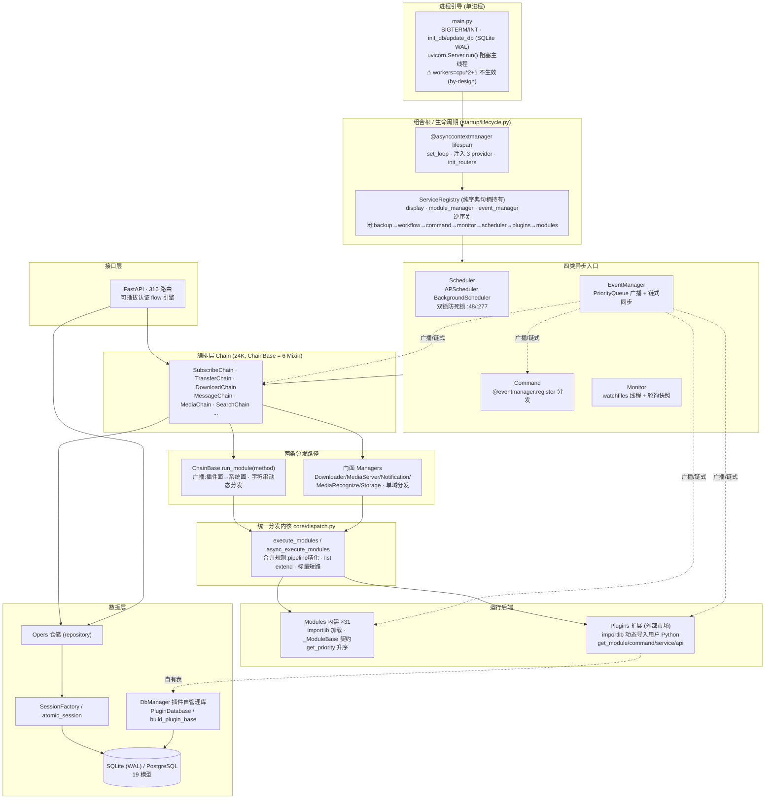
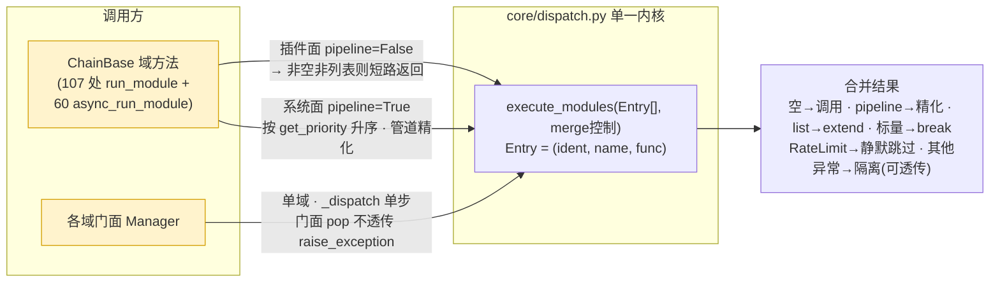
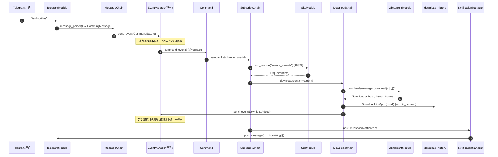
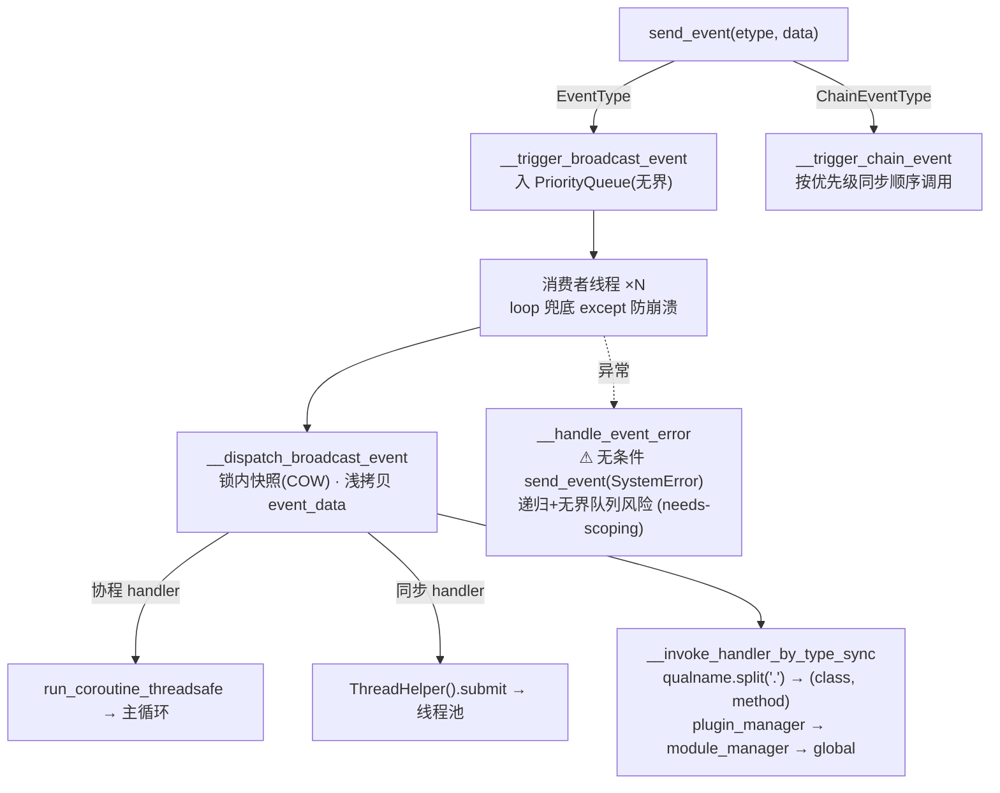
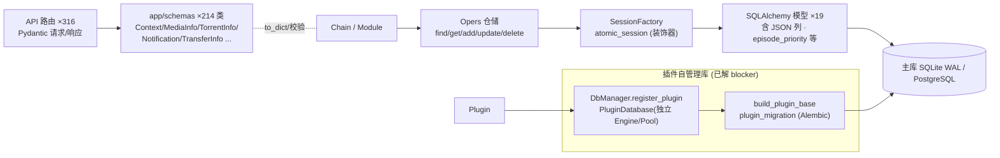

# MoviePilot v3-python 架构图集 · 多维审计汇总 · Rust 重构原型就绪度评估

> **范围**:v3-python @ `62eecb38`(HEAD 未变,~227K 行 / 750 文件,17 子系统)
> **日期**:2026-07-01
> **定位**:本文是 [`architecture-audit-v3python-2026-06-29.md`](./architecture-audit-v3python-2026-06-29.md)(对抗性缺陷审计,71 agent/489 万 token)的**补充卷**,新增两块此前未覆盖的内容:**① 架构图集(可视化)** 与 **② Rust 重构原型就绪度评估**。缺陷清单不重复,详见母报告 §五/§七/§八。
> **方法**:图集据母报告 §三(逐行复核的当前代码实测)绘制;就绪度评估由聚焦工作流(6 维证据 → 逐条阻断项对抗证伪 → 合成评分 + 完整性批判)产出。

---

## 零、量化基线(2026-07-01 实测)

| 维度 | 数值 | 说明 |
|---|---|---|
| 总规模 | 227,384 行 / 750 `.py` | `app/` 下 |
| 子系统 LOC Top | modules 58.5K(133) · plugins 47.4K(194) · agent 28.7K(111) · chain 24.0K(23) · helper 15.6K(38) · api 13.1K(37) · core 10.5K(45) | (文件数) |
| 上帝文件 | 73 个 >800 行 | 最大 `transfer.py` 3447 / `subscribe.py` 3413 / `plugin.py` 2767 / `provider.py` 2744 |
| 契约面 | 214 Pydantic schema 类 · 19 DB 模型 · 316 API 路由 | app/schemas · app/db/models · app/api |
| 测试 | 242 文件 / 1931 测试函数 | tests/ |
| 内建模块 / 内置插件 | 31 modules · 5 内置 plugins(第三方插件在外部市场) | |
| **动态构造(Rust 移植指标)** | `run_module` 字符串分发 **167** · `getattr` **574** · `hasattr` 鸭子类型 **161** · `importlib.import_module` **14** · 元类单例 **43** · `pickle` **17** · `run_coroutine_threadsafe` **24** · `@eventmanager.register` **30** · `exec`/`ast.parse` 3 · 跨类 name-mangling 16 | 见 §三/§四 |

---

## 一、架构图集

### 图 1 · 分层架构总览(9 层)

### 图 2 · 双分发内核的关系(P2 #60 统一后)

> **by-design 差异(勿当 bug 修)**:`ChainBase` 向系统后端**透传** `raise_exception`(经 `**kwargs` 消费),门面 Managers **pop 不透传**——有铁证测试(严格形参后端:manager 返 ok / chain 抛 TypeError)。这是刻意的契约差异。

### 图 3 · 端到端调用链时序(用户 `/subscribes` → 下载 → 落库 → 事件)

### 图 4 · 事件系统(双订阅者 · 广播异步 / 链式同步)

### 图 5 · 数据 / Schema 层与插件自管理库

---

## 二、多维审计结论汇总(母报告复核结论,不重复清单)

> 结论来自 2026-06-29 对抗审计:58 发现 → **35 confirmed / 17 needs-scoping / 6 refuted**(真阳率 ~90%,无 CRITICAL,无活跃 HIGH 阻断)。以下为**分维度 / 分主题**的浓缩视图,便于对照 Rust 就绪度评估。

### 2.1 Confirmed 缺陷分布(35)

| 维度 | 数量 | severity | 热点子系统 |
|---|---|---|---|
| 方法 | 12 | high 2 · medium 14 · low 19 | chain-transfer 5 · plugin-system 5 · agent-ai 5 |
| 架构 | 9 | | chain-subsearch 4 · chain-message-media 4 |
| 调用逻辑 | 8 | | entry-lifecycle 3 · modules-contract 3 |
| 边缘漏洞 | 6 | | chain-core 2 · db 2 · api-auth 2 |

### 2.2 九大跨子系统主题(每个都直接影响 Rust 重构设计)

| # | 主题 | 代表位置 | 对 Rust 重构的含义 |
|---|---|---|---|
| 1 | 信任边界缺失(FS sink + 反序列化) | Zip Slip `plugin.py:1725`、runtime 路径 `runtime.py:734`、`pickle.loads` ×17 | Rust 应内建 `is_within` 守卫 + 禁 pickle(改 serde/HMAC),**重构反而是收口良机** |
| 2 | 锁边界过宽 / 锁外续跑 | `subscribe.py:979/1010`、`systemconfig_oper.py:36` | Rust 无 GIL,这些竞态会**从偶发变必现**,必须重新设计锁粒度 |
| 3 | 错误静默吞没 / 可观测断层 | `scheduler.py:724` 丢 Future、`agent:1392` 吞 CancelledError | Rust `Result`/`?` + `tracing` 强制显式传播,是**结构性改善点** |
| 4 | 同异步双实现语义漂移 | `post_message` 230 行复制、`media.py:1657` | Rust async 可用同一 `async fn` + 阻塞包装,**消除双轨** |
| 5 | 类级/模块级可变状态跨实例共享 | `telegram.py:39` 类级 dict、`cache.py:364` | Rust 所有权模型天然禁止此类隐式共享,**编译期即挡** |
| 6 | check-then-act 非原子(GIL 边界) | `plugin_manager.py:112`、`site.py:19` TOCTOU | 同 #2,GIL 消失后暴露,Rust 需 `Mutex`/DB 唯一约束 |
| 7 | None/falsy 守卫缺失 | `download.py:129`、`systemconfig set` if value | Rust `Option<T>` + 模式匹配**编译期消除**整类 bug |
| 8 | 上帝类 / 职责过载 | SubscribeChain 3413、TransferChain name-mangling | 重构前应先按域拆分,否则 1:1 移植会把结构债一并搬入 Rust |
| 9 | 部署条件型安全(needs-scoping) | pickle RCE、SSO Host 头、Zip Slip | 依赖 Redis 无认证/未配 APP_DOMAIN,Rust 版应默认加固 |

### 2.3 对抗过滤剔除的典型误报(prototype 中的"刻意设计",Rust 版应保留语义)

- 双锁防死锁(`scheduler.py:48/277`)· 字符串方法名分发是**契约**而非漏洞 · `raise_exception` 透传差异 by-design · 单进程 `Server.run()`(`workers` 不生效)· `WeakSingleton` 已带锁 · GET `/system/global` 静态 token 是**登录前公开端点** · PG 迁移"未 commit"是对 SQLAlchemy autobegin 语义的误判。

---

## 三、Rust 重构原型就绪度评估

> **方法**:6 维证据 finder → 每条 high/medium 阻断项独立 opus 默认证伪 → 合成评分 + 完整性批判。39 agent / 247 万 token / 12 分钟。**30+ 候选阻断项经对抗证伪后仅 5 条真项存活**——绝大多数是"Python 惯用法 → Rust 惯用法"的等价平移(不改架构),部分平移还顺手消除了既有隐患。

### 3.1 结论(TL;DR)

**就绪度评分 = 68/100 · 可作为 Rust 重构参考原型 = 是(但有三条严格限定)**

1. **"忠实"必须指忠实于行为与契约,不是逐行转写**;且**绝非低成本**移植。
2. 原型的**参考清晰度高**:代码 + docstring + 三轮既有审计已经把"每个机制做什么、既有 bug 在哪"写清楚了——Rust 团队**继承的是一份规格,而非一个逆向工程难题**。
3. 真正不可平移的只有**三块边界清晰的区域**:CPython 动态插件生态、~28.7K LOC 的 LangGraph agent 运行时、SMB2/3 存储客户端。这三块是**"重设计/内嵌"决策,而非翻译**,必须在动手写 Rust 之前先定。

> ⚠ **反直觉的战略风险(批判者补出)**:仓库已存在 `moviepilot-rust` 的 **PyO3 加速器**(metainfo/filter/indexer 解析等 CPU 热点已 Rust 化),而整个应用**以 I/O 为主**(网络刮削、媒体服务器 API、磁盘转移)。因此"全量 Rust 重写"的**核心收益(性能)基本未被论证**——最大的风险不是技术不可行,而是**高成本、低运行时收益**。

### 3.2 六维就绪度评分卡(对抗证伪后)

| 维度 | 分(0–100) | 真阻断/候选 | 关键判断 |
|---|:--:|:--:|---|
| 类型契约 & schema 面 | **76** | 1/4 | 211 个扁平 Pydantic DTO、19 个**无 relationship** 的 SQLAlchemy 模型、91%(288/316)路由声明 `response_model=` → serde/sqlx/axum 机械平移低风险 |
| 动态 Python 构造 | **58** | 1/6 | 原始分 2,证伪后上修:`run_module` 反射面向的是**内建模块的封闭集合**(设计期已知),可换 trait+enum;真阻断只有"进程内热重载源码分发插件" |
| 并发 & 运行时模型 | **60** | **0/5** | 单 asyncio loop + ThreadPool + APScheduler + watchfiles → **一个 tokio 运行时 + Arc<Mutex>/DashMap/channel** 全可映射;所有候选阻断均被驳 |
| **插件生态 & 扩展性** | **33** ⬇ | **2/7** | **唯一的重大真阻断、评分主拖累**:importlib 进程内加载市场分发的第三方 Python 源码 + 运行时 pip 装原生依赖 |
| 集成广度 & 移植规模 | **56** | 1/5 | ~111K/227K LOC;PyO3 加速器已消除最难的启发式;真阻断=agent 运行时无 Rust 底座 |
| 行为规格 & 测试预言 | **~55** | **0/4** | 1931 测试可作跨语言一致性预言,但**深度耦合 CPython 私有属性(274 处 patch name-mangled 属性)**——须按黑盒行为重新表述,不能盲目照搬 |

### 3.3 对抗证伪后**真正成立**的阻断项(5 条 + 1 关键澄清)

| 级别 | 阻断项 | 位置 | 为何不可平移 / Rust 出路 |
|---|---|---|---|
| 🔴 **CRITICAL** | CPython 动态插件生态:进程内 `importlib` 加载市场分发源码 + 热重载 | `plugin_manager.py`(`import_module(f'app.plugins.{dir}')`) | Rust 无运行时源码导入。出路:**子进程/IPC 插件宿主**(或 PyO3 内嵌 CPython)让现有 Python 插件继续跑;或封闭世界重编译(丢失在线安装)。**非平移** |
| 🟠 HIGH | 运行时 `pip install` 插件的原生/二进制依赖(进程中) | `plugin.py`(下载 plugin `requirements.txt` 后 live 安装 + `importlib.reload(site)`) | 如 p115strmhelper 拉 numpy 等。Rust 二进制内无法中途装原生依赖 → 强化上一条:插件层需保留 Python 宿主 |
| 🟠 HIGH | `app/agent` ~28.7K LOC 的 LangGraph/LangChain 图式运行时 | `app/agent/*`(AgentMiddleware/`awrap_model_call`/InMemorySaver checkpoint) | Rust 无对等图编排底座。出路:据规格**重设计**到 `rig`/`genai`/`async-openai` + 自研 provider,接受比 LangGraph 简单得多的图/检查点模型。**放最后做** |
| 🟡 MED | SMB2/3 存储后端无成熟纯 Rust 客户端 | `modules/filemanager/storages/smb.py`(封 `smbprotocol`) | Rust 生态无同级 SMB2/3 实现。出路:`libsmbclient` FFI 或 `smbclient` shell-out,隔离处理 |
| 🟡 MED(批判补) | **每插件独立库的动态供给**被合成低估 | `app/db/manager.py` `register_plugin`/`PluginDatabase` | 运行时构造独立 Engine/schema/DDL,是真动态供给而非"干净惯用法平移",绑定于上面的插件宿主决策 |

**被对抗证伪驳回(prototype 中应保留语义,勿当 Rust 阻断)**:`run_module` 反射分发(面向封闭内建集,换 trait/enum 即可)· 字符串标签 + 无类型 payload 配置(`serde_json::Value` 即忠实平移,本就刻意"开放")· Manager Protocol"最宽松签名"(不同后端 `**kwargs` 吸收)· 第三方插件 monkey-patch 私有方法 · `ObjectUtils.check_signature` 类型提示 eval 驱动的管道多分派 · 24 处 `run_coroutine_threadsafe`(→ `Handle::spawn`)· **全部 5 条并发候选阻断**(GIL 原子性依赖 → Rust `Arc<Mutex>`,平移即修复)· 测试的 name-mangling 耦合(黑盒重述即可)。

### 3.4 完整性批判:合成漏掉/低估的 12 个维度(须并入决策)

> 这些不是"技术阻断",而是**被乐观合成忽略的成本项与前提**;合并计入后,"成本仅集中在两个子系统"的说法被证过于乐观。

1. **GPLv3 copyleft(High)**:LICENSE 实为 **GPLv3**(工作流曾误猜 AGPL)。逐行"忠实移植"= 派生作品 → 整程序无法闭源/换协议;并**约束 Rust crate 与 FFI(libsmbclient)选型**,还与"内嵌 CPython 插件宿主"相互作用。
2. **存量数据迁移**:现有 Alembic 版本链戳记的 SQLite/PG 安装、**每插件隔离库**、认证密钥/会话——合成只提 `refinery/sqlx`,**未给任何升级现有用户装机的路径**。无法接管存量装机的重写实质是"新产品"。
3. **部署拓扑复现**:交付物**不是单二进制**,而是**内嵌 nginx(反代 + Vue SPA 静态服务)+ entrypoint(PUID/PGID/权限)+ 证书生成 + Python 进程**。Docker 等价复现是独立工作量。
4. **前端/API 契约边界**:整个 Web UI 是**独立 Vue SPA**(nginx 托管)消费 API → **好消息:前端不受影响**;但也意味着 **API 成为唯一的硬一致性面**(316 路由必须字节级兼容)。
5. **上游 v2 漂移(移动靶)**:v3-python 仍周期性 cherry-pick 上游 v2(见 [[v2-to-v3python-sync]]);高频子系统(站点/索引器适配、反爬/CookieCloud/flaresolverr、TMDB/豆瓣 shim)在多年重写期内**持续变化**,Rust 版要一直追。
6. **性能 ROI 前提未定义**:见 3.1 反直觉风险——I/O 密集 + 热点已 PyO3 化,"parity/收益"从未界定。
7. **配置面 parity**:`app/core/config.py` 1310 行 Pydantic `BaseSettings`、**192 个有类型设置**含校验器/默认/派生属性(如 `DB_POSTGRESQL_URL()`),须逐项复现语义。
8. **跨平台文件系统/路径语义**:transfer/filemanager 大量 hardlink/symlink/rename/reflink + Jinja2 路径模板,跑在 Linux/Win/macOS/NAS,Rust 需逐平台核对。
9. **i18n/时区/locale**:默认 `TZ=Asia/Shanghai`、`TMDB_LOCALE=zh`、中文优先识别 + locale 敏感日期解析。
10. **测试预言被高估**:1931 测试中 unit/integration/依赖外部实服(TMDB/豆瓣/站点)的比例未核实,不能直接当纯黑盒预言。
11. **认证/会话/密钥连续性**:进行中的可插拔认证重构 + SSO 插件(仓库有 `github_sso` 测试),重写须保留既有口令哈希方案与 JWT/会话密钥,否则全员掉线。
12. **提醒**:综合以上,重写总成本**不止集中在插件 + agent 两块**;licensing/数据迁移/部署/配置/路径 locale/上游追踪叠加后是系统性工程。

### 3.5 分阶段移植策略(合成产出,6 阶段)

- **Phase 0 · 先冻规格再写 Rust**:把**插件 ABI**与 **agent 运行时**当作"规格→重设计"目标而非移植目标。产出 (a) 插件能力面(`provides_*`/`get_command`/`get_api`/`get_form`/`get_page`/事件钩子)的**版本化接口契约**,(b) agent 图/中间件/工具调用的**行为规格**。**默认推荐:子进程/IPC(或 PyO3 内嵌 CPython)插件宿主**,让现有社区 Python 插件继续可用。
- **Phase 1 · 机械干净的核心 1:1 移植**:211 Pydantic DTO → serde struct;19 无关系模型 → sqlx row(运行时 SQL/DDL + refinery/sqlx 迁移);91% 已声明 `response_model` 的路由 → axum/actix。**JSON blob 列与开放字符串标签配置保留为 `serde_json::Value`**(忠实保留刻意的"开放"设计)。低风险,早出可运行骨架。
- **Phase 2 · 重设计(非翻译)分发层与并发层**:`run_module` 字符串反射 → 按域 trait + `Vec<Box<dyn Trait>>` + 显式 `fold` 管道;元类单例 → `OnceLock`/`Arc`;共享可变 → `Arc<Mutex>`/`RwLock`/`DashMap`;事件总线 → channel;APScheduler → cron crate + `CancellationToken`+`JoinSet`;watchfiles → `notify` crate。**关键:必须在此阶段修掉母报告已发现的既有竞态**(丢 Future 的 Job 可重入、`subscribe.py` 锁穿透 + 持锁 sleep、transfer `is_finished`/act 分裂)——**多核 tokio 移除了 GIL 的意外节流,不修就会从偶发变必现**。
- **Phase 3 · 按层移植集成**:先 drop-in crate(teloxide/serenity/bollard/web-push/notify);把现有 `moviepilot-rust` PyO3 加速器**提为主路径并删 Python 回退**;再啃高频机械 reqwest/serde 客户端(TMDB/豆瓣/TVDB/Bangumi/媒体服务器);SMB 隔离决策(libsmbclient FFI 或 shell-out),flaresolverr 作外部 HTTP sidecar。
- **Phase 4 · 最后建重设计的 agent 运行时**:据 Phase-0 规格,建在 `rig`/`genai`/`async-openai` + 自研 provider 上,接受比 LangGraph 简单得多的模型。用 1931 测试作行为一致性预言:凡编码了"被刻意重设计"的插件/agent 行为的测试,须**重新表述而非盲目通过**。
- **Cross-cutting · 接受长期混合**:现实产物是 **Rust 核心 + 经 IPC 触达的 Python 插件/agent 执行宿主**,而非纯 Rust 单二进制。插件 RPC 设计为双向(插件回调宿主 DB/事件/配置),为第三方插件生态预留**多年迁移窗口或长期共存**。

---

## 四、动态构造 → Rust 对策映射(附实测计数)

| Python 构造 | 计数 | 代表位置 | Rust 对策 | 阻断? |
|---|:--:|---|---|:--:|
| 字符串方法名分发 `run_module`/`async_run_module` | **167** | `chain/__init__.py:1826` | 按域 trait + `Vec<Box<dyn Trait>>` + 显式 `fold` 管道;或操作 enum | 平移(封闭内建集) |
| `getattr` 反射取属性 | **574** | 全仓 | 多数是可选取值 → `Option`/`match`;分发型 → 注册表(`inventory`/`linkme`) | 平移(逐点评估) |
| `hasattr` 鸭子类型探测 | **161** | 契约校验 | `trait` bound / `Option<&dyn T>` 向下转型 | 平移 |
| `importlib.import_module` 动态导入 | **14** | `plugin_manager.py` | **内建模块**:编译期注册表;**插件**:见下 | ⚠ 插件面真阻断 |
| 元类单例 `Singleton/SingletonClass/WeakSingleton` | **43** | `core/singleton.py` | `OnceLock`/`OnceCell` + `Arc`;弱引用型 → `Weak` | 平移(顺手补锁一致化) |
| `pickle`(反序列化) | **17** | `redis.py:65`/`cache.py`/`chain:66` | serde(JSON/msgpack)+ 需要时 HMAC-SHA256 验签 | 平移(**顺手消除 RCE 面**) |
| `run_coroutine_threadsafe` 跨线程提交 | **24** | `scheduler.py`/`event/manager.py` | `tokio::runtime::Handle::spawn` / `mpsc` channel | 平移 |
| 线程执行器 `ThreadPoolExecutor`/`BackgroundScheduler` | **48** | scheduler/monitor/event | `tokio` task + `spawn_blocking` + cron crate + `JoinSet` | 平移 |
| 反射式事件注册 `@eventmanager.register` + `__qualname__` 解析 | 30 + 10 | `event/manager.py:535` | 编译期 `inventory`/`linkme` 注册 + 类型化 handler | 平移 |
| 源码/AST 改写(插件分身) `exec`/`ast.parse` | 3 | `plugin_cloner.py:124` | 与插件宿主决策绑定(IPC/PyO3 宿主内保留 Python) | ⚠ 随插件生态 |
| 跨类 name-mangling 私有访问 `_Class__method` | 16 | `transfer.py` 8 处 | 显式 `pub(crate)` 方法 + trait 契约(**Rust 编译期即挡**) | 平移(顺手去脆弱耦合) |
| **进程内加载市场分发第三方源码 + 热重载 + 运行时 pip 装原生依赖** | — | `plugin.py`/`plugin_manager.py` | **无平移**:子进程/IPC 或 PyO3 内嵌 CPython 插件宿主 | 🔴 **CRITICAL** |

**读法**:12 类动态构造里,**11 类是"惯用法平移"**(其中 pickle/name-mangling/None-falsy 平移还顺手消除既有隐患);**唯一真阻断是最后一行的插件生态**——它同时解释了为何"插件生态"维度只有 33 分,以及为何现实产物注定是 **Rust 核心 + Python 插件宿主的混合体**。

---

## 四补 · 与 Rust 版对比:能不能直接拿 Python 版当"原型基准"?

| 对比维度 | 作为 Rust 原型的可用性 | 依据 |
|---|---|---|
| **行为规格来源** | ✅ 高 | 代码 + docstring + 三轮审计(52 条 backlog + by-design 清单)= 现成规格,非逆向 |
| **数据模型契约** | ✅ 高 | 19 个无 relationship 模型 + 316 路由 91% 有 `response_model`,serde/sqlx 机械平移 |
| **接口契约(内建)** | ✅ 中高 | `_ModuleBase`/`IDownloader`/`IMediaServer` 等 Protocol 有精确 docstring 记录每后端签名差异 |
| **接口契约(插件)** | ❌ 低 | `provides_*` 返回 `List[Type]`/`List[Any]`,编译期零契约,依赖运行时 importlib+结构校验 |
| **并发语义** | ⚠ 需重设计 | GIL 原子性依赖的 check-then-act 在 Rust 多核下会暴露,须按母报告修竞态后再平移 |
| **API 一致性面** | ✅ 硬基准 | 前端是独立 Vue SPA,API=唯一契约面,316 路由是明确的黑盒对比基准 |
| **测试预言** | ⚠ 中 | 1931 测试可作一致性预言,但 274 处 patch 私有属性需黑盒重述 |
| **配置面** | ✅ 明确 | 192 个类型化设置(1310 行 BaseSettings)是完整可对照的配置规格 |

**总判**:作为**行为/契约级参考原型**——**合格(68/100)**;作为**逐行移植蓝本**——不合格(且无必要)。插件生态与 agent 运行时须先冻结规格再重设计。

---

## 五、优先级行动清单

> 两条轨道独立成立,可并行:**轨道 A** 是 v3-python 本身的健康度整改(无论是否重写都该做);**轨道 B** 是启动 Rust 重写前必须先定的前置决策。

### 轨道 A · v3-python 现状整改(源自母报告 §六,当前代码仍适用)

| 优先级 | 动作 | 关键项 |
|---|---|---|
| **P0** 安全/可观测黑洞 | PR-A 路径&反序列化信任边界统一 `is_within` | Zip Slip `plugin.py:1725`、runtime 路径 `runtime.py:734`、clone suffix 白名单、FileBackend key、pickle→JSON/HMAC |
| | PR-B scheduler 协程错误收口 | `scheduler.py:703-751` 捕 Future + done-callback 记录/事件/finish |
| **P1** 并发正确性 | PR-C subscribe 锁正确性(**须先于结构拆分**) | `subscribe.py:979` 超时即 return、`:1010` 释放-睡眠-重读-重获取 |
| | PR-D/E/F/G/H | monitor `reschedule_job`+快照守卫 · post_message `break→continue`(隐私泄漏) · systemconfig 锁外 I/O · agent re-raise CancelledError · themoviedb 哨兵/Telegram 实例级 dict |
| **P2** 健壮性/结构债 | PR-I None/falsy 守卫族 · PR-J 反序列化加固 · PR-K 结构治理 | SubscribeChain 3413 按域拆 · TransferChain name-mangling→受保护方法 |

> 完整 52 条(35 confirmed + 17 needs-scoping)见母报告 §五/§七/§八。**无 CRITICAL、无活跃 HIGH 阻断,最该警惕的是"在已知竞态上先做大重构"**。

### 轨道 B · 启动 Rust 重写前的前置决策(Phase 0 冻结项)

| # | 决策 | 建议默认 | 不定则 |
|---|---|---|---|
| B1 | **插件执行模型** | 子进程/IPC(或 PyO3 内嵌 CPython)宿主,保住现有 Python 插件生态 | 封闭世界重编译 = 丢弃全部第三方插件 → 社区分叉 |
| B2 | **agent 运行时** | 冻结行为规格,最后据规格在 `rig`/`genai` 重设计(非移植 LangGraph) | 试图移植 28.7K LOC LangGraph → 无底洞 |
| B3 | **存量数据迁移** | 定义读取/升级现有 Alembic SQLite/PG + 每插件隔离库 + 认证密钥的路径 | 无迁移 = 新产品,老用户不买账 |
| B4 | **GPLv3 合规** | crate/FFI 选型受 copyleft 约束;确认可接受全程序 GPLv3 | 误用不兼容许可 crate → 分发违规 |
| B5 | **部署拓扑** | 复现 nginx(反代+Vue SPA)+ entrypoint(PUID/PGID)+ 证书 + Python 宿主的 Docker 等价 | 只出单二进制 = 无法平替现有部署 |
| B6 | **性能 ROI 论证** | 先量化"为什么重写"(I/O 密集 + 热点已 PyO3 化,收益存疑) | 高成本低收益,项目最大战略风险 |
| B7 | **API/配置基准冻结** | 316 路由 + 192 设置作字节级一致性基准(前端 Vue SPA 不变) | API 漂移 = 前端全线返工 |
| B8 | **上游 v2 追踪策略** | 明确重写期如何吸收上游 v2 持续变更 | 移动靶,多年后与上游脱节 |

### 推荐次序

1. **立即**:执行轨道 A 的 P0/P1(与是否重写无关,都是净收益;且 Rust 版 Phase 2 会直接复用这些竞态修复结论)。
2. **决策**:先回答 B6(ROI)与 B1(插件模型)——这两条决定整个重写是否值得启动。若 ROI 不成立,**理性结论是不做全量 Rust 重写,而是继续扩大 `moviepilot-rust` PyO3 加速器覆盖 CPU 热点**(增量、低风险、保留生态)。
3. **若启动**:按 §3.5 的 Phase 0→4 推进,Phase 2 强制并入轨道 A 的竞态修复,**切勿把已知竞态平移进 Rust**。

---

## 附:结论一句话

> v3-python **已经是一个足够清晰、足够规格化的 Rust 重构参考原型(68/100,可用)**;但真正的门槛不在"能不能移植",而在**三块不可平移区(插件生态/agent 运行时/SMB)的重设计决策**与**一个未被论证的前提——对一个 I/O 密集、热点已 PyO3 加速的应用做全量 Rust 重写,收益是否成立**。技术上就绪,战略上待定。
